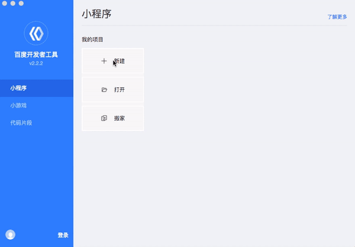
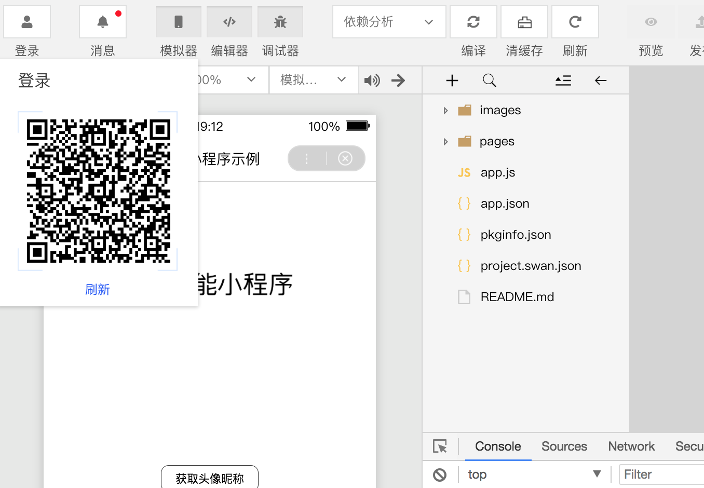
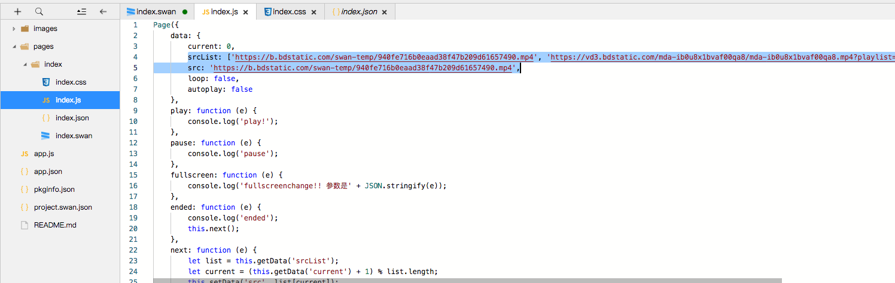
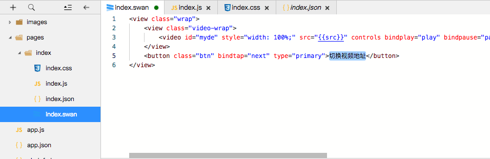
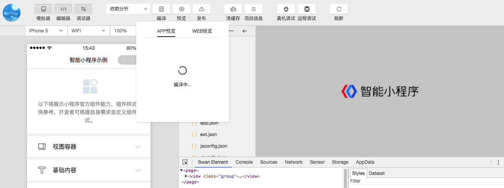
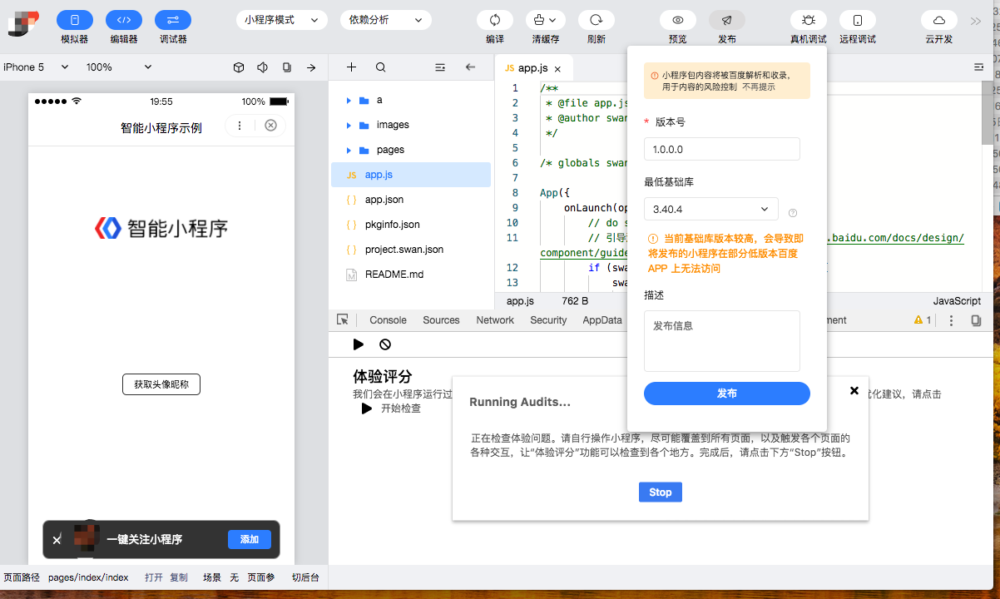

## 新建项目

> **项目目录**：请提前新建空白文件夹。
> **AppID**: 请在开发者平台[获取AppID](https://smartprogram.baidu.com/docs/introduction/register_prepare/#获取-AppID)

## 扫码登录智能小程序

## 开发小程序

> 以在“智能小程序示例”中增加快速入门教学视频为例。

#### 1. 参考文档中 [video](/develop/component/media_video/) 组件的内容，分别更新[.swan文件](/develop/tutorial/dev/)、[.js文件](/develop/tutorial/devjs/)。

#### 2. 修改视频链接及 button 名称。 

#### 3. 调试

可使用[真机调试](https://smartprogram.baidu.com/docs/develop/devtools/remoterelease/)、[远程调试](https://smartprogram.baidu.com/docs/develop/devtools/remotedebugging/)对您的小程序进行调试。
## 预览发布

### 预览

当点击预览按钮时，开发者工具会对当前项目进行编译，然后制作压缩包上传到服务器，并生成小程序和 web 小程序的预览二维码，用百度app扫码后可以看到相应页面。

### 发布

当点击发布按钮时，开发者工具会对当前项目进行编译，然后制作压缩包上传到服务器，上传成功后，可以在智能小程序官网的开发管理一栏看到提交的相关信息。

    1、输入当前发布的小程序版本号，默认按照上次发布的版本号递增
    2、选择上线基础库的最低版本
    3、填写描述信息

