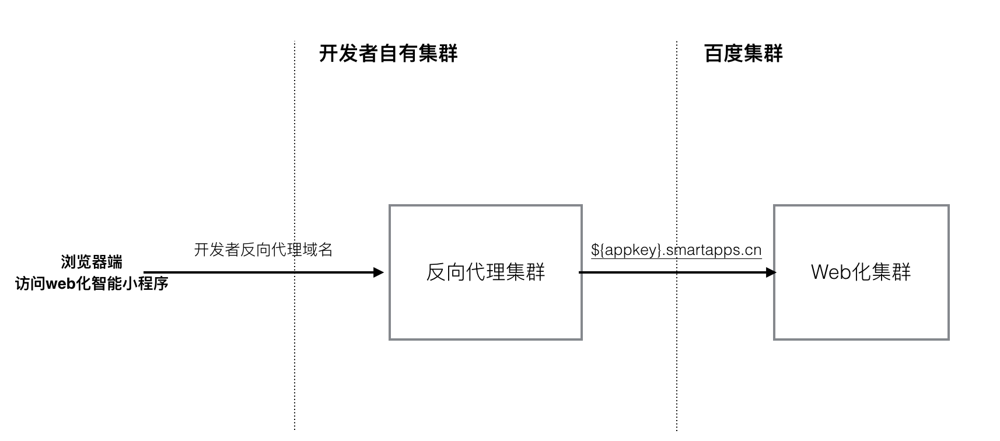
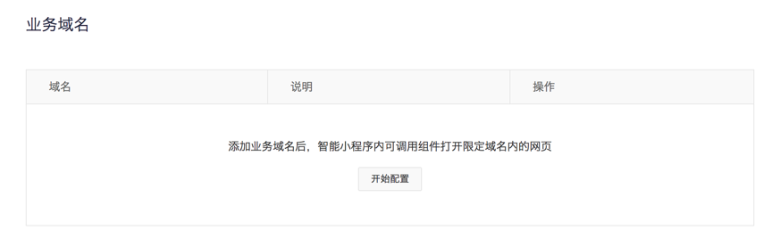

## 介绍

智能小程序web化数据流如下图所示：


## 搭建方式

### 获取Web化域名
根据小程序的 appkey 拼接web化域名。
**格式**： appkey值.smartapps.cn
**说明**： 由于域名不区分大小写，所以针对小程序域名做了转换，将大写字母改写为：小写字母加上”-“字符。如：“A”变为“a-”。

**具体转换参考下表**

| appkey | 转换后的appkey | 示例 | 
| ----- | ------ | --- |
| 4fecoAqgCIUtzIyA4FAPgoyrc4oUc25c | 4fecoa-qgc-i-u-tzi-ya-4f-a-p-goyrc4ou-c25c | `https://4fecoa-qgc-i-u-tzi-ya-4f-a-p-goyrc4ou-c25c.smartapps.cn/pages/component/component `| 


**转换工具**

<style type="text/css">
.webdomain-trans-tools .webdomain-trans-box {
    display: flex;
}

.webdomain-trans-tools .webdomain-trans-box input {
    display: block;
    width: 100%;
    border: 1px solid #ccc;
    height: 40px;
    padding: 0 10px;
    box-sizing: border-box;
    outline: none;
    font-size: 16px;
    text-decoration: none;
}

.webdomain-trans-tools .webdomain-trans-box .button {
    background-color: #38f;
    color: #fff;
    width: 120px;
    height: 40px;
    display: block;
    box-sizing: border-box;
    outline: none;
    font-size: 18px;
    text-align: center;
    line-height: 40px;
    text-align: center;
    text-decoration: none;
}

.webdomain-trans-tools .webdomain-trans-box .button:hover {
    opacity: 0.9;
}

.webdomain-trans-tools .webdomain-trans-result {
    padding-top: 5px;
}

.webdomain-trans-tools .wd-toast {
    color: #666;
    margin-left: 5px;
}

.webdomain-trans-tools .copy-btn {
    margin-left: 5px;
}

</style>

<div id="webdomain-trans-tools" class="webdomain-trans-tools"><div class="webdomain-trans-box"><input type="text" class="webdomain-trans-input" placeholder="请输入要转换的appkey" /><a class="button" href="javascript:;" onClick="__webdomainTransHandler__()">转换</a></div><div class="webdomain-trans-result"></div></div>

### 搭建反向代理

以使用nginx搭建反向代理配置为例；
1.	业务方确认自己的代理域名建议代理域名构建格式： {小程序标识}. {业务主域名}
    例如 智能小程序的代理域名`smartapp-demo.baidu.com `，其中 baidu.com 为业务主域名，smartapp-demo 为业务方为小序单独分配的特殊标识。
2.	搭建nginx服务器，将代理域名请求解析到该服务器下。
3.	在nginx.conf 中增加代理配置，将请求重定向到小程序分配的web化链接。

**示例**：

```
location / {
   #跨域设置
   add_header Access-Control-Allow-Origin $http_origin;
   #需要设置当前的host信息给web化服务
   proxy_set_header X-Forwarded-Host $http_host; 
   #显示设置Host为开发者自己的web化url，该url生成规则参见获取Web化域名。
   proxy_set_header Host 4fecoa-qgc-i-u-tzi-ya-4f-a-p-goyrc4ou-c25c.smartapps.cn; 
   #转发给web化服务进行处理,域名：proxy.smartapps.cn
   proxy_pass http://proxy.smartapps.cn/;
}
```
### 添加代理域名
将代理域名添加到业务域名下。

### 配置小程序域名
参考<a href="http://smartprogram.baidu.com/docs/develop/web/start/">配置开启 Web化</a>进行操作。

