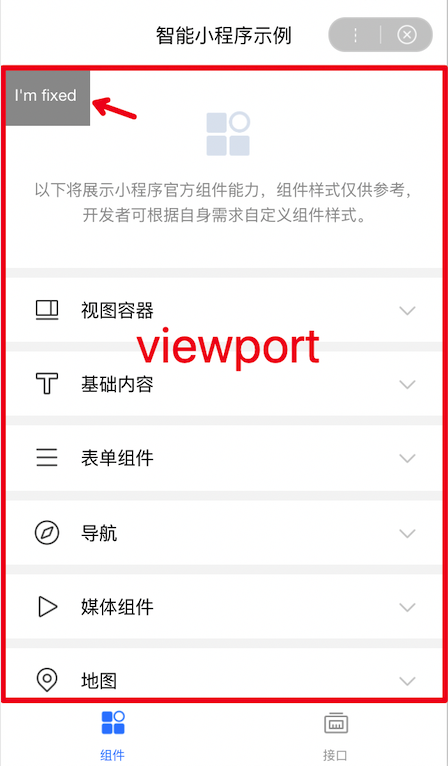
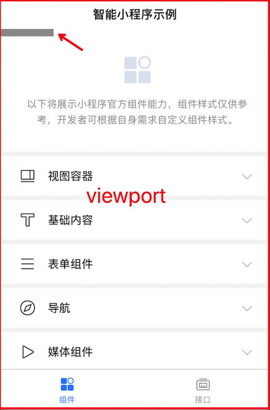

### 页面基础信息

[页面基础信息](https://smartprogram.baidu.com/docs/introduction/rank/#%E8%AE%BE%E7%BD%AE%E9%A1%B5%E9%9D%A2%E5%9F%BA%E7%A1%80%E4%BF%A1%E6%81%AF/) 通过 `swan.setPageInfo() `设置。在 Web 化环境下，页面基础信息会通过 meta 标签插入页面 head 中。
恰当的页面基础信息可以帮助爬虫更精准的理解页面内容。

**页面基础信息的设置应与页面本身的内容相关**。比如：贴吧的一篇贴子详情页，应该以贴子的标题作为页面标题而不是使用“百度贴吧”这样的标题。

> 这里的页面标题与小程序页面 json 配置中设置的`navigationBarTitleText`不同，`navigationBarTitleText`仅用于页面顶部展示；页面基础信息中的 title 不会在页面中展示，而是在 Web 化的 title 标签中。

### 登录
爬虫的访问环境没有账号登录模拟，在任何页面都将以游客模式访问（游客模式下调用 swan.login 会执行 fail 回调）。因此，**开发者希望收录的页面，应考虑对游客模式的兼容**。比如对于无用户信息依赖的页面不添加强制登录的逻辑，用户信息获取失败时仍然展示有效内容。

### 页面跳转
小程序提供了两种页面跳转的方式
- [navigator 组件](https://smartprogram.baidu.com/docs/develop/component/nav/#navigator/)
- [导航 API ](https://smartprogram.baidu.com/docs/develop/api/show_tab/)，包括 navigateTo、redirectTo、switchTab、navigateBack、reLaunch
如果两种方式都能满足使用场景，**建议使用 [navigator 组件](https://smartprogram.baidu.com/docs/develop/component/nav/#navigator/) 实现相应的导航功能，以便更好的被搜索引擎理解**。

### 页面样式
由于 Web 化中 header 和 tabBar 是由 H5 实现的，包含在窗口中；而小程序中的视窗是除去 header 和 tabBar 的部分。两种视窗的差异会导致 fixed 定位的差异。因此**开发中尽量避免使用fixed定位方式**。如图：

    

        
    

    

        
    

    

        
    
     

### 如何在运行时识别 Web 化环境
在代码中，可以通过 API [getSystemInfo](https://smartprogram.baidu.com/docs/develop/api/device_sys/) 判断是否为 Web 化 环境。Web 化环境下，调用 `swan.getSystemInfo() `得到的系统信息中，`platform` 值为`"web"`。

> 通常情况下，为保证抓取内容相关性和用户体验一致性，**不建议开发者区分 Web 化环境做差异化实现**。
> Web 化环境标识主要服务于诸如区分环境统计等需求场景。

### 避免使用新的ESNEXT语法
考虑到 Web 化可能会在各种浏览器版本打开，源码实现时尽量避免使用过新的 ESNEXT 特性。

