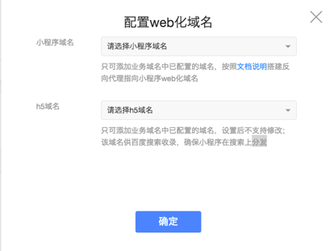
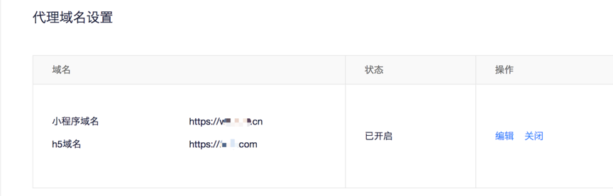
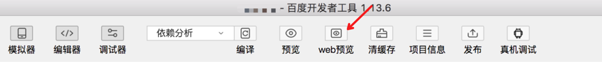

小程序本身仅支持手机百度 App及部分合作App打开，为扩大智能小程序的使用范围，百度智能小程序提供小程序Web化能力。
> 小程序Web化需重新发包上线后生效。

### 配置开启Web化
1. 进入平台首页，在左导航中单击“设置>开发设置>代理域名设置”。

2. 单击“去开启”，填写“小程序域名”和“h5域名”。

**说明**：
参考<a href="http://smartprogram.baidu.com/docs/develop/web/detail/">代理域名配置文档</a>将代理域名配置到业务域名列表中才可以筛选。

### 开启成功标志

* 开发者平台界面展示

* 开发者工具界面会展示web化预览按钮

* 按照正常开发流程提包发布并上线后即可使用代理域名访问小程序的web化页面
    例如：smartapp-demo.baidu.com
