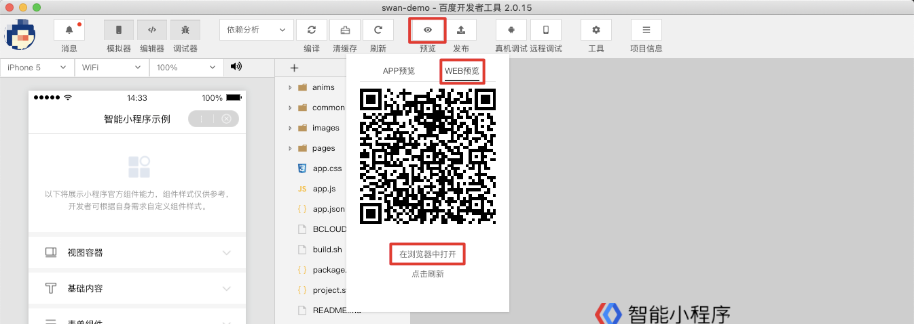
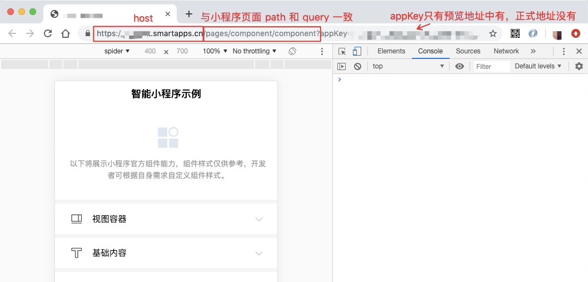

Web 化是百度小程序包在后台自动转化得到的一个 H5 版本的小程序，其功能与展示形式与小程序一致。百度智能小程序为开发者提供了[对接百度搜索生态的能力](https://smartprogram.baidu.com/docs/introduction/intro/)。 **由于智能小程序运行在宿主 app 中，无法被爬虫感知，所以需要对智能小程序进行 Web 化的处理。**

> 如何接入自然搜索流量请阅读[接入自然搜索结果](https://smartprogram.baidu.com/docs/introduction/rank/)。


**Web 化对小程序开发者来说是透明的，开发者几乎不用做额外的适配即可完成转换**（由于H5与客户端天然存在的差异，针对 Web 化的场景，我们仍有一些[开发建议](http://smartprogram.baidu.com/docs/develop/web/proposal/)希望开发者能够关注）。

## 关于爬虫抓取
生成的 Web 化页面会提供给搜索爬虫抓取，从而建立小程序页面索引。爬虫抓取的 UA 中包含 `swan-webapp`，爬虫的抓取方式不仅针对静态的 html 文本，**页面中的动态数据渲染和样式布局等也会对爬虫识别有效信息起到至关重要的作用**。

## Web 化预览

### Web 化页面地址

```
https://xxx.smartapps.cn/pagesdetail/index?id=1
```

* 每个小程序都有唯一的子域名；
* URL 中 path 和 query 部分和小程序页面中的 path 和 query 一致。比如：上例对应的小程序页面在百度App中的打开路径即为 `/pages/detail/index?id=1`；
* 如URL为指定 path 和 query，默认跳转首页。

### 预览

> 预览 Web 化前，请确保服务器域名配置中 request 域名已配置，否则异步请求不能正常返回。
> 配置方式：小程序后台-设置-开发设置-服务器域名-request的合法域名

* 在工具中预览：登录状态下，点击“预览”按钮，弹出窗中切换到 “WEB预览” Tab 可以预览 Web 化的效果。直接扫码通过手机浏览器查看。



* 浏览器预览：点击“在浏览器中打开”通过本地浏览器查看。
浏览器中打开的 URL 域名即是该小程序的 Web化真实域名。预览环境的 URL 后有 appKey 参数，正式环境下没有该参数。

   


