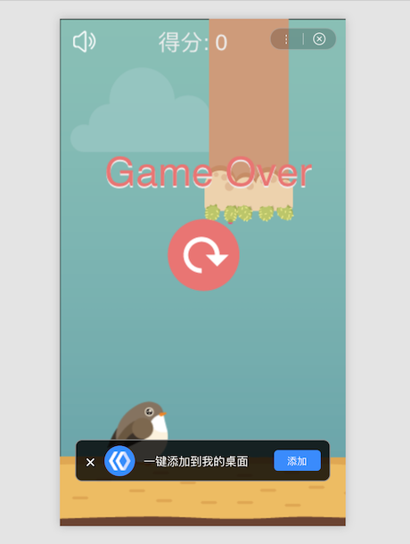
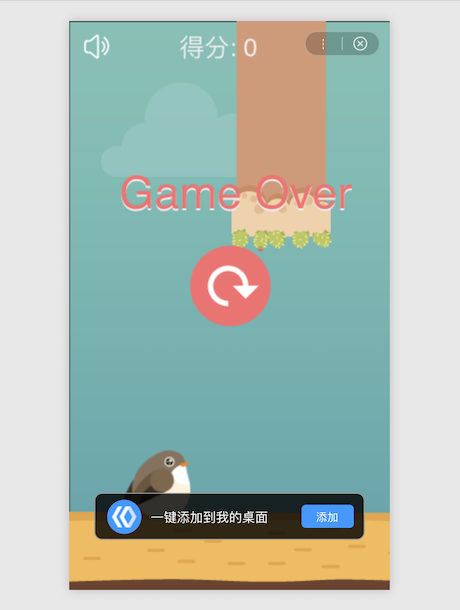

### swan.showAddToDesktopGuide()

> 基础库 swan-game.js 1.8.0 版本开始支持。目前仅 Android 端支持。

支持在小游戏内调起添加到桌面引导组件，引导用户添加到桌面。若桌面已经存在，则直接进入成功回调，组件不显示。引导组件有统一的疲劳度，用户点击添加并成功、用户未执行过添加操作（点击取消或者自动消失）、用户点击添加但是失败次数超过三次，皆算做一次疲劳，存在疲劳情况的，3 天内不再出现引导组件。

```js
swan.showAddToDesktopGuide(opts)
```

**参数值：**

|属性|类型|默认值|是否必填|描述|
|---|-------|---|-------|-------|
|type|String|bar|否|引导组件类型，有效值： bar/bar-autohide|
|content|String|bar: 一键添加到我的桌面 <br> bar-autohide: 一键添加到我的桌面|否|引导组件文字，若过长会溢出打点隐藏|
|success|function||否|添加成功的回调函数|
|fail|function||否|添加失败的回调函数|
|complete|function||否|接口调用完成的回调函数（添加成功、失败都会执行）|

**返回值：**

`success` 回调函数：

形如 `function (res) {...}`，其中：

|属性|类型|描述|
|-|-|-|
|res.errCode|string|成功代码|
|res.errMsg|string|成功信息|

`fail` 回调函数：

形如 `function (res) {...}`，其中：

|属性|类型|描述|
|-|-|-|
|res.errCode|string|错误代码|
|res.errMsg|string|错误信息|

**errCode 与对应的描述信息：**

|状态码|描述|
|-|-|
|1|已在桌面存在|
|2|添加成功|
|3|已执行添加，状态未知 |
|-1|调起失败|
|-2|组件疲劳|
|-3|取消添加（到时间自动取消，用户点击取消按钮，界面跳转）|
|-4|添加失败|

**展现形式:**

* 一直展现：用户点击引导组件旁边的关闭按钮才能关闭，点击添加按钮可直接添加到我的桌面。


**示例代码 1:**

```js
swan.showAddToDesktopGuide({
    type: 'bar',
    content: '一键添加到我的桌面',
    success: res => {
        console.log('添加成功：', res);
    },
    fail: err => {
        console.log('添加失败：', err);
    }
})
```

* 自动消失：引导组件 3s 后自动消失，点击添加按钮可直接添加到我的桌面。


**示例代码 2:**

```js
swan.showAddToDesktopGuide({
    type: 'bar-autohide',
    content: '一键添加到我的桌面',
    success: res => {
        console.log('添加成功：', res);
    },
    fail: err => {
        console.log('添加失败：', err);
    }
})
```
