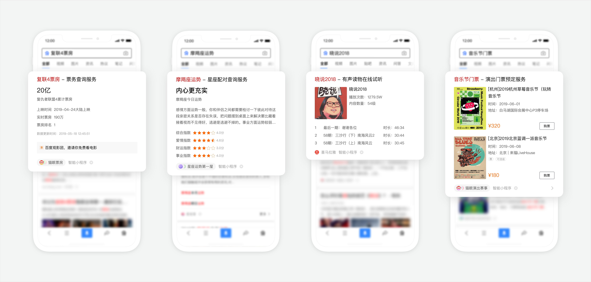
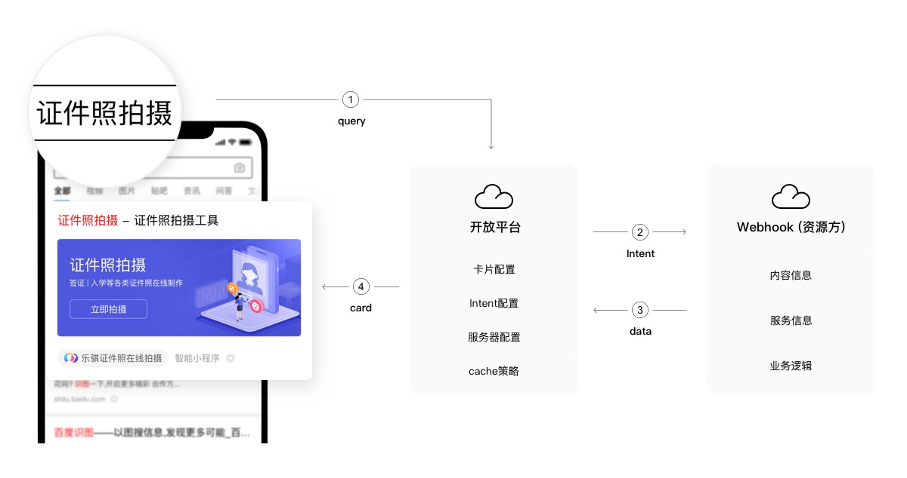
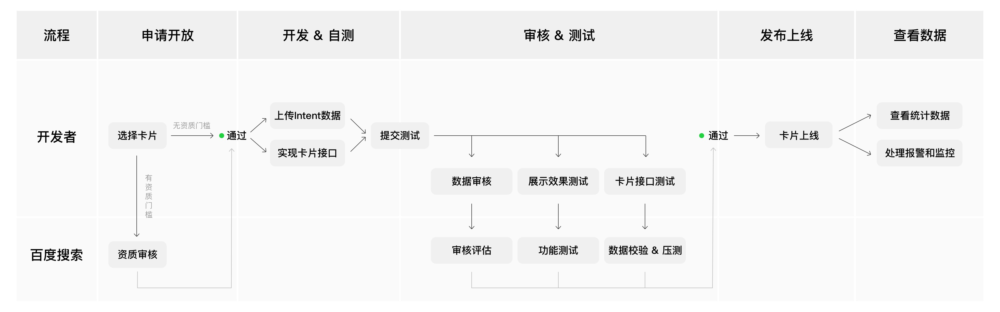

## **什么是OpenCard？**

OpenCard是搜索面向百度智能小程序开发者推出的全新的合作模式，是原有阿拉丁特型卡的升级版，它继承原有阿拉丁卡片的强样式展现，给搜索用户带来惊喜的满足感。如下图所示：

在资源合作模式上，与原有阿拉丁卡片相比，它有以下几个明显特点：

 - 开放更多合作类目，除头部领域外还包括一众小而美的中长尾类目；
 - 同一卡片引入多家资源方，以搜索体验为展现权重分配标准，促进开发者公平竞争；
 - 开发者自由度大，可自主申请开放新类目、设计卡片样式；
 - 对接流程简单，上线周期短，内容提交成本低；
 - 卡片中展示的信息可以实时动态变化，与小程序内容联动。比如产品定价的调整、数据列表顺序、运营活动信息等等，搜索结果卡片可以与小程序的内容保持完全一致，避免普通搜索结果数据更新存在的迟滞现象。

## OpenCard数据流

当用户搜索某检索词（query），搜索会对用户的检索词进行分析提炼出用户需求，进而搜索会向能满足该用户需求的OpenCard开发者发出数据请求，请求实时数据返回，经过百度数据开放平台（后称开放平台）的处理，最终以OpenCard的样式展现在搜索结果中，根据用户喜爱程度调整展现位置。另外，OpenCard资源无需走传统的搜索抓取、入库等环节，搜索将直接从开发者服务器调用数据和服务，时效性数据可以同步展示在搜索结果中，开发者可以轻松管理卡片展现内容。

智能小程序能力与OpenCard能力的结合，将为时效性强、交互性强的内容和服务开辟一条触达搜索用户的快速通道，OpenCard将是服务类、工具类智能小程序在搜索获取流量的关键入口。

## **如何接入OpenCard?**

接入条件和接入指南详见：[智能小程序opencard接入指南](https://open.baidu.com/xcxdoc/guide/grasp/index.html)。

