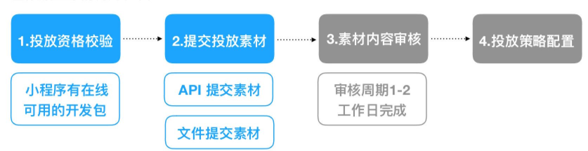
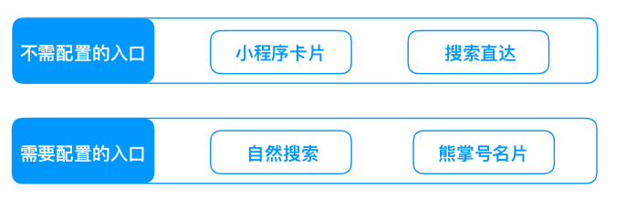

## 百度信息流
百度信息流作为小程序的主要流量入口，在您提交想要的素材内容后，可在用户的自然信息流结果中展示相应小程序的内容并引导用户进入小程序，获取流量。
### 形式
图文大图、视频大图、横滑卡片、左图右文等，具体参数如下：

|项|要求|
|--|--|
|图文大图|1.小程序名称
2. icon:`42 * 42`
3.标题：不得超过40个汉字长度（含标点、符号、空格等）
4.配图：jpg格式，`750 * 422`
5.Path
6.Appkey|
|视频大图|1.小程序名称
2. icon:`42 * 42`
3.标题：不得超过40个汉字长度（含标点、符号、空格等）
4.大图：`1140*642`
5.Path
6.退化小图：`372*246`|
|横滑卡片|1.小程序名称
2. icon:`42 * 42`
3.Path
卡片标题：不超过10个字
自卡片标题：不超过8个字
（根据模板不同可选）子卡片描述：不超过20个字
图片格式：jpg
图片尺寸：`456*306`|
|左图右文|1.小程序名称
2. icon:`42 * 42`
3.标题：不得超过40个汉字长度（含标点、符号、空格等）
4.配图：`218*146`
5.Path|
|百家号文章挂载|1.小程序名称
2. icon:`42 * 42`
3.标题：不得超过40个汉字长度（含标点、符号、空格等）
4.配图：`400*224`
5.Path|
|UGC作者挂载|1.百家号帐号ID
2.动态标题：建议12个以内（含标点），超出一行截断。
3.动态描述：建议20个字以内（含标点），超出一行截断。
4.小程序icon:`129 * 129`
5.Appkey
6.小程序Appid
7.短内容：200字以内（含标点）
8.图片（非必填）：jpg格式，每张大学不超过5M。最佳比例：`16:9`，宽度不超过750px。
9.Path|

### 投放流程

 蓝色为您需要进行的操作，我们将在1-2个工作日完成审核，尽快完成投放策略配置。

 <!-- ### 投放说明
 搜索作为百度的最大流量入口，当用户在百度 App进行自然搜索时，会在不同的环节和搜索结果中展示小程序的内容和入口进而进行流量获取。当前已有流量入口如下：

 

**小程序卡片**：
 当用户在百度 App搜索指定的Query（小程序名称/小程序名称+“小程序”）时，将可在搜索结果中展示小程序卡片的入口，从而进行曝光并获取流量。
**搜索直达**：
 当用户在百度 App搜索指定的Query（小程序名称/小程序名称+“小程序”）时，将可在搜索联想词中展示小程序卡片的入口，从而进行曝光并获取流量。
**自然搜索**：
当开发者完成相应的配置后即可在用户的自然搜索结果中展示小程序内容的搜索结果，从而进行曝光并获取自然用户流量。配置操作相见：<a href="https://smartprogram.baidu.com/docs/develop/flow/rank/">接入自然搜索</a>。
**熊掌号名片**： -->

