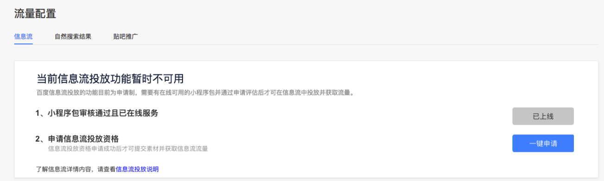
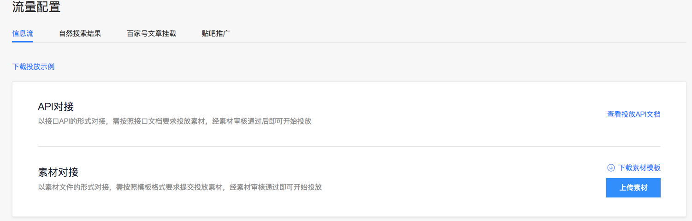
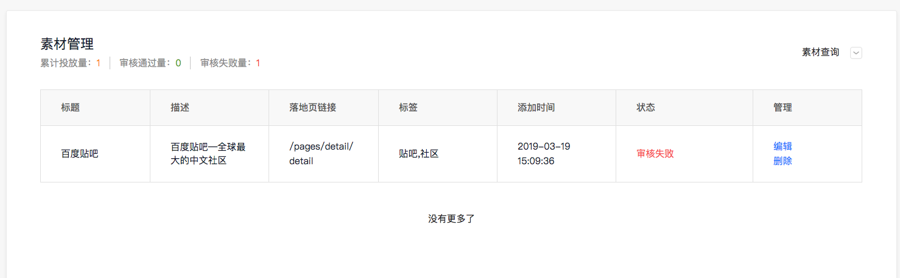
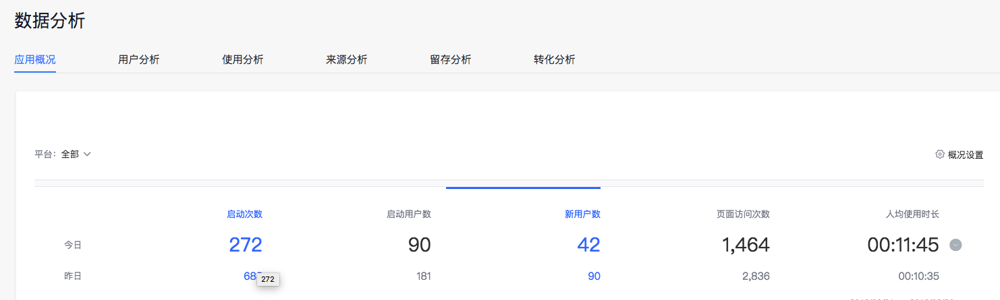

> 接入信息流流量时，请确认您的小程序已发布上线。

信息流自然分发申请流程如下：

        申请信息流分发资格-->素材上传-->素材审核-->在线分发-->数据查询

## 申请信息流分发资格
单击“流量配置”，进入“信息流”页面，点击“一键申请”按钮发起申请。
 

## 素材上传

获取分发资格后，开发者可在流量配置-信息流页面通过API或素材对接上传素材。
* API对接：对时效性要求较高和数量较大的素材进行上传；
* 素材对接：对时效性要求较低和数量较小的素材进行上传。
 

## 在线分发

素材上传后，可在页面下方关注素材审核状态，并进行素材查询、编辑、删除等管理。
 

## 数据查询

完成在线分发后，可在开发者“平台-数据分析”模块查询相关数据。
 
 

