  信息流流量接入流程图

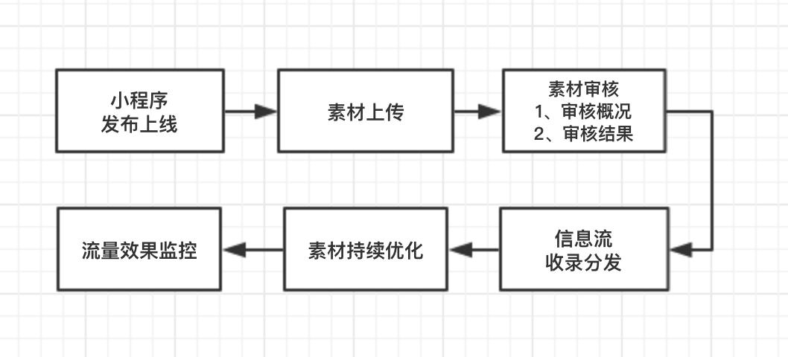 

 

## **小程序发布上线**

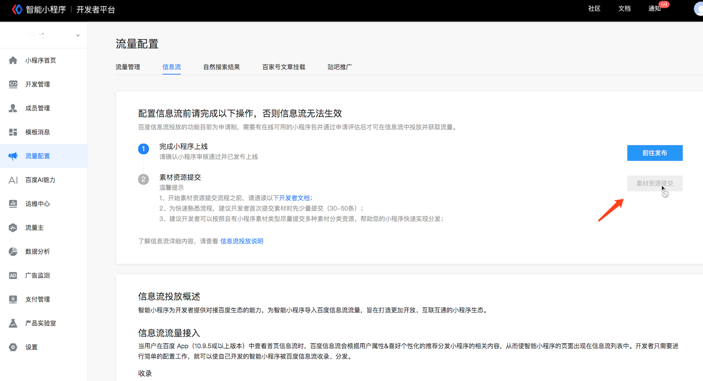 

当您的小程序尚未发布上线时，“素材资料提交”按钮将置灰，您的小程序发布上线后，该按钮即被点亮，如下图

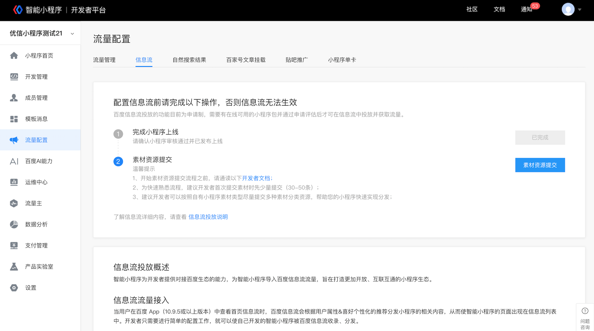 

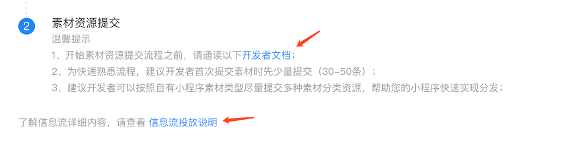 

在您的小程序尚未发布前，您也可以提前通过阅读“[开发者文档](http://baidu.com/)”以及“[信息流投放说明](http://baidu.com/)”全面了解信息流流量的玩法及素材提交管理流程。

 

## **素材上传**

 

**建议tips：首次上传物料时建议您对素材少量试传，待收到审核概况反馈后再进行大批量的物料上传**

 

**为什么初次建议少量提交素材进行试传？**

当您的小程序发布上线后，为了使您获取到与小程序内容更加匹配的信息流流量，建议您首次对素材进行少量试传（30-50条），同时建议您可以提交多种素材分类资源，便于我们对您的素材物料进行更加精准的分发判断，试传完成后，我们将尽快完成审核，并为您展示审核概况以及审核结果，作为您后续素材上传的参考

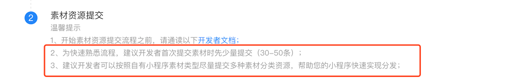 

 

**关于素材提交方式**

当前，百度为开发者提供了3种素材上传方式，用于应对不同的素材量以及时效性，详情参考下表：

 

| **提交方式**    | **上传原理** | **时效性** | **是否需要开发** | **适用素材量** |
| --------------- | ------------ | ---------- | ---------------- | -------------- |
| 链接文件提交    | sitemap      | 定时       | 是               | 不限量         |
| API实时接口提交 | API          | 实时       | 是               | ＜500/天       |
| 单条资源提交    | 模板         | 实时       | 否               | 1/次           |

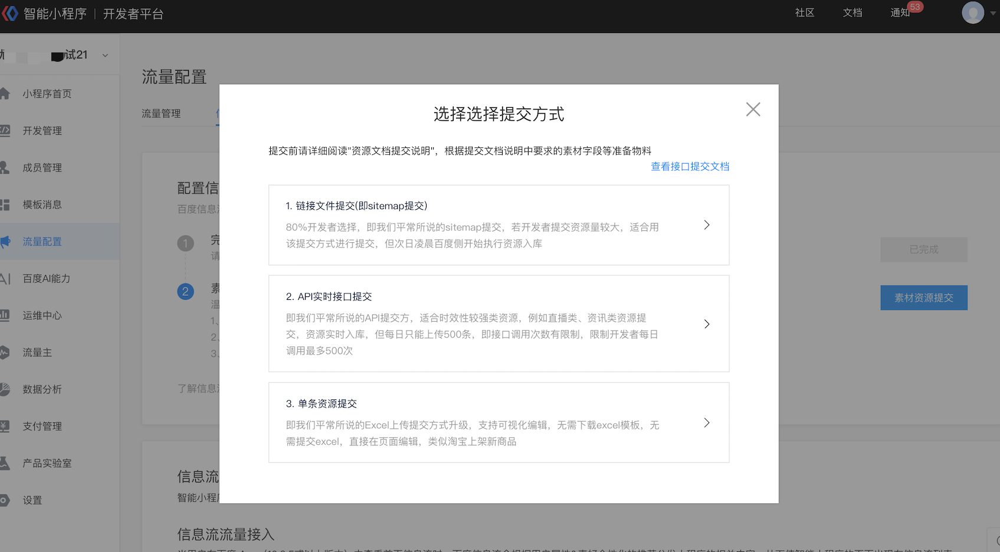 

**方式1-链接文件提交（sitemap提交）**

提交原理说明：资源Sitemap是小程序结构化资源url列表。开发者需要将小程序落地页信息按[规范](111)整理成标题、正文 、图片等结构化信息；百度Spider会根据上次更新时间、更新频率等信息对资源数据进行提取，经过审核最终投放到feed中进行分发，为小程序带来巨大的流量。 

 

方法1：接口提交，详见[开发者文档](111)；

方法2：B端连接文件提交，如下图；

 

操作步骤：

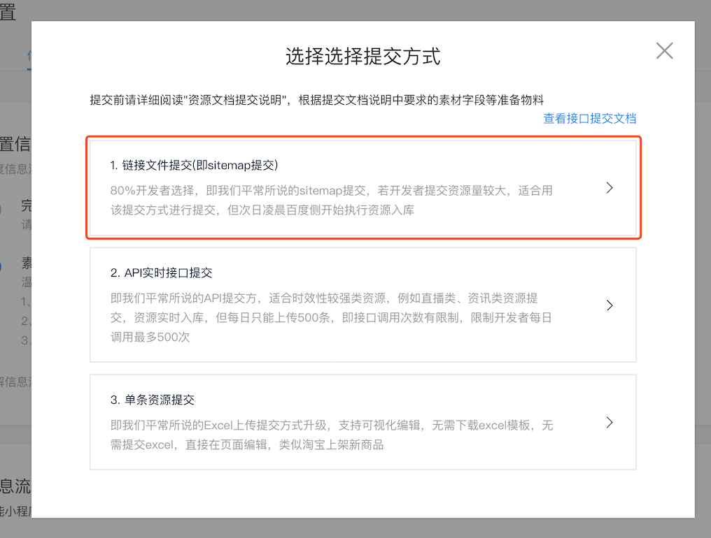 

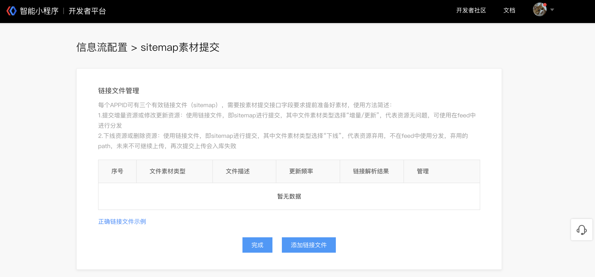 

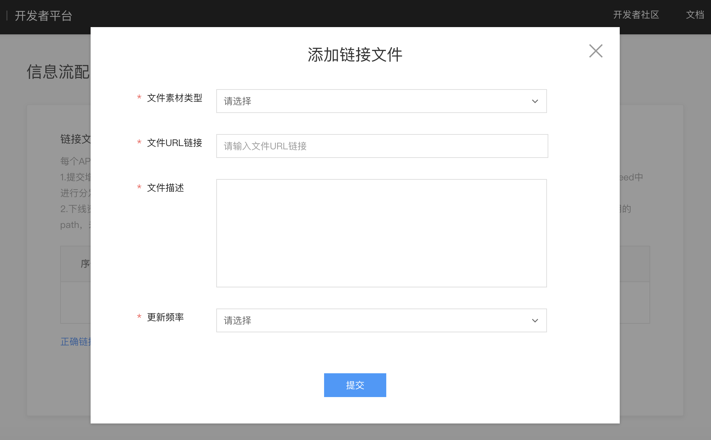 

 

**填写说明：**

每个APPID可有三个有效链接文件（sitemap），需要按素材提交接口字段要求提前准备好素材，使用方法简述：

1.提交增量资源或修改更新资源：使用链接文件，即sitemap进行提交，其中文件素材类型选择“增量/更新”，代表资源无问题，可使用在feed中进行分发

 

2.下线资源或删除资源：使用链接文件，即sitemap进行提交，其中文件素材类型选择“下线”，代表资源弃用，不在feed中使用分发，弃用的path，未来不可继续上传，再次提交上传会入库失败

 

**方式2-API实时接口提交**

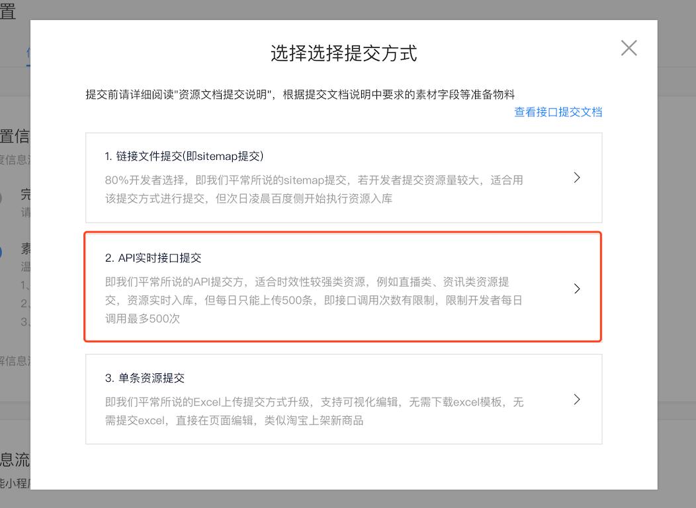 

 提交原理说明：通过调用接口进行资源提交，该提交方式适用于少量素材提交，每天有500次调用限制。

**详情请参考开发者文档内容**

https://smartprogram.baidu.com/docs/develop/serverapi/open_feed/#submitresource/

 

**方式3-单条资源提交**

提交原理说明：适用于少量资源提交，直接在页面编辑，资源需要逐条填写。

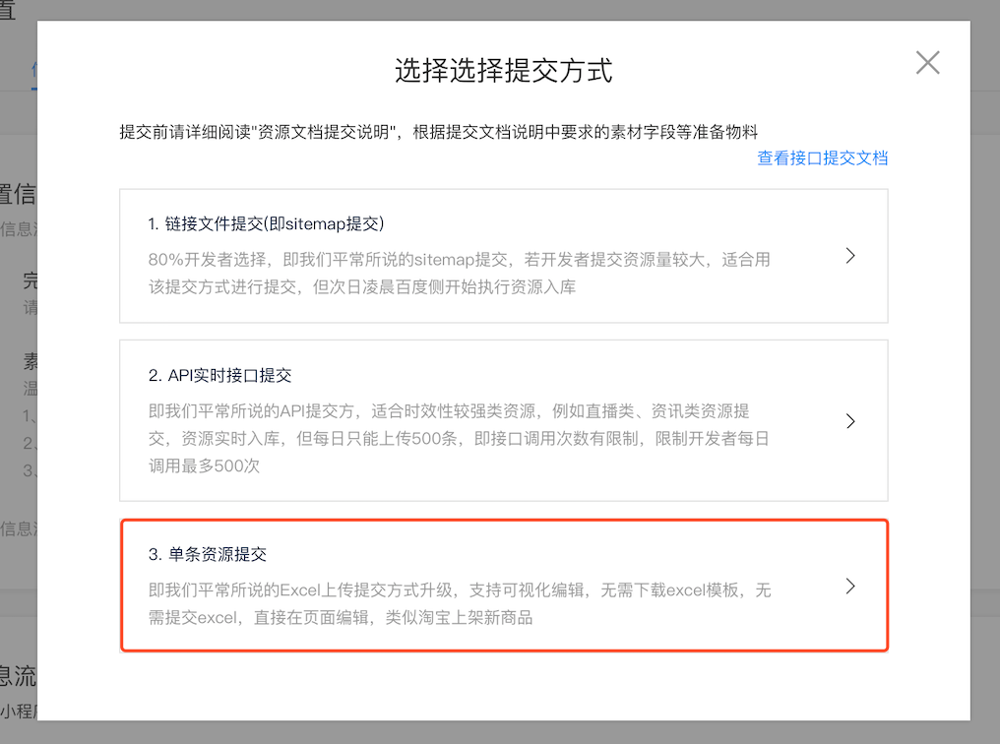 

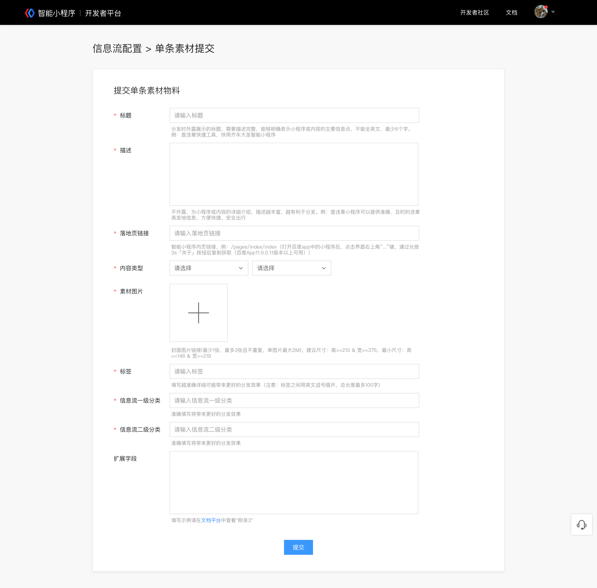 

 

## **素材审核**

 

### 审核概况

当您进行批量素材上传后，我们将尽快对您上传的素材进行审核，并给予您素材相关建议，您可以根据建议用于后续补充素材物料上传。

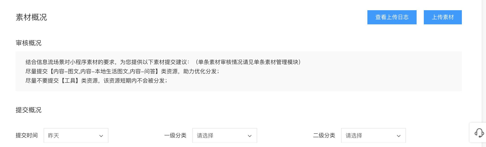 

**字段信息请参考开发文档** [submitresource](https://smartprogram.baidu.com/docs/develop/serverapi/open_feed/#submitresource/)

 

### 审核结果

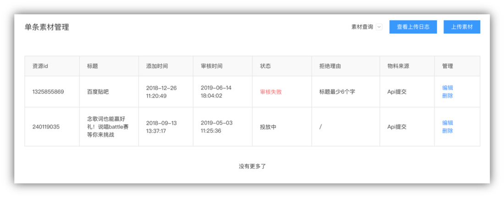 

 

## **信息流收录分发**

当您的素材在后台界面中状态显示为“投放中”时，说明您的素材已被信息流收录并会根据实际情况进行相应分发，具体展示样式将根据您提交的素材物料，由百度信息流决定展现具体样式，您可以在开发者后台，数据分析模块查看到信息流入口获取到的流量效果。

 

 

## **素材优化建议**

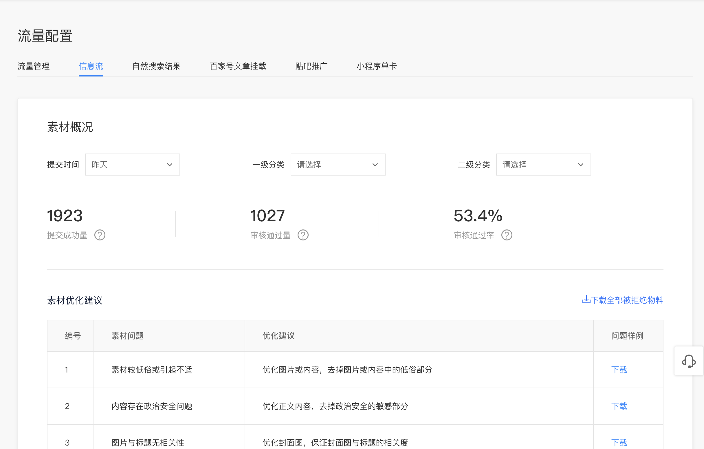 

该模块会显示当前的top5待优化问题，您可参考“优化建议”对相应素材内容进行优化，同时您也可以下载问题样例具体查看问题详情，素材完成优化后您可重新上传素材内容，系统会尽快对已解决问题进行校验。

 

## **流量效果监控**

 

 

您可从开发者后台数据分析模块了解到信息流流量为您带来的流量收益。

