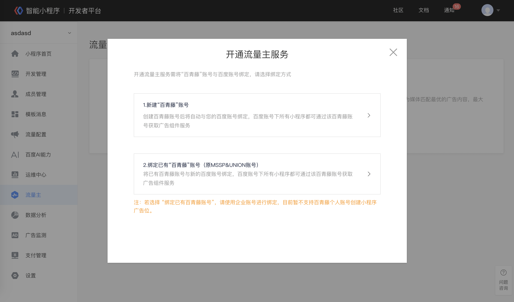

## 开通条件
小程序流量主功能已全量开放。目前暂不支持政务民生、公益、公共医疗类小程序接入流量主。

## 登录小程序平台

登录小程序平台，点击“流量主”模块。
> 流量主模块目前仅支持超级管理员操作。

##  开通小程序流量主

点击“立即开通”，根据页面提示，可选择“新建百青藤账号”，或“绑定已有百青藤账号”（原MSSP&UNION用户可选择“绑定已有百青藤账号”）。如需找回百青藤账号用户名或邮箱，请填写此[问卷](https://iwenjuan.baidu.com/?code=ptjj4s)。

1. 新建百青藤账号流程
 1.1 点击“新建百青藤账号”，并按要求填写相关信息，通过后即可成功创建百青藤平台账号并与小程序平台所使用的百度账号绑定。

 1.2 点击“前往百青藤平台”即可跳转至百青藤平台完成后续获取代码位等操作。

2. 绑定已有百青藤账号流程
点击“绑定已有百青藤账号“后，在弹出登录框中输入已有百青藤平台的账号密码（或原MSSP&UNION平台账号密码），完成登录后即可将已有百青藤账号与小程序平台所使用的百度账号绑定。绑定成功后将自动跳转至百青藤平台。
> 若选择“绑定已有百青藤账号”，请使用企业账号进行绑定，目前暂不支百青藤个人账号创建小程序广告位。

 
## 进入百青藤平台代码位管理

1. 点击应用管理进行小程序的管理

2. 新建小程序应用
进入应用管理页点击“新建小程序应用”进行小程序应用的创建。

3. 创建代码位
进入代码位管理页点击“新建代码位”进行代码位创建，完成代码位和广告组件的配置即可。

> 目前小程序支持的广告样式包括：banner广告、信息流广告。其中信息流广告为内测阶段，请联系对接BD进行单独申请。

4. 提现前操作
在百青藤首页首页点击实名认证，完成实名认证后，即可每月进行提现。
