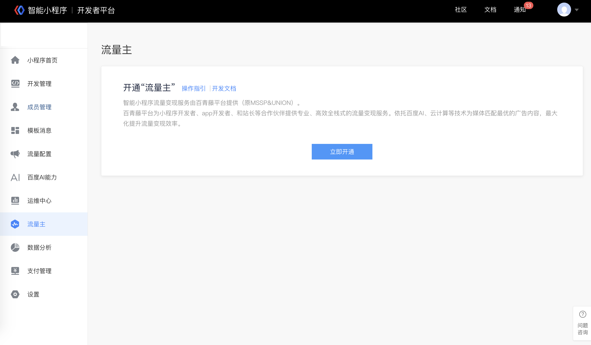
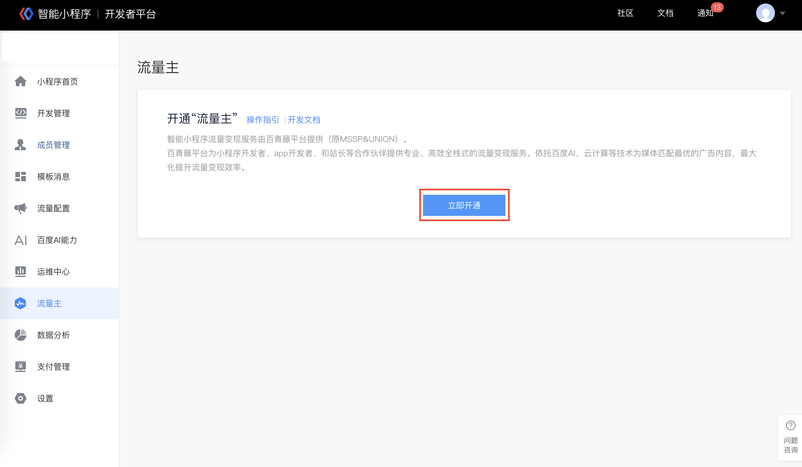
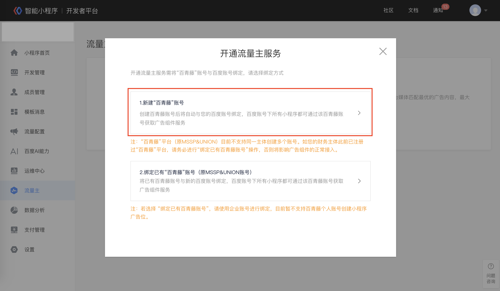
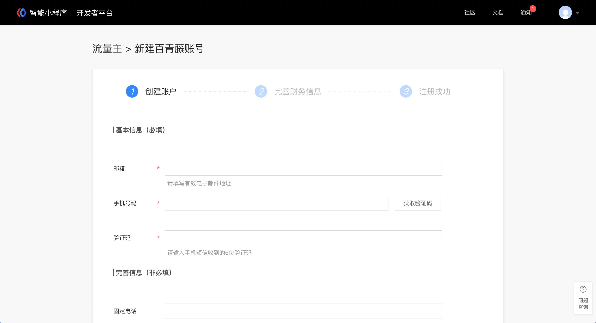
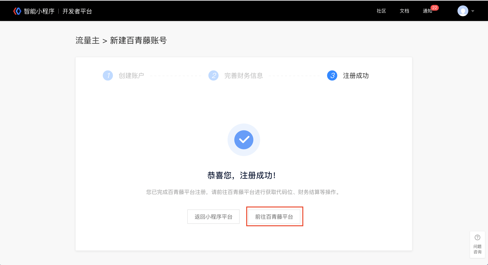
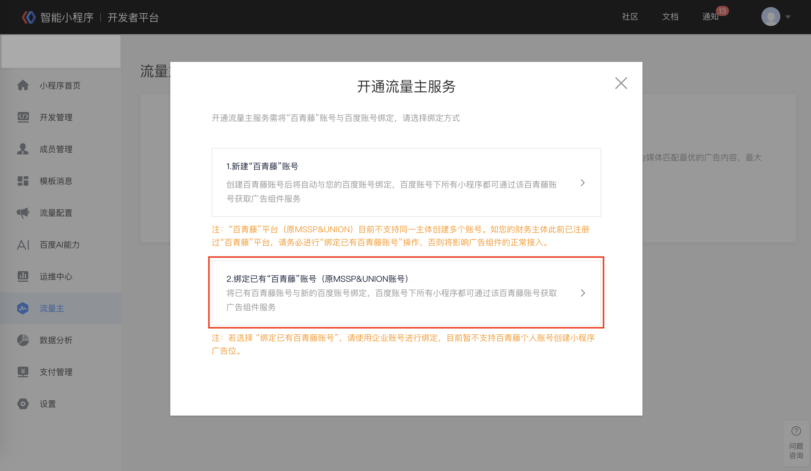
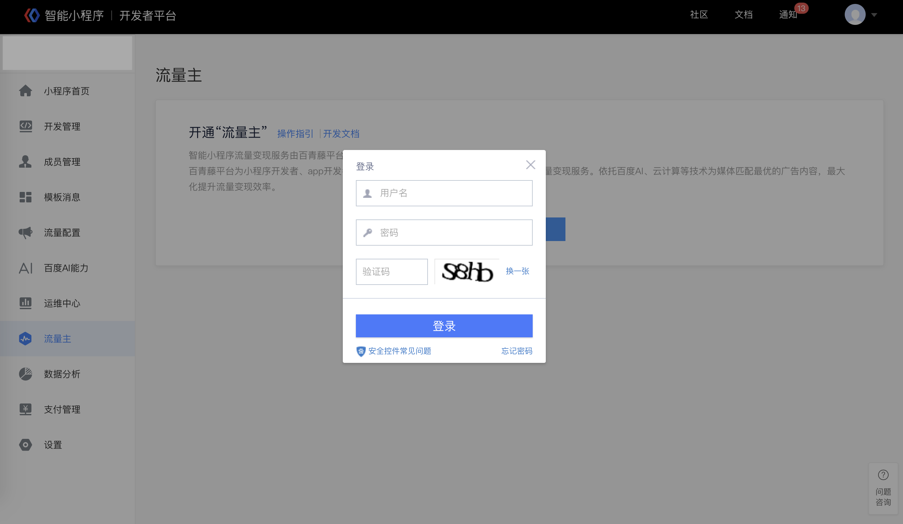
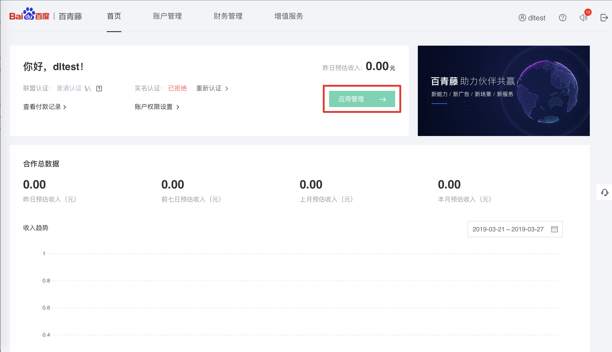
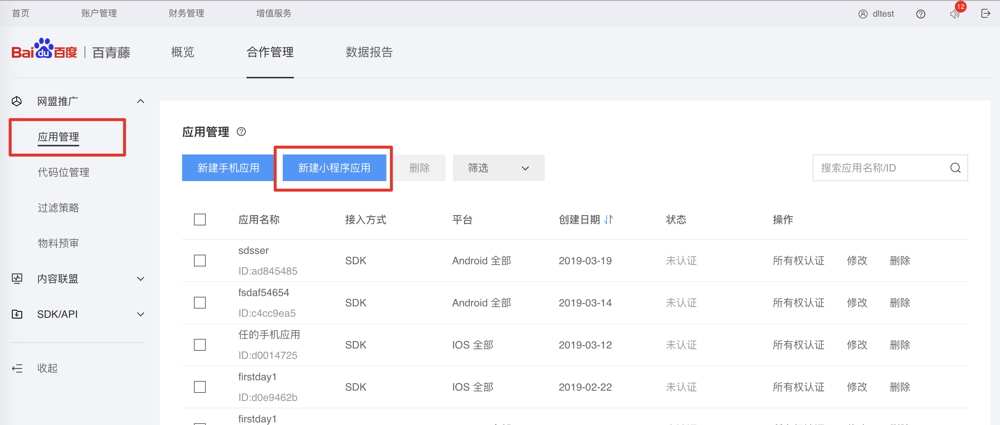

## 登录小程序平台

登录小程序平台，点击“流量主”模块。
> 流量主模块目前仅支持超级管理员操作。

## 开通条件

### 小程序开通流量主需满足以下条件 
 
* 小程序已开通流量主白名单 
* 小程序无严重违规记录  
* 非医疗、健康品类 

### 邮件要求
流量主白名单申请请按照以下要求发送邮件。

**收件人**：smartprogram_support@baidu.com
**邮件标题**：小程序广告组件白名单开通申请+小程序名称+APPID
**邮件内容**：
* **行业口碑**：无违规记录，包括但不限于恶意名称抢注、侵权等。
* **品类限定**：医疗全品类禁止，健康部分品类禁止（药品查询、疾病咨询、两性禁止申请）。
    >确认您的小程序非此品类。

* 说明广告组件合理的应用场景及用途。
* 如果当前 H5 或 App 接入网盟广告，请提供对应流量情况及 cpm 收益水平。

##  开通小程序流量主

点击“开通”，根据页面提示，可选择“新建百青藤账号”,或“绑定已有百青藤账号”（原MSSP&UNION用户可选择“绑定已有百青藤账号”）。

1. 新建百青藤账号流程
 1.1 点击“新建百青藤账号”，并按要求填写相关信息，通过后即可成功创建百青藤平台账号并与小程序平台所使用的百度账号绑定。

 1.2 点击“前往百青藤平台”即可跳转至百青藤平台完成后续获取代码位等操作。

2. 绑定已有百青藤账号流程
点击“绑定已有百青藤账号“后，在弹出登录框中输入已有百青藤平台的账号密码（或原MSSP&UNION平台账号密码），完成登录后即可将已有百青藤账号与小程序平台所使用的百度账号绑定。绑定成功后将自动跳转至百青藤平台。

 
## 进入百青藤平台代码位管理

1. 点击应用管理进行小程序的管理

2. 新建小程序应用
进入应用管理页点击“新建小程序应用”进行小程序应用的创建。

3. 创建代码位
进入代码位管理页点击“新建代码位”进行代码位创建，完成代码位和广告组件的配置即可。

4. 提现前操作
在百青藤首页首页点击实名认证，完成实名认证后，即可每月进行提现。
