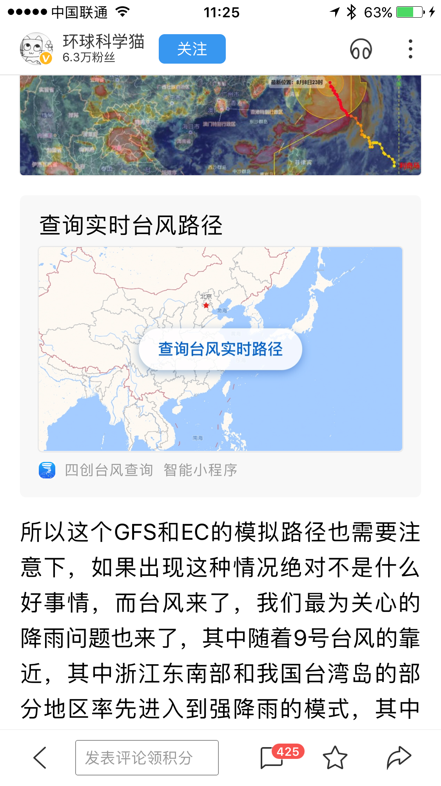

### 一、标题
标题无敏感信息；避免标题党、低俗内容；标题不出现错别字、特殊符号。
### 二、图片
避免出现不清晰、色情低俗、恶心血腥的图片，避免出现文字图、表格图、表情图以及P图明显等问题图片。
### 三、内容
避免出现色情低俗、恶心血腥、虚假信息和违反现行法律法规等内容；发布具有时效性的文章。
文章挂载通过后需要您在百家号上发布的文章中自行选择挂载，效果如下：

 	
### 四、避免发推广信息
不发布二维码、营销电话、带有推广信息水印的图片；不发布恶意推广类信息。
### 五、常见问题
标题或图片与落地页内容相关性差（如落地页进入主页，与标题不一致）；标题/内容等存在引导性广告，如满减/促销活动/引导至其他平台等；标题过短或表意不清。
### 六、不符合平台内容规范

发布不通过，不被推荐的类型包括但不限于以下几种：

1. 违反相关法律法规，被认定为违反法律法规的内容，包括但不限于：
  * 反对宪法确定的基本原则；
  * 泄露国家秘密、危害国家安全或者损害国家荣誉和利益；
  * 教唆、组织他人进行违法乱纪活动；
  * 危害社会公德，损害民族优秀文化传统；
  * 含有境外媒体相关内容；
  * 有关法律、行政法规和国家规定禁止的其他内容。
2. 虚假谣言，被认定为虚假谣言的内容，包括但不限于：
  * 一般性谣言，未被明示的情况下，捏造及传播无事实根据或与事实不同甚至相反的言论；
  * 有关灾害的谣言，捏造某种灾害产生或在灾害发生后，夸大灾害的危险性，对民众的心理以及社会的安定产生不利影响；
  * 有关恐怖袭击的谣言，捏造有关社会、国家的危害信息，例如恐怖袭击或者是爆炸事件来引发社会恐慌，扰乱社会秩序；
  * 有关犯罪的谣言，捏造犯罪、治安事件信息，引发社会民众反抗与不满；
  * 有关食品安全的谣言，捏造夸大某食品质量安全问题，引发民众恐慌与不满；
  * 有关名人、明星的谣言，捏造非事实的信息，对当事人造成名誉侵权与心理伤害，渲染不正之风。
3. 恶意营销，被认定为恶意营销的内容，包括但不限于：
  * 收藏类推广信息：含有鉴定、评估、收购、估价等词语，以及留有微信变体（如威信、V信）等联系方式；
  * 健康类推广信息：含有男科、妇科、壮阳、强精、缩阴、早泄、补肾等两性信息，以及脱发、减肥药、瘦身药、丰胸、胎儿性别等无法判断真实性的推荐消息；
  * 财经类推广信息：含有实盘解析、带盘操作、轻松解套等股票推荐信息。
4. 旧闻冒充新闻发布，被认定为旧闻冒充新闻发布的内容，包括但不限于：
  * 恶意将发生了很久的事件用新近发生的语气进行陈述，误导用户。
5. 封建迷信，被认定为封建迷信的内容，包括但不限于：
  * 宣扬鬼神、妖怪转世、附体等；
  * 宣扬巫术、符水治病等。
6. 与事实不符，被认定为与事实不符的内容，包括但不限于：
  * 发布与客观事实不相符的内容；
  * 与现有知识体系不符的事实性错误。
7. 淫秽色情、令人不适，被认定为淫秽色情、令人不适的内容，包括但不限于：
  * 含有色情交友、卖淫嫖娼、推广色情网站等有伤社会风化的内容；
  * 含有性行为、性过程、性方式、性心理感受、性暗示等令人产生联想、具有挑逗性的内容；
  * 违背社会公德的性观念：如虐待、捆绑、性暴力等；
  * 含有容易引发用户不适的内容：如虐待动物、血腥暴力等描述。
8. 广告推广信息，被认定为广告或推广的内容，包括但不限于：
  * 带有明显营销意图的微信公众账号、自媒体平台账号、二维码等；
  * 商品广告，如：淘宝、微店等电商平台链接；
  * 含有作者及他人联系方式，目的是对产品、服务进行推销，诱引读者与其联系的；
  * 含有第三方网站及网址等。
9. 标题含有明显错误，被认定为标题含有明显错误的内容，包括但不限于：
  * 标题空白或不完整；
  * 标题不通顺：如有语病或多短语拼接；
  * 标题全部为英文、外文、繁体字等；
  * 标题多字、错字、漏字或含有无意义的乱码符号等。
10. 题文不符，被认定为题文不符的内容包括但不限于：
  * 标题与正文内容无关；
  * 标题表达与正文内容观点完全相反；
  * 标题耸动，使用过于夸张的描述；
  * 标题断章取义、歪曲正文内容；
  * 封面与视频或者图集内容无关。
11. 危害人身或财产安全，被认定为危害人身或财产安全的内容，包括但不限于：
  * 含有涉爆、涉枪、涉毒等内容；
  * 含有非法物品交易：如出售非法烟草、假币、发票、走私物品、违法办证刻章、代办身份证、信用卡、手机复制卡、人体器官等内容；
  * 含有管制刀具、弩、警用品等交易买卖的内容。
13. 内容低俗，被认定内容低俗的内容，包括但不限于：
  * 含有庸俗和挑逗性吸引点击的内容；
  * 公共场合不雅行为等有伤社会风化的内容；
  * 恶意谩骂、侮辱他人、恶意传播侵害他人隐私的文字或图片。
14. 无关内容过多，被认定无关内容过多的内容，包括但不限于：
  * 含有通过多主题内容拼接形成与标题无关的内容，前后没有任何衔接，与标题无关内容篇幅占比较大；
  * 含有往期内容回顾，前后回顾文章内容篇幅占比较大等。

