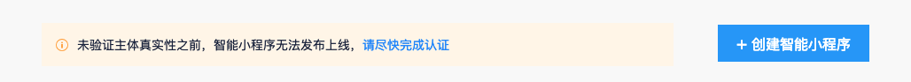

特别说明：该环节主要用于验证主体真实性，为不影响到开发进展，可暂时跳过此步骤直接<a href="/introduction/register_consummate/#%E5%AE%8C%E5%96%84%E5%9F%BA%E6%9C%AC%E4%BF%A1%E6%81%AF/">创建</a>小程序，并在小程序的开发过程中任意时间完成真实性认证即可，真实性认证状态将影响提交代码包及发布上线。

各主体类型对应验证方式

|主体类型|验证方式|
|---|---|
|媒体|企业媒体：对公验证； 组织媒体：对公验证or证照验证。|
|企业|企业：对公验证； 个体工商户：对公验证or法人人脸识别。|
|政府|对公验证|
|其他组织|对公验证或证照验证|

## 对公验证

1. 单击“对公验证”，进入对公打款页面。

2. 对公打款：填写企业对公银行开户信息。 

3. 登录查询银行对公账户回填正确的打款金额进行验证。   

## 证照验证

> 仅组织媒体、其他组织需要进行此步操作。

## 法人人脸识别

> 仅个体工商需要进行此步操作。

## 小程序优惠通道

1. 验证成功后单击“小程序优惠通道”。

2. 单击开通优惠通道，请于60天内完成至少一个小程序的发布。

 

