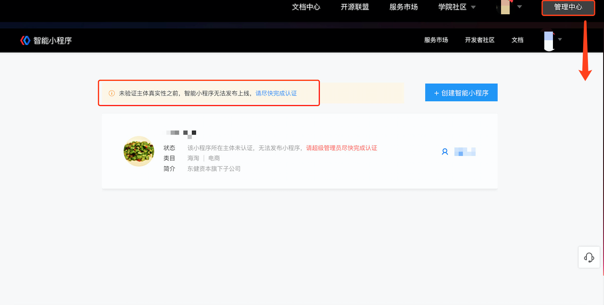
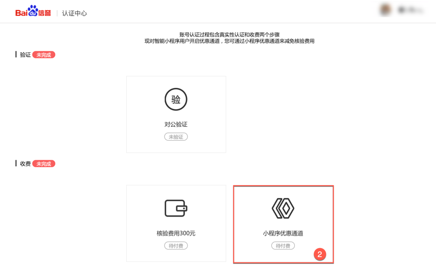
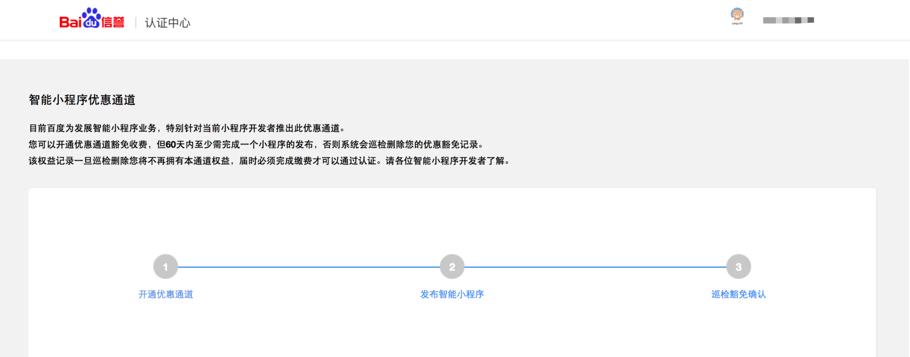

### 什么是真实性认证？
主体真实性认证是为确保智能小程序帐号信息的真实性、安全性，对企业/机构/媒体等主体进行的认证服务。

> 该环节主要用于验证主体真实性，为不影响到开发进展，可暂时跳过此步骤直接创建小程序，并在小程序的开发过程中任意时间完成真实性认证即可，真实性认证状态将影响提交代码包及发布上线。

真实性认证入口：[登录智能小程序平台](https://smartprogram.baidu.com/developer/index.html)，单击顶部导航『管理中心』进入小程序管理界面，如下图所示：

### 真实性认证步骤
1. 验证
2. 收费（小程序优惠通道）

## 验证
针对各主体类型的特性，提供以下不同的验证方式，可以根据主体特性任选一种：

|主体类型|验证方式|
|---|---|
|媒体|企业媒体：对公验证； 组织媒体：对公验证or证照验证。|
|企业|企业：对公验证； 个体工商户：对公验证or法人人脸识别。|
|政府|对公验证|
|其他组织|对公验证或证照验证|

#### 对公验证

1. 单击“对公验证”，进入对公打款页面。

2. 对公打款：填写企业对公银行开户信息。 

3. 登录查询银行对公账户回填正确的打款金额进行验证。   

#### 证照验证

> 仅组织媒体、其他组织需要进行此步操作。

#### 法人人脸识别

> 仅个体工商需要进行此步操作。

## 收费（小程序优惠通道）

1. 当前面向智能小程序的主体，提供了免费通道，单击“小程序优惠通道”即可。

2. 单击开通优惠通道后，请于60天内完成至少一个小程序的发布，否则系统会巡检删除优惠权益，届时必须完成缴费才可以发布小程序。

 

