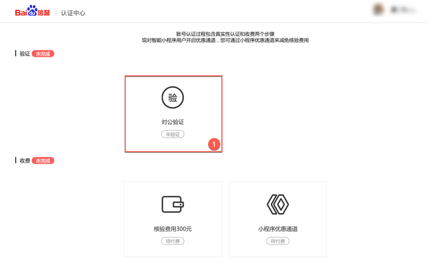
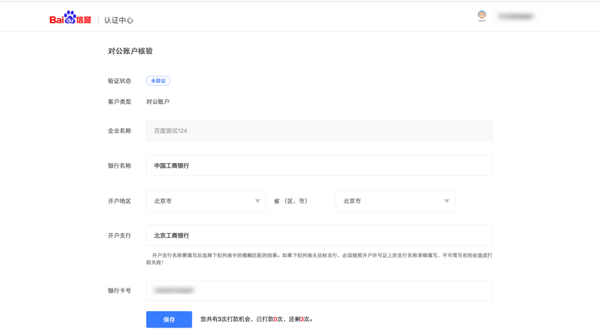
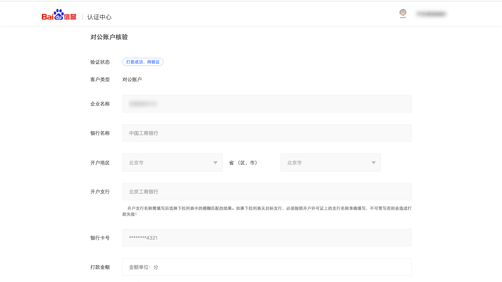
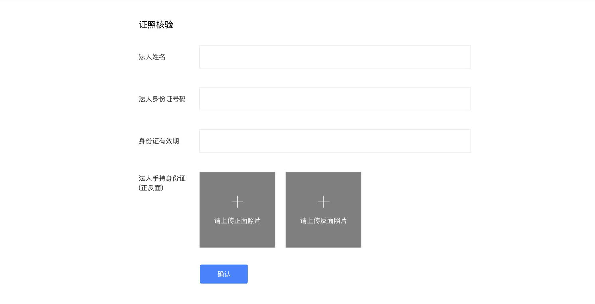
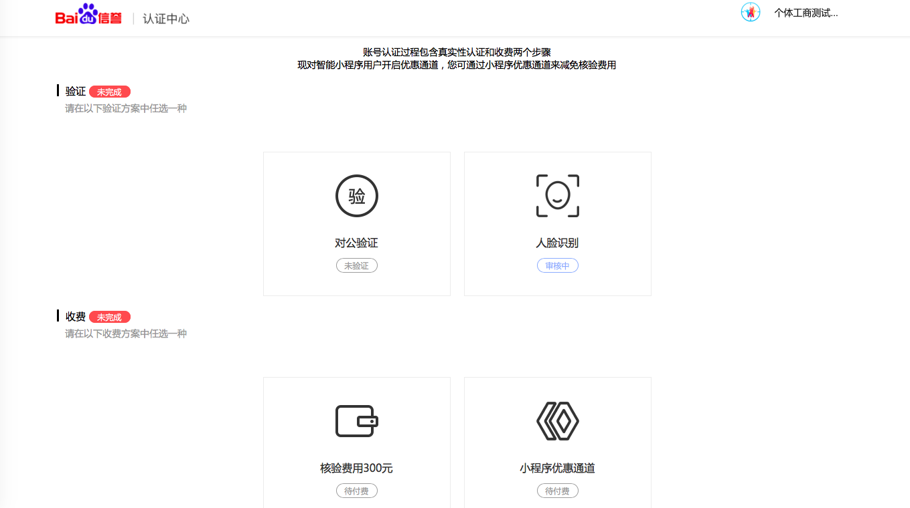
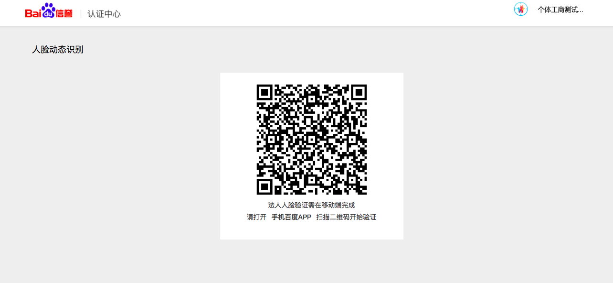

针对各主体类型的特性，提供以下不同的验证方式，可以根据主体特性任选一种：

|主体类型|验证方式|
|---|---|
|媒体|企业媒体：对公验证； 组织媒体：对公验证or证照验证。|
|企业|企业：对公验证； 个体工商户：对公验证or法人人脸识别。|
|政府|对公验证|
|其他组织|对公验证或证照验证|

#### 对公验证

1. 单击“对公验证”，进入对公打款页面。

2. 对公打款：填写企业对公银行开户信息。 

3. 登录查询银行对公账户回填正确的打款金额进行验证。   

#### 证照验证

> 仅组织媒体、其他组织需要进行此步操作。

#### 法人人脸识别

> 仅个体工商需要进行此步操作。

