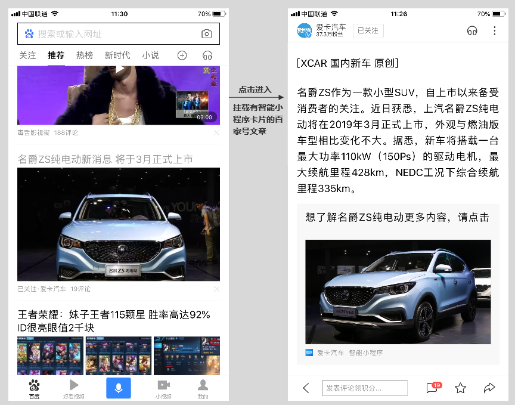

智能小程序为开发者提供了对接百度生态的能力，将百度百家号流量成功接入智能小程序，从而打造一个更加开放、互联互通的小程序生态。

## 接入方法

百家号作者可在文章发布时，在文内插入相关的智能小程序来获得展现机会。
在百度 App 用户从信息流、搜索等入口进入百家号文章页点击获得小程序分发。开发者只需要进行简单的配置工作，就可以在百家号平台发布带有智能小程序卡片的文章。

### 百家号与小程序的关联

目前开通熊掌号后，使用相同的百度账号开通百家号，智能小程序将被自动关联到百家号。
> 对于不同百度账号及不同主体的关联开放请关注平台后续通知。

### 形式

|形式|要求|
|--|--|
|图文大图|1.标题：不得超过 15 个汉字长度（含标点、符号、空格等）； 2.配图：jpg格式，`1044 * 585`； 3.Path。|
