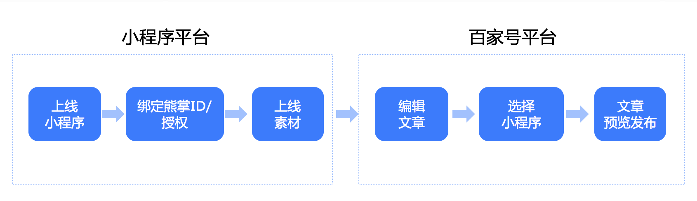
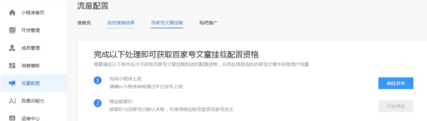
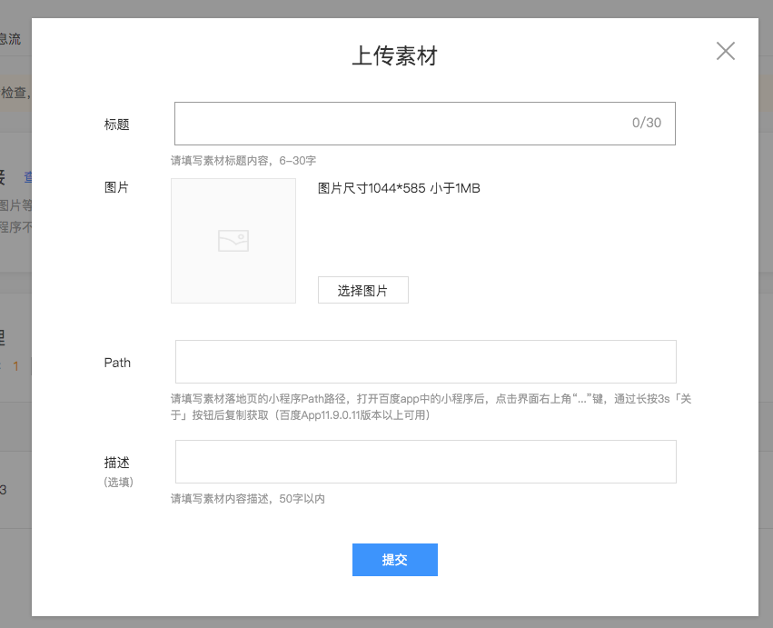
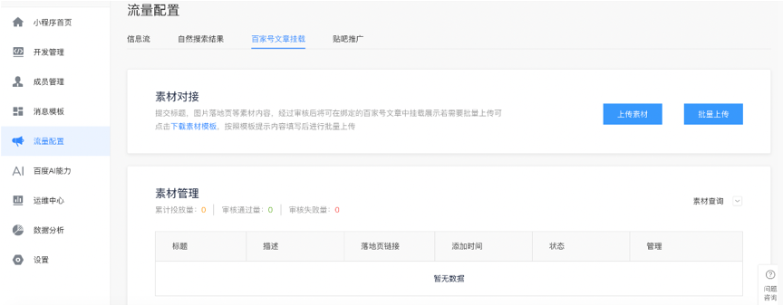
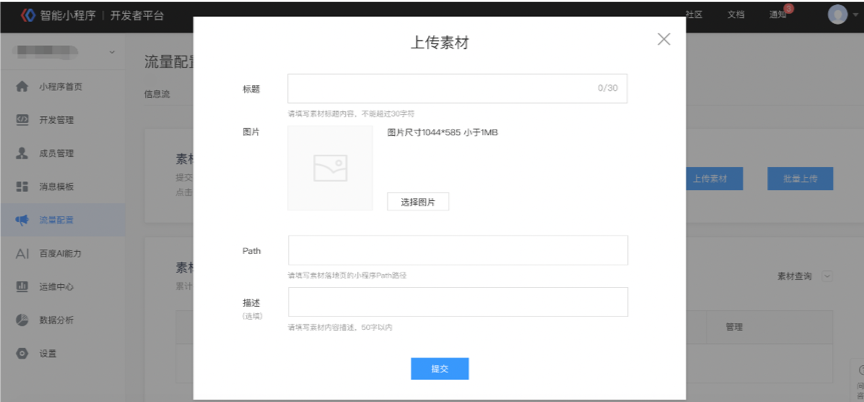
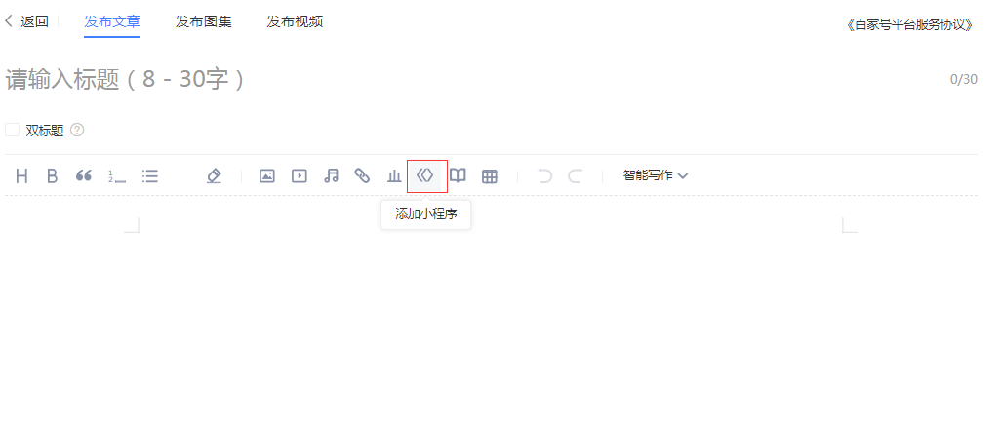
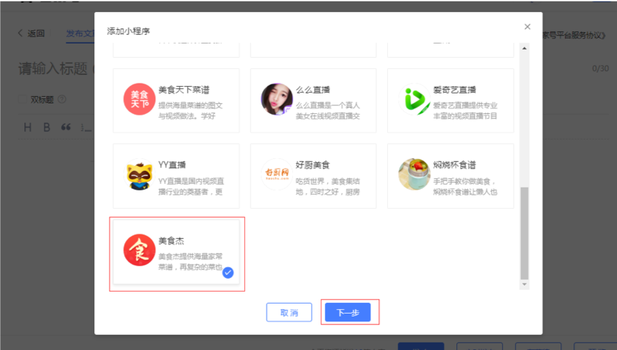
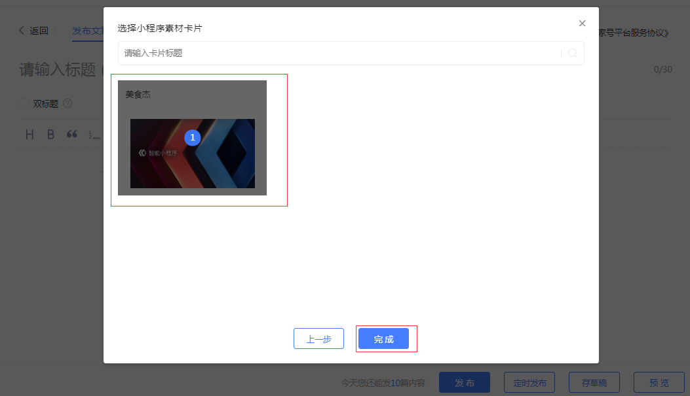

智能小程序为开发者提供了对接百度生态的能力，将百度百家号流量成功接入智能小程序，从而打造一个更加开放、互联互通的小程序生态。

在小程序平台完成“上线小程序 -> 绑定熊掌号 -> 上传素材”的操作后，在百家号平台完成“编辑文章 -> 选择小程序 -> 文章预览发布”即可完成百家号文章的挂载。

## 小程序平台操作流程
1. 完成小程序发布上线

2. 绑定熊掌号

3. 上传素材

4. 补充标题、图片、path和页面描述

## 百家号平台操作流程
1.  进入百家号后台点击发布文章，进入文章编辑页面，接着在工具栏找到并且点击“添加小程序”图标

2.  选中要添加的小程序

3.  选择小程序素材卡片之后点击完成

