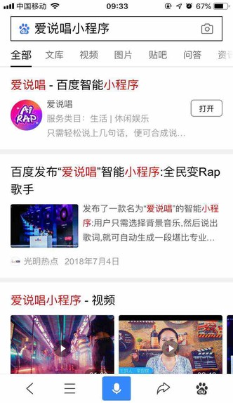
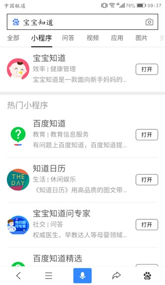
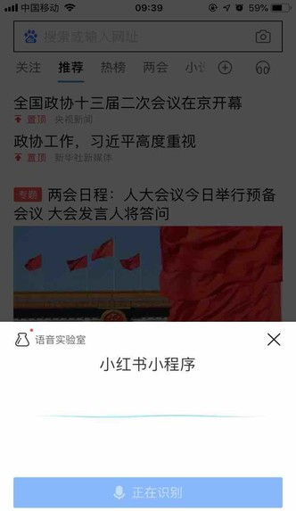
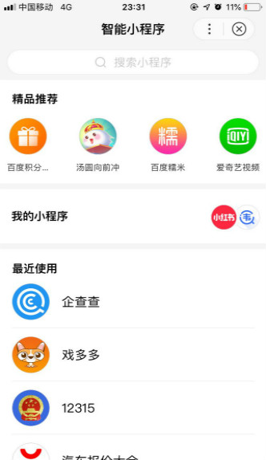

小程序发布上线后即可在线上拥有以下入口，上线即得无需申请
1、	**自然搜索-智能小程序单卡入口介绍：**
当用户在百度App（10.10或以上版本）搜索输入的关键词命中小程序的相关关键词（XXX小程序） 时，即会在搜索结果页中看到小程序的入口，点击可进入相关小程序，小程序从而获得曝光和流量。

2、	**自然搜索-智能小程序搜索tab入口介绍：**
当用户在百度App（10.10或以上版本）搜索输入的关键词命中小程序的相关关键词时，即会在搜索结果页小程序tab中看到小程序的入口，点击可进入相关小程序，小程序从而获得曝光和流量。

           
        
3、**自然搜索-语音直达入口介绍：**
当用户在百度App（10.11或以上版本）的语音入口语音输入的关键词命中小程序的相关关键词（XXX小程序）时，会直接进入对应的小程序，小程序从而获得流量。

 
4、**智能小程序搜索入口介绍：**
当用户在百度App（10.10或以上版本）首页顶部下拉进入二楼页面，点击二楼“更多历史”可进入智能小程序页面搜索。个人中心路径：“我的”-点击小程序横滑模块“…”进入智能小程序，在搜索框输入相关小程序名称后，点击搜索结果页会直接进入对应的小程序，小程序从而获得曝光和流量。

