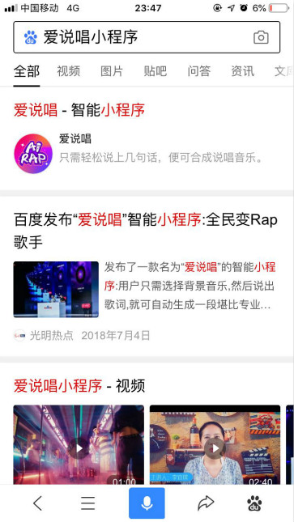
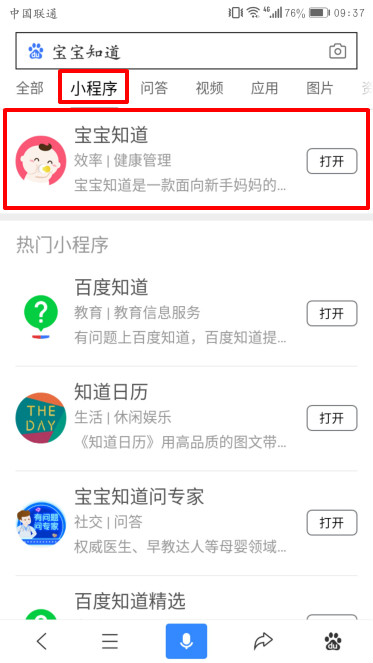
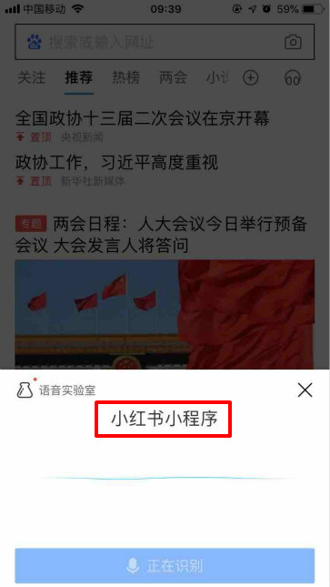
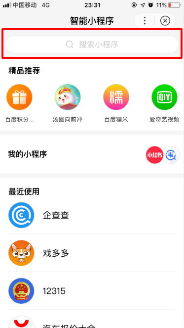
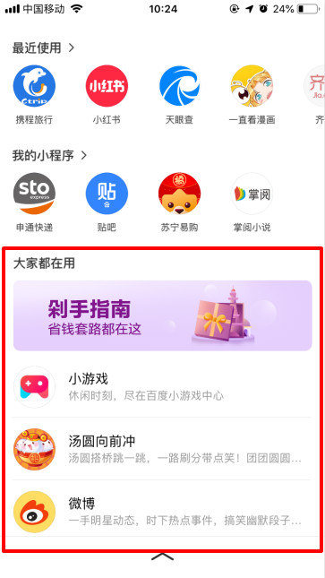
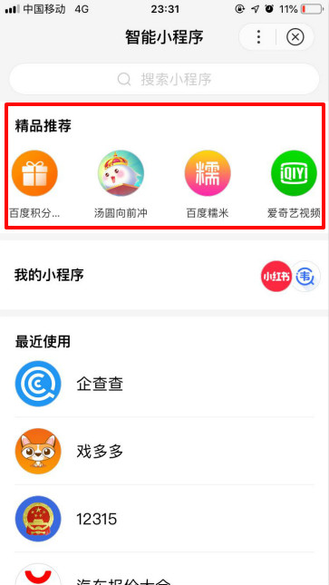
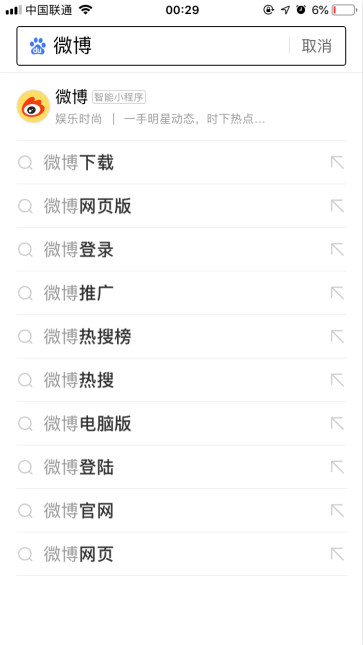

## 自然搜索-智能小程序单卡-初级卡

渠道说明：当用户在百度App（10.10或以上版本）搜索输入的关键词命中小程序的相关关键词（XXX小程序） 时，即会在搜索结果页中看到智能小程序单卡-初级卡的入口，点击可进入相关小程序，小程序从而获得曝光和流量。小程序单卡-初级卡不包含小程序相关子链，点击可直达小程序首页。

获取方式：该入口不需要开发者进行配置，小程序上线后自动获取。

    

        
    

    

        
    

    

        
    
     

## 自然搜索-智能小程序搜索tab

渠道介绍：当用户在百度App（10.10或以上版本）搜索输入的关键词命中小程序的相关关键词时，即会在搜索结果页小程序tab中看到小程序的入口，点击可进入相关小程序，小程序从而获得曝光和流量。

获取方式：该入口不需要开发者进行配置，小程序上线后自动获取。

    

        
    

    

        
    

    

        
    
     

## 自然搜索-语音直达

渠道说明： 当用户在百度App（10.11或以上版本）的语音入口语音输入的关键词命中小程序的相关关键词（XXX小程序）时，会直接进入对应的小程序，小程序从而获得流量。

获取方式：该入口不需要开发者进行配置，小程序上线后自动获取。

    

        
    

    

        
    

    

        
    
     

## 智能小程序-搜索

渠道说明：当用户在百度App（10.10或以上版本）首页顶部下拉进入二楼页面，点击二楼“更多历史”可进入智能小程序页面搜索。个人中心路径：“我的”-点击小程序横滑模块“…”进入智能小程序，在搜索框输入相关小程序名称后，点击搜索结果页会直接进入对应的小程序，小程序从而获得曝光和流量。

获取方式：该入口不需要开发者进行配置，小程序上线后自动获取。

    

        
    

    

        
    

    

        
    
     

## 二楼-大家都在用

渠道说明：当用户打开百度App（10.10或以上版本），在首页顶部下拉进入二楼，可在“大家都在用”模块看到相关小程序推荐，此模块可根据用户画像进行个性化推荐。该入口不需要开发者进行配置，

获取方式：小程序上线后将根据质量及体验自动获取。

    

        
    

    

        
    

    

        
    
     

## 个人中心-小程序推荐

渠道说明：当用户打开百度App（10.10或以上版本），点击“我的”进入个人中心，当用户此前从未在百度App使用过任一小程序时，会看到小程序推荐模块，此模块可根据用户画像进行个性化推荐。

获取方式：该入口不需要开发者进行配置，小程序上线后将根据质量及体验自动获取。

 

## 智能小程序-精品推荐

渠道说明：当用户打开百度App（10.10或以上版本），可在以下路径进入智能小程序页面，精品推荐模块会根据用户画像进行精准推荐。

•         二楼—点击“历史”进入智能小程序页面

•         我的-点击小程序横滑模块“…”进入智能小程序页面

获取方式：该入口不需要开发者进行配置，小程序上线后将根据质量及体验自动获取

    

        
    

    

        
    

    

        
    
     

## 自然搜索-搜索词推荐直达

渠道说明：当用户在百度App（10.11或以上版本）搜索小程序精准名称时，会在搜索框下方展现小程序相关入口，点击可直达相关小程序。

获取方式：该入口不需要开发者进行配置，小程序上线后将根据质量及体验自动获取

    

        
    

    

        
    

    

        
    
     

