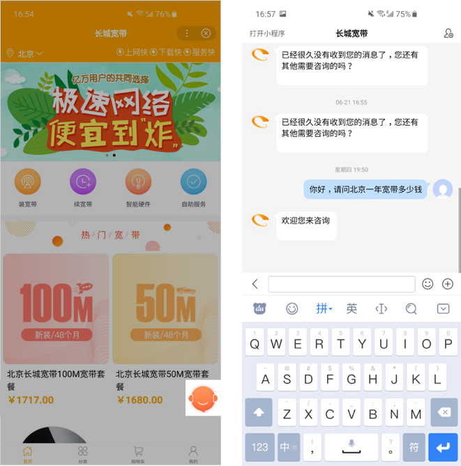
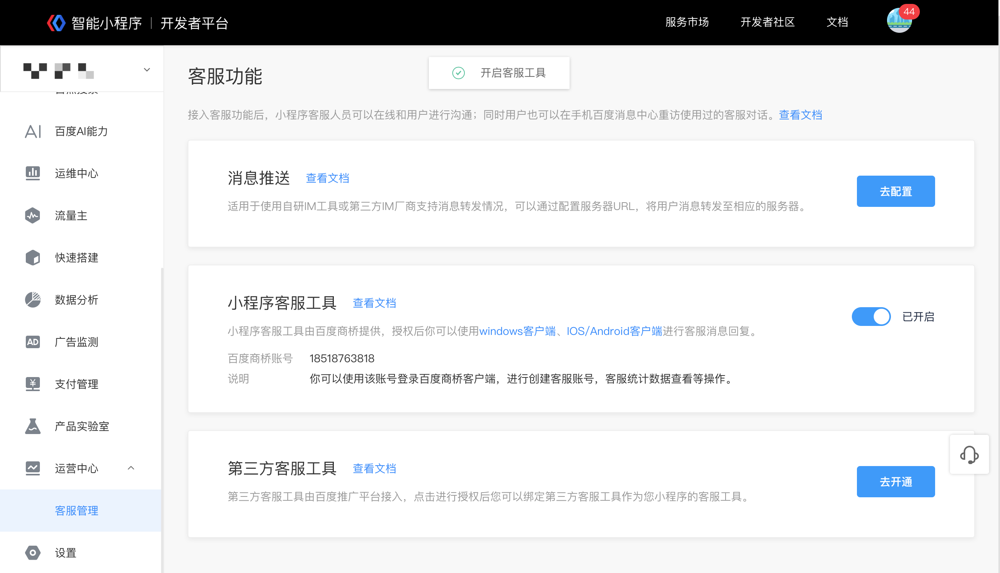

# 客服功能介绍

## 为什么要接入客服功能
百度为小程序提供了强大、易用的客服消息能力。一方面为小程序客服消息提供了多个入口，触达用户更高效；另一方面，小程序与用户的交互更高效，提升服务质量，提高转化。

### 多入口重访，让百度用户成为你的用户
**百度APP/私信页面更快触达用户：**百度APP的私信入口，对用户沟通过的客服消息聚合展示，用户可以在私信页面直接完成小程序重访。让百度用户成为你的用户。
**多入口快速跳转小程序主页：**用户可以在客服消息页面直接跳转至小程序主页，实现用户唤醒。

### 高效的用户转化
**挖掘用户兴趣点提升转化率：**客服功能扩展了与用户的接触时间，让运营能够在沟通中更便捷的了解用户，从而结合产品能力，更快更好的挖掘用户兴趣点，把潜在的用户转化成精准的用户，提高转化。
**用户沟通更有效：**通过客服功能，开发者不仅能够实时的与用户进行沟通，也能够及时了解用户基本情况与诉求，提高客服应对能力，打造服务口碑。

## 客服消息入口

1.   开发者在小程序内添加客服功能（参考[在页面中使用客服消息](http://smartprogram.baidu.com/docs/develop/serverapi/contact_api/#在页面中使用客服消息/)）后，用户可在小程序内唤起客服会话页面，给小程序发消息。

2.  已使用过的小程序客服消息会聚合显示在“百度APP-我的-私信”中，用户可以在此处查看历史客服消息，并给小程序客服发消息。

    

        
    

    

        
    
       

   

## 消息下发条件

当用户向小程序客服发送消息后，48小时内，小程序客服最多就该条消息向用户发送5条消息回复，可发送客服消息条数不累加。
用户每发送一条新消息，对小程序客服进行新的时间限制和条数限制，即重新开始计时，新的48个小时内小程序客服最多向用户发送5条消息回复。

 

## 消息支持的类型

目前不仅支持文本消息，也支持图片类型消息。

# 客服功能支持的接入类型

## 消息推送

### **简要原理** 
通过配置消息推送及调用发送客服消息接口进行消息上下行联通。
当用户给小程序客服发消息，百度的服务器会将消息的数据包（JSON或者XML格式）POST到开发者填写的URL。开发者收到请求后可以调用接口进行异步回复。
适用于使用自研IM工具或第三方IM厂商支持消息转发情况，可以通过配置服务器URL，将用户消息转发至相应的服务器。

### **消息推送配置流程** 

使用超级管理员或管理员权限登录开发者后台，点击“客服管理-消息推送-去配置”，按照页面提示进行配置。

### **接口调用** 

小程序[客服消息](http://smartprogram.baidu.com/docs/develop/serverapi/contact_api/)API文档。

## 小程序客服工具

### **简要原理** 
在开发者后台配置后，可以使用客户端进行客服消息回复。
小程序客服工具由百度商桥提供，授权后你可以使用windows客户端、IOS/Android客户端进行客服消息回复。
### **消息推送配置流程** 

使用超级管理员或管理员权限登录开发者后台，点击“客服管理-小程序客服工具-去开通"，即开始小程序客服工具开通流程。

如果您希望将已有的百度商桥账号作为小程序的客服账号，可以选择“绑定已有的百度商桥账号”。如果没有百度商桥账号，或想使用新的商桥账号进行小程序客服消息回复，点击“新建百度商桥账号”开通并使用。

### 新建百度商桥账号

如果您没有百度商桥账号，或想使用新的商桥账号进行小程序客服消息回复，可以选择此选项，并按照页面提示进行操作。

1、点击"新建百度商桥账号"。

2、系统会自动为您生成一个账号名/密码，可在当前弹窗内进行修改，修改并牢记账号密码后再点击“确定”键。
**注意：**请您牢记并保存好账号及密码，注意不要误触“确定”键，智能小程序不会存储您客服工具的密码。

3、账号创建成功并开启后，您可以下载百度商桥客户端进行配置客服等操作。

### 绑定已有百度商桥账号

如果您希望将已有的百度商桥账号作为小程序的客服账号，可以选择此选项。

1、点击"绑定已有的百度商桥账号"。

2、按照页面提示输入商桥账号及密码，校验成功后会自动绑定。

3、账号绑定成功并开启后，您可以在百度商桥客户端进行配置客服等操作。

### 小程序客服工具使用指南

将商桥账号和小程序进行绑定后，会按照小程序名称自动生成站点，您可以在商桥客户端进行小程序客服账号创建、客服消息回复、客服统计数据查看等操作。

## 第三方客服工具
### **简要原理** 
在开发者后台配置后，可以使用第三方客服工具进行客服消息回复。
第三方客服工具由百度推广平台接入，点击进行授权后您可以绑定第三方客服工具作为您小程序的客服工具。
### **消息推送配置流程** 
1. 使用超级管理员权限登录开发者后台，点击“客服管理-第三方客服工具-去配置"，即开始第三方客服工具配置流程。
> 仅超级管理员有权限进行此项配置。 

2. 在新跳转的页面选择想要绑定的第三方客服工具，点击"授权新账号"。

3. 输入第三方客服工具账号密码，完成授权，授权成功后，点击"确定"。

4. 在已经授权的客服工具账号里，选择一个与小程序进行绑定。

 

# **运营规范**

小程序客服消息使用除必须遵守《智能小程序平台运营规范》外，还不能违反以下规则，包括但不限于：

1. 不允许恶意诱导用户进行可能触发客服消息下发的操作，以达到可向用户下发客服消息目的。
2. 不允许恶意骚扰用户，下发与用户发送的消息无关或对用户造成骚扰的消息。
3. 不允许下发虚假夸大、违法类等恶意营销信息。
4. 不允许使用客服消息向用户下发色情、暴力等违反国家法律规定的信息。

