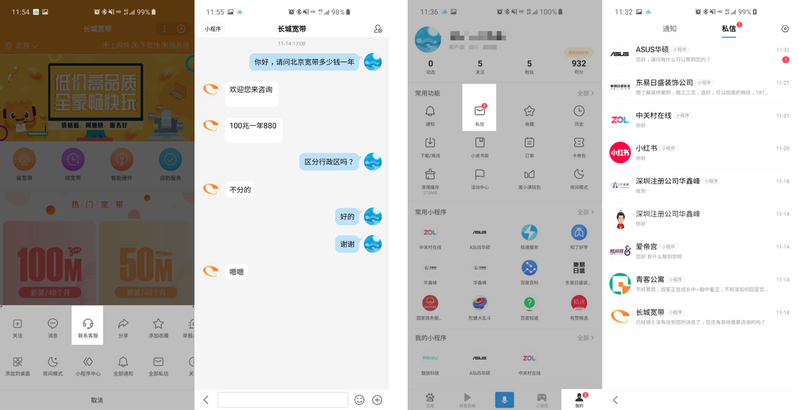
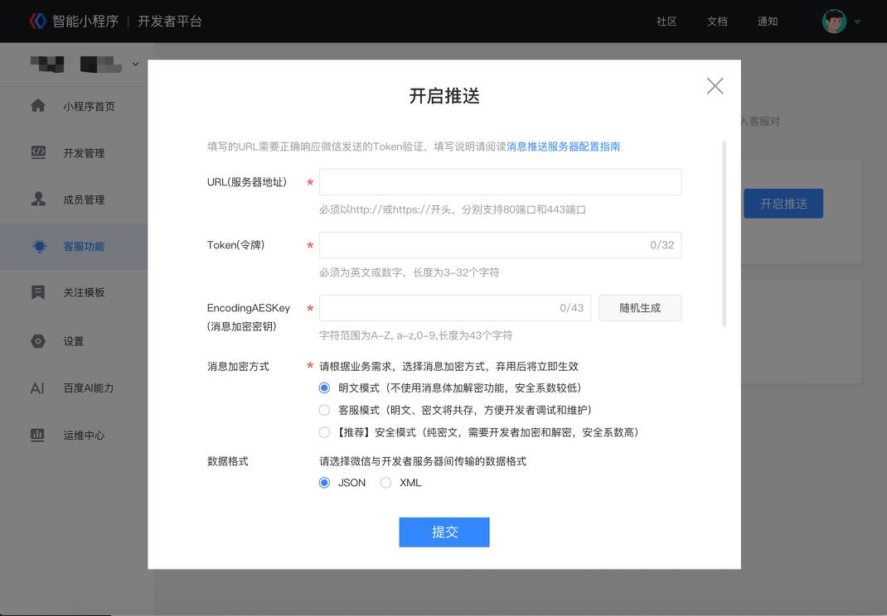

为丰富小程序的服务能力，提高服务质量，百度为小程序提供客服消息能力，客服能力可以便捷的连接用户与开发者，提升用户满意度。

## 客服消息入口

1.   开发者在小程序内添加客服功能（参考[在页面中使用客服消息](http://smartprogram.baidu.com/docs/develop/serverapi/contact_api/#在页面中使用客服消息/)）后，用户可在小程序内唤起客服会话页面，给小程序发消息；

2.  已使用过的小程序客服消息会聚合显示在手机百度消息中心 “小程序客服消息”文件夹内，用户可以在此处查看历史客服消息，并给小程序客服发消息。

    

        
    

    

        
    
    

   

## 消息下发条件

当用户向小程序客服发送消息后，48小时内，小程序客服最多可以向开发者发送5条消息，可发送客服消息条数不累加，上述用户动作会触发可下发条数及可下发时限的更新，可下发消息条数更新为当前可下发条数限制的最大值，有效下发时间限制也更新为最长有效时间。

 

## 消息支持的类型

目前支持文本及图片类型消息

## 客服支持的接入类型

目前仅支持消息转发：通过配置消息推送及调用发送客服消息接口进行消息上下行联通。我们将不断优化，支持更多类型的接入。

 

## **简要原理**

当用户给小程序客服发消息，百度的服务器会将消息的数据包（JSON或者XML格式）POST到开发者填写的URL。开发者收到请求后可以调用接口进行异步回复。

## **消息推送配置流程**

使用超级管理员或管理员权限登录开发者后台，点击“客服功能”，按照页面提示进行配置。

## **接口调用**

小程序[客服消息](http://smartprogram.baidu.com/docs/develop/serverapi/contact_api/)API文档。

 

## **运营规范**

小程序客服消息使用除必须遵守《智能小程序平台运营规范》外，还不能违反以下规则，包括但不限于：

1.  不允许恶意诱导用户进行可能触发客服消息下发的操作，以达到可向用户下发客服消息目的

2.  不允许恶意骚扰用户，下发与用户发送的消息无关或对用户造成骚扰的消息

3.  不允许下发虚假夸大.  违法类等恶意营销信息

4.  不允许使用客服消息向用户下发色情.  暴力等违反国家法律规定的信息

