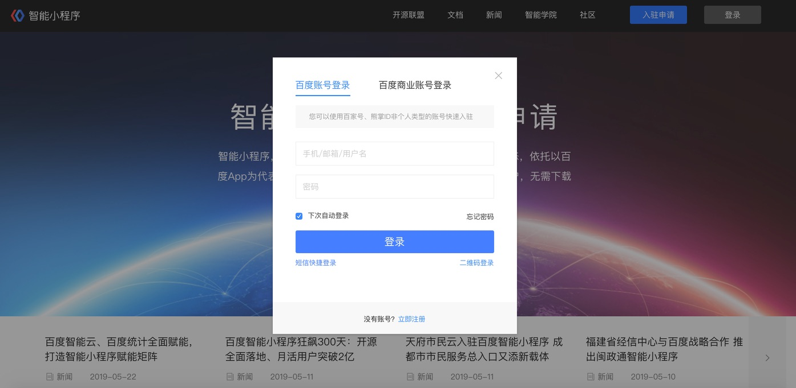
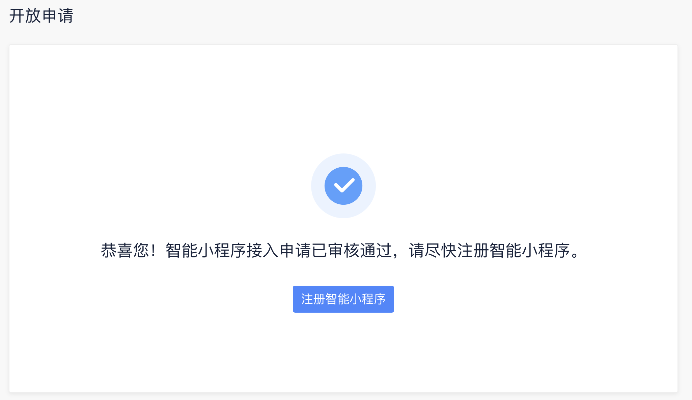

智能小程序，智能连接人与信息、人与服务、人与万物的开放生态，依托以百度 App 为代表的全域流量，通过百度 AI 开放式赋能， 精准连接用户，无需下载安装便可享受智慧超前的使用体验。

## 登录注册

- **入驻申请**：
1. 登录注册
   
   打开智能小程序[首页](https://smartprogram.baidu.com/mappconsole/main/login)，点击智能小程序首页右上方“入驻申请”按钮 。

    
2. 登录/注册百度账号
    目前支持手机短信、账号密码、二维码登录。
    > 如您已有企业熊掌 ID，可直接使用熊掌 ID登录名及密码直接登陆智能小程序即可，无需重新注册。

    

## 入驻申请

登陆后进入到入驻申请环节，请根据页面提示填写入驻问卷。
> 如您已通过其他渠道获取到邀请码，您可直接点击页面左上方链接输入邀请码后跳过入驻环节。

* **必填内容**：标有“*”内容均需仔细填写，信息需真实有效，否则审核将无法通过。
    

* **选填内容**：请根据实际情况如实填写，资料丰富度有助于提升您的入驻申请审核通过率。
    

* **入驻申请提交审核**：申请信息填写完毕后请等待审核结果，您将在24小时内收到审核结果。
    

* **申请被驳回**：信息不完整，可再次完善资料后进行提交。
    

* **申请被拒绝**：暂时不符合申请条件，无法再次提交，可等待正式开放后注册。
    

    > 如对入驻申请审核结果存在异议，请您与<a href="https://zhiqiu.baidu.com/imcswebchat/roulette/in?id=754&token=fd41n2l8t7eetr2lfnql4c5hv59pc45i&domainID=smartapp&type=2">客服</a>取得联系。

* **审核通过**：入驻申请审核通过后，点击“注册智能小程序”按钮进入下一步。
    