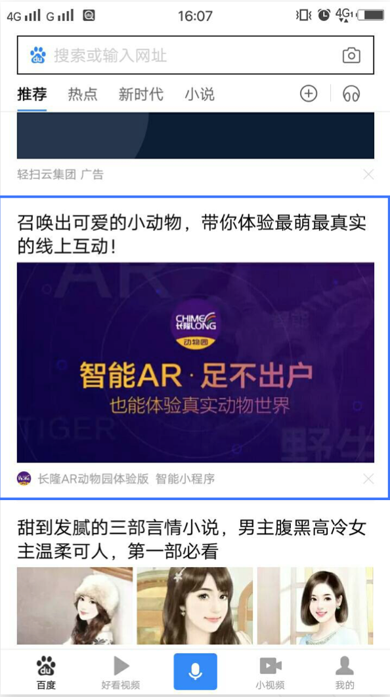
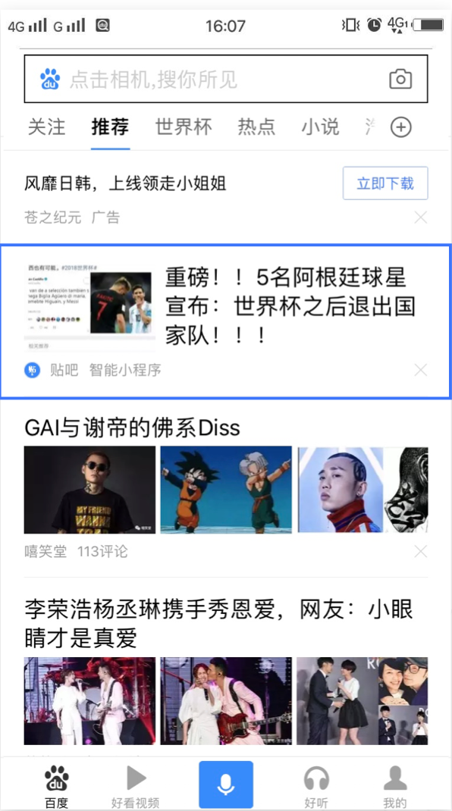
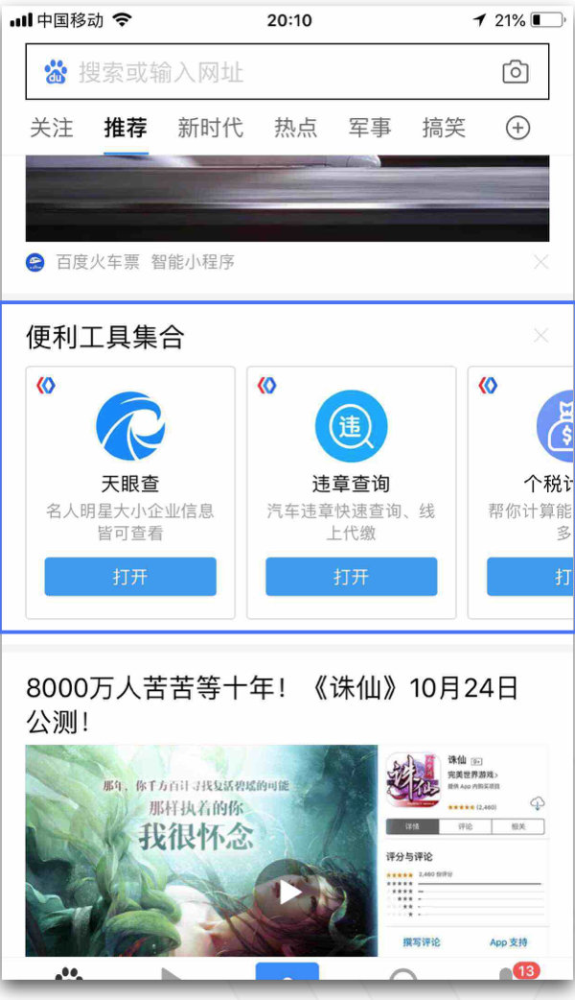
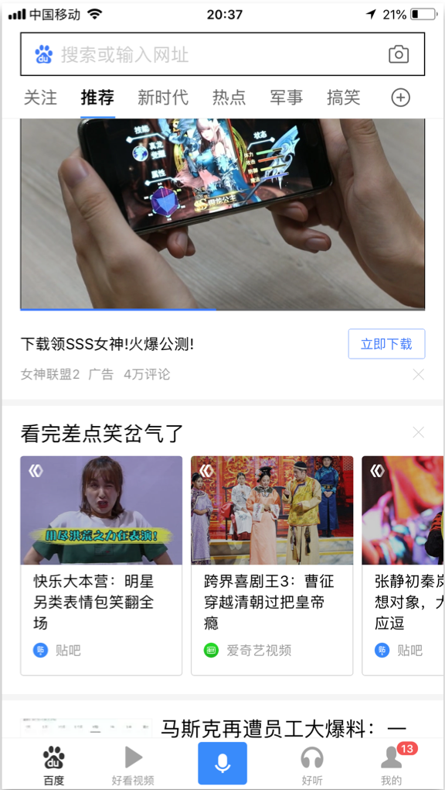

<!-- ## 信息流资源介绍

百度信息流是小程序能够免费获取的重要流量入口。当用户在百度 App（10.10.0或以上版本）中查看首页信息流时，百度信息流会根据用户属性、兴趣等个性化的推荐分发小程序的相关内容，从而使智能小程序的内容展现在信息流列表中。
开发者只需要进行简单的配置工作，就可以使自己开发的智能小程序被百度信息流收录、分发。

## 信息流分发样式
信息流投放为自然分发，获取的是自然用户流量。展示样式目前将由百度信息流决定。

	

	
	

	

		 
	

	

		 
	

	

	
	

	

		 
	

	

		 
	

 -->
智能小程序为开发者提供对接百度生态的能力，为智能小程序导入百度信息流流量，旨在打造更加开放、互联互通的小程序生态。

## 信息流接入
当用户在百度 App（10.10.0或以上版本）中查看首页信息流时，百度信息流会根据用户属性和喜好个性化的推荐分发小程序的相关内容，从而使智能小程序的页面出现在信息流列表中。开发者只需要进行简单的配置工作，就可以使自己开发的智能小程序被百度信息流收录、分发。
智能小程序在百度信息流投放的内容为原生内容，点击该内容将可进入小程序页面，包括大图，三图，左图右文，视频播放等样式。

### 收录
智能小程序被百度信息流收录的前提是：
1. 获取投放资格。需要开发者发送小程序基础信息（如小程序id，小程序名称等）至邮箱ext_sapp_dt@baidu.com  提交投放申请，从而获取具体接口信息
2. 开发者提交物料并被审核通过，建议开发者需要按照其素材的规范进行提交从而保证分发内容的质量。

### 形式
图文大图、视频大图、横滑卡片、左图右文等，具体参数如下：

|项|要求|
|--|--|
|图文大图|1.小程序名称
2. icon:`42 * 42`
3.标题：不得超过40个汉字长度（含标点、符号、空格等）
4.配图：jpg格式，`750 * 422`
5.Path
6.Appkey|
|视频大图|1.小程序名称
2. icon:`42 * 42`
3.标题：不得超过40个汉字长度（含标点、符号、空格等）
4.大图：`1140*642`
5.Path
6.退化小图：`372*246`|
|横滑卡片|1.小程序名称
2. icon:`42 * 42`
3.Path
卡片标题：不超过10个字
自卡片标题：不超过8个字
（根据模板不同可选）子卡片描述：不超过20个字
图片格式：jpg
图片尺寸：`456*306`|
|左图右文|1.小程序名称
2. icon:`42 * 42`
3.标题：不得超过40个汉字长度（含标点、符号、空格等）
4.配图：`218*146`
5.Path|
|百家号文章挂载|1.小程序名称
2. icon:`42 * 42`
3.标题：不得超过40个汉字长度（含标点、符号、空格等）
4.配图：`400*224`
5.Path|

### 分发
当智能小程序的素材被百度正常收录后，百度信息流将会按照素材的内容和相应的标签为其匹配合适的用户进行展示，从而实现个性化分发。
注：百度信息流投放为免费功能，获取到的是自然用户流量；素材展示的样式和用户目前将由百度信息流决定。

 

 

