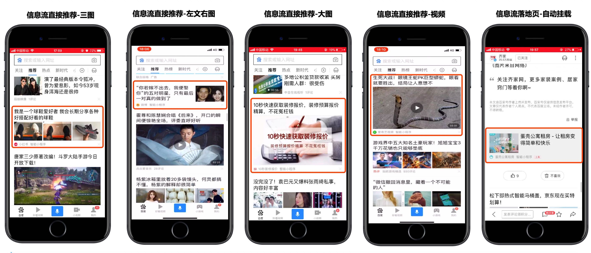

### 智能小程序信息流流量简介

* **对开发者：** 百度信息流流量是小程序开发者能够免费获取的重要流量入口之一，智能小程序为开发者提供上传素材入口，从而为开发者实现将小程序内容接入百度信息流流量的能力，开发者只需要进行简单的配置工作，就可以使自己的智能小程序内容被百度信息流收录及分发。

 

* **对百度用户：** 在百度app中查看首页信息流时，百度信息流会根据用户属性、兴趣等个性化的推荐分发智能小程序的相关内容，从而使用户得到更加精准的服务推荐。

 

 

 

### 信息流流量样式示例

>小程序接入信息流流量属于自然分发，获取的是自然用户流量，展示样式由百度信息流决定，开发者仅需要提供素材即可。

 

