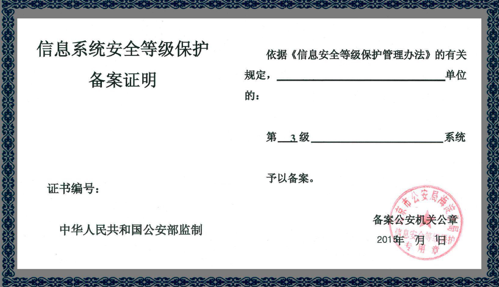

---
title: 获取用户手机号权限申请
header: introduction
nav: book
sidebar: getphonenumber
---

### 申请条件
已完成认证的企业账号。

### 申请入口
登录[开发者平台](https://smartprogram.baidu.com/developer/index.html)，通过小程序后台-设置-开发设置-获取用户手机号权限申请，申请获取用户手机号权限。

### 申请材料

企业注册资本、行业口碑、信息安全等级证书、手机号使用场景等。
 
* 企业注册资本，比如：50万

* 行业口碑：申请获取用户手机号权限企业需具备良好的行业口碑：申请企业需无不良信用记录。

    [国家企业信用信息公示系统查询](http://www.gsxt.gov.cn/index.html查询)

    [企业失信黑名单查询](http://zhixing.court.gov.cn/search/)

* 信息安全等级证书示例：

 

* 手机号使用场景：目前仅支持使用手机号登录、填写收货联系方式，如有其它使用场景，请详细说明。

> 申请说明：您的小程序内需包含用户隐私政策说明，完善的客服售后机制，否则影响您的小程序上线。
