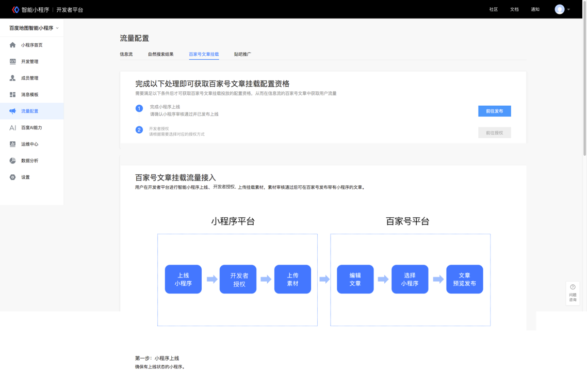
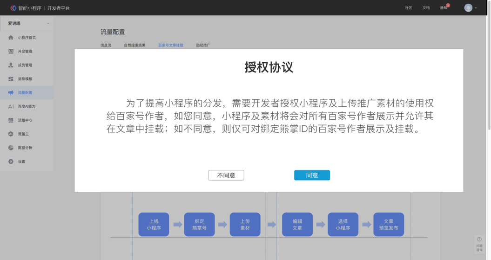
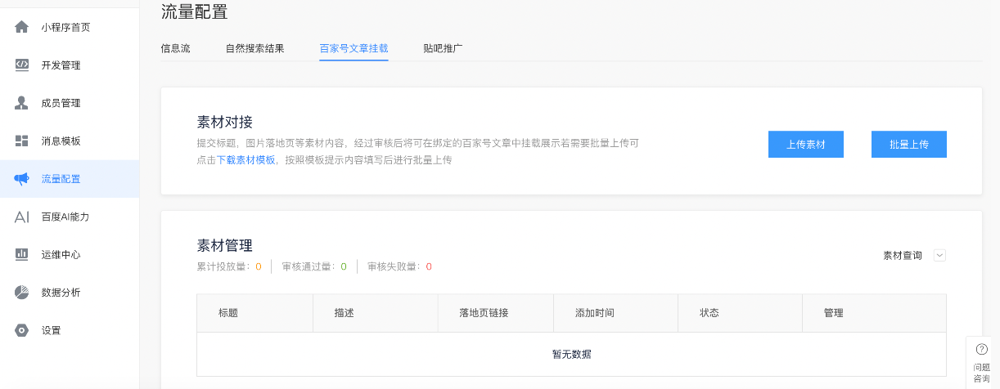
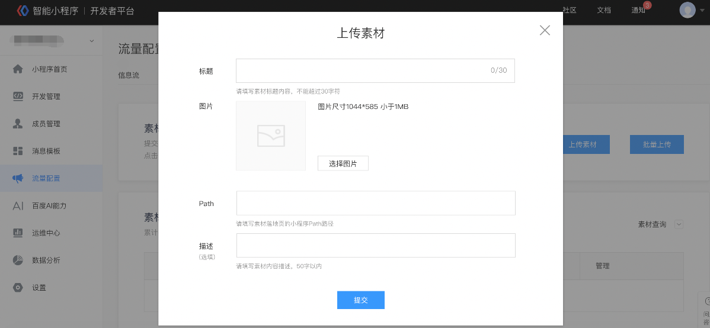

# 百家号作者发文挂载智能小程序

 

百家号作者发文挂载智能小程序，是开发者通过普通作者挂载自己小程序来获取更多流量的新流量获取方式。开发者只需在平台上传并授权给作者开放小程序挂载卡片物料，就可以将自己的小程序提供给写相关内容的作者进行挂载，从而获得流量。依托此功能，开发者可以获取到更开放的流量。

 

## 入口介绍：

挂载智能小程序的文章通过信息流进行展现

信息流展现——点击进入文章——点击文中插入的小程序卡片进入小程序

百家号挂载入口图

 

 

## 接入方法：

1. 完成小程序发布上线，前往授权：

 

 

2. 完成授权：（授权状态不可更改，请慎重选择）

* 当开发者选择『同意』授权时，授权状态为：全部开放

* 当开发者选择『不同意』授权时，授权状态为：向绑定熊掌ID的号开放

 

 

3. 上传素材

 

4. 补充标题，图片，path和页面描述（选填）

  