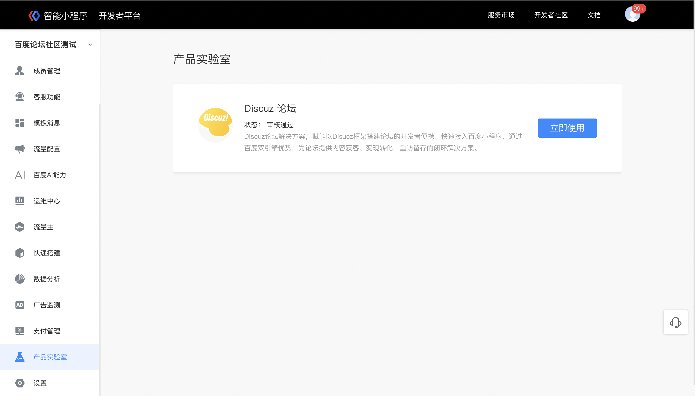
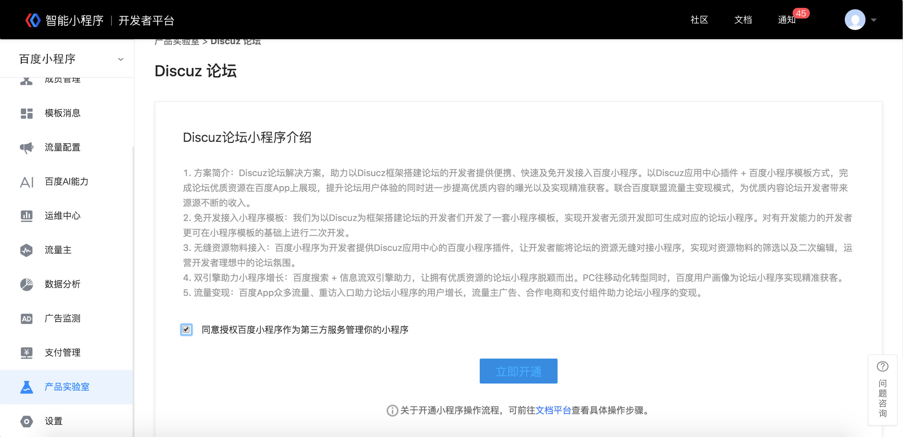
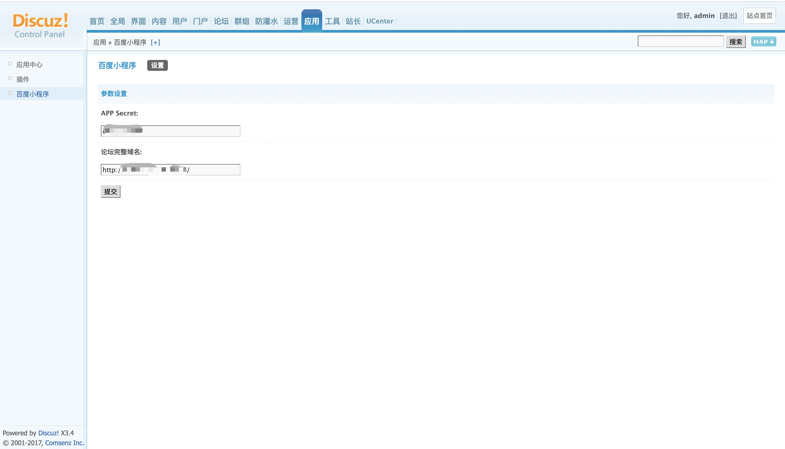
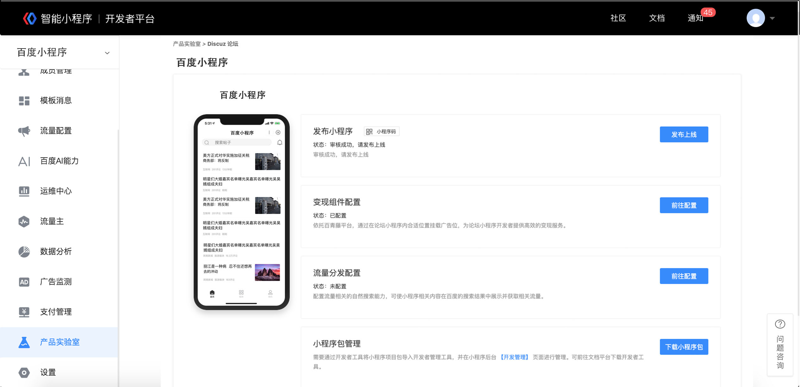

## 开通条件 

注册以及创建小程序请参考 [智能小程序注册指导文档](https://smartprogram.baidu.com/docs/introduction/enter_application/)。

 

## 登录小程序平台

登录小程序平台，点击“产品实验室”模块。
> 产品实验室模块目前只有少数合作伙伴在小程序后台可见。

 

 
## 开通使用Discuz论坛百度小程序

阅读用户协议后并勾选，点击“立即开通”，并根据页面提示操作。

	
1.  Discuz数据对接流程
    1.1.  输入Discuz论坛的完整域名，以及小程序的App Secret。填完后下载“配置文件”，解压后打开README文件，根据README文件内容提示进行操作。

    > App Secret请前往 『设置』-『开发管理』获取。
    请务必按照README文件部署“bd_mapp_domaimcer”、“discuz-miniapp-plugin”到服务器。
        
    

    1.2. 黏贴完“discuz-miniapp-plugin”到服务器后，请用管理员账号登录论坛，打开管理中心，在『应用』-『插件』中找到“百度小程序”，依次安装、启用后，根据“百度小程序”插件页面提示填写小程序的App Secret。

    > 请在插件页面先在『未安装的插件』里找到“百度小程序”点击安装，再到『未启用的插件』里找到“百度小程序”点击启用，在『已启用的插件』里找到“百度小程序”，点击设置，输入App Secret。
    注意：每次在小程序后台重置App Secret后，都需要到此重新黏贴最新App Secret。

    

    1.3. 在“百度小程序”中填写完数据后返回Discuz论坛开通页，点击“配置完成”即可进入Discuz小程序管理页面。

    > 只有在数据对接成功后，点击“配置完成”才能成功进入Discuz小程序管理页面。若不能成功进入管理页面，请重新检查配置文件是否操作正确。

    

2.提交小程序审核
 进入Discuz小程序管理页面，点击“提交审核”，即可将小程序包上传至后台审核，同时可用百度App扫描二维码预览小程序。

> 审核通过后，在页面点击“发布上线”，即可将小程序发布到线上。
若审核失败，在页面上可点击“重新提交”，或咨询客服。

