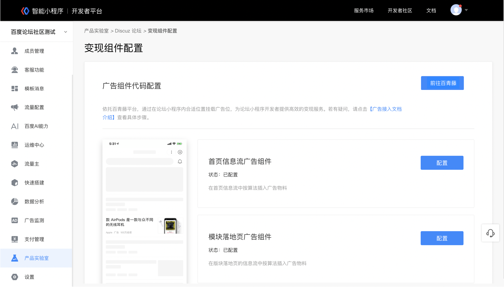
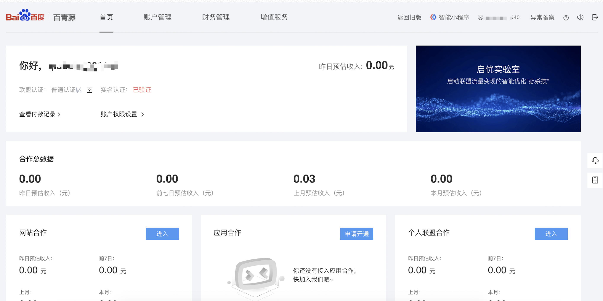
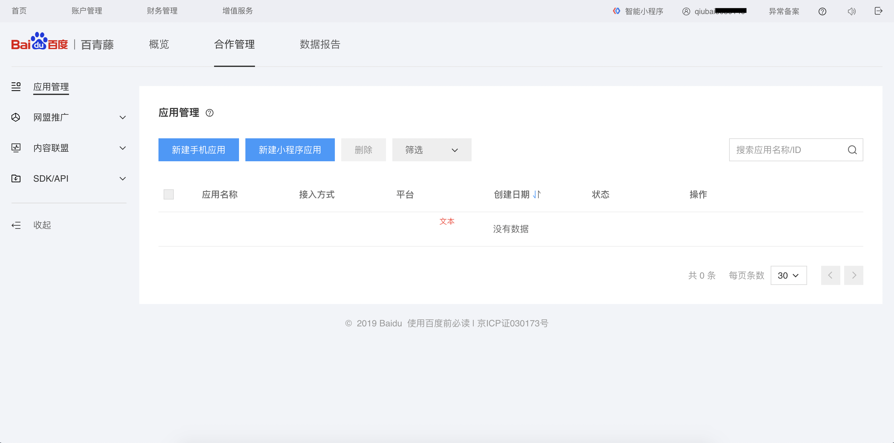
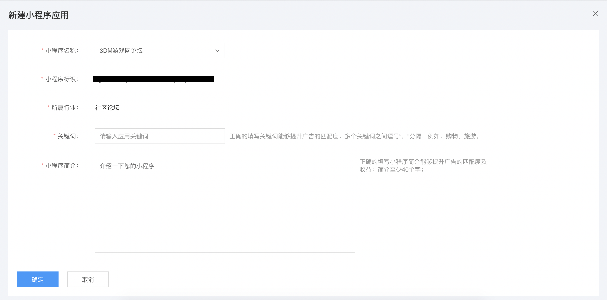
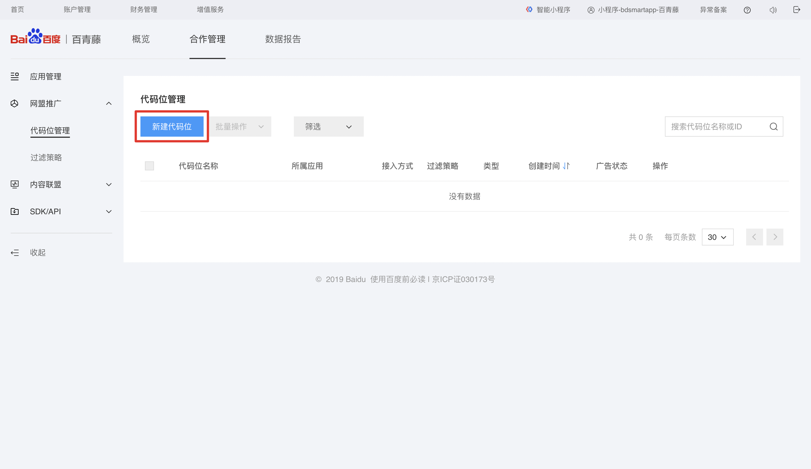
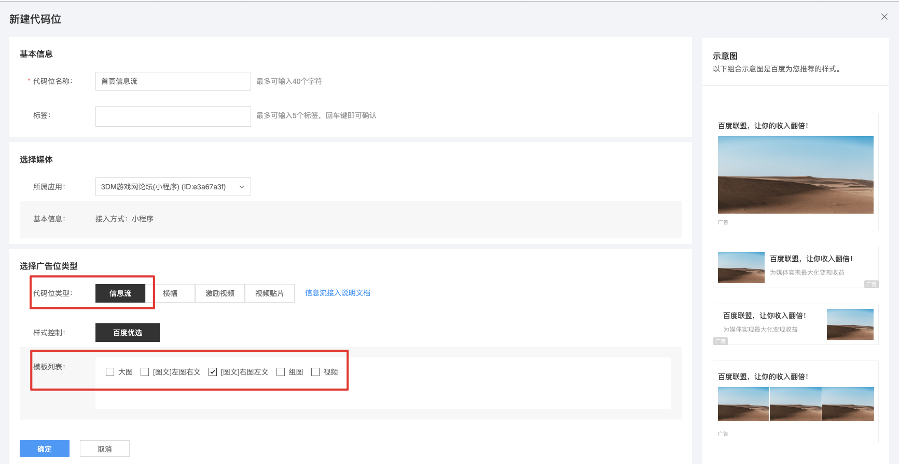
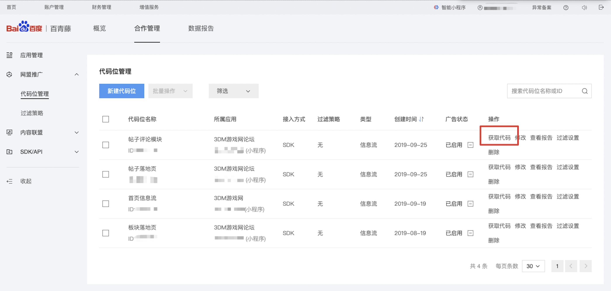
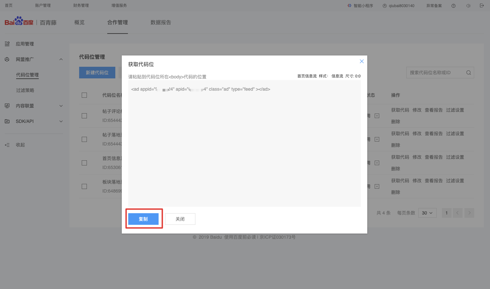
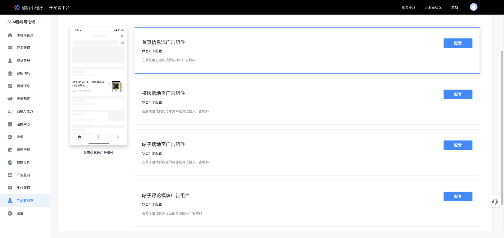
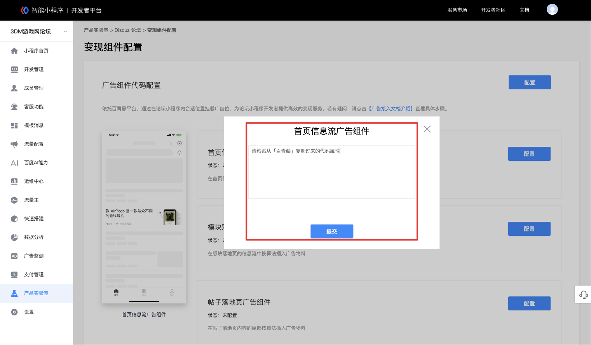

 

## 流量主介绍

Discuz!小程序模板支持接入百青藤平台广告组件，帮助接入模板的开发者们更好地变现。

## 开通条件

小程序流量主功能已全量开放。目前暂不支持政务民生、公益、公共医疗类小程序接入流量主。

## 开通小程序流量主

通过Discuz! 论坛管理页面进入变现配置页面，点击 **广告组件代码配置模块** 中的<前往百青藤>按钮，跳转百青藤页面进行账号的开通，百青藤流量主的开通详看 [流量主开通指引](https://smartprogram.baidu.com/docs/introduction/adopen/)

## 进入百青藤平台代码位管理

1. 跳转进入百青藤平台管理后台，点击应用合作模块中“申请开通”按钮。

2. 新建小程序应用
进入<合作管理-应用管理>模块，点击<新建小程序应用>按钮。按照要求填写小程应用信息。

3. 创建代码位
创建小程序应用成功后，点击“继续新建代码位”按钮。按照要求创建广告代码位。

>   目前小程序支持的广告样式包括：banner广告、信息流广告。选择所属小程序后，即可预览广告样式。

## 复制代码位到Discuz!变现管理页面
1. 选择代码位类型为“信息流”。
2. 按Discuz!变现管理页面中左侧的示意图新建对应样式的代码位。
> 首页信息流、板块落地页两个模块的广告组件代码位样式只勾选“[图文]右图左文”；帖子落地页、帖子评论模块的广告组件代码位样式只勾选“大图”。

3. 新建代码位成功后，点击“获取代码”，复制代码。

4. 回到Discuz!论坛变现配置页面，在对应的栏目上点击“配置”按钮，粘贴代码位。

> 为了能让用户获得更好的浏览体验和让广告获取更多的点击，请配置建议的广告代码位类型和样式。代码粘贴提交后，可重复编辑修改。

## 提现操作

完成“新建小程序应用”操作后，在百青藤首页点击实名认证，完成实名认证后，即可每月进行提现。

## FAQ

百青藤流量主平台开通FAQ请查看 [百青藤流量主平台开通FAQ](https://smartprogram.baidu.com/docs/introduction/adopen_feedback/)；