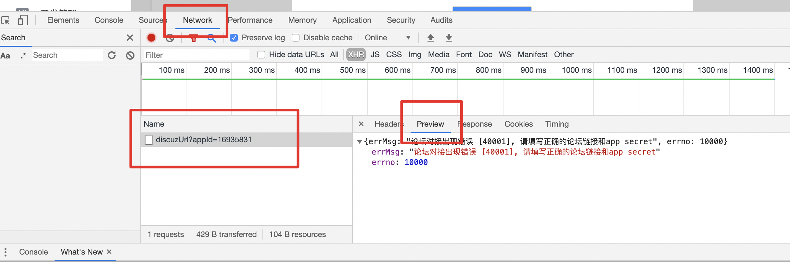

## 一、前提条件


 - 论坛版本：目前仅支持 Discuz! x3.4；
 -  论坛编码：支持 utf-8 和 gbk 两种编码，请安装对应编码的插件；
 -  服务器运行系统：支持 linux 系统及其衍生系统，如 CentOS，不支持 Windows 系统；
 -  PHP 版本：支持 PHP 版本 5.3 及以上；

## 二、接入前，数据对接失败如何处理？
 

**1、数据对接时提示报错『论坛域名或App secret校验失败』。**

1）确保你已经在"论坛-管理中心-应用-插件"中安装了插件并填写了App Secret和论坛域名；
2）论坛域名后需添加"/"， 如: https://www.baidu.com/。
3）确保两端填写的App Secret和论坛域名保持一致。
4）请在两端填写最新的App Secret，若你已经开通成功并进入下一个页面，请不要重置你的App Secret；

**2、检查第三方平台授权信息：**
请检查“设置-第三方服务”中是否有授权除“百度小社区平台”之外的其他第三方平台，若有，请取消其授权。

**3、检查插件是否安装成功：**
若放置插件目录到服务器处理完后，在Discuz!论坛管理中心未发现"百度小程序" 安装选项，原因为<百度小程序>插件目录未赋予777权限。请进入服务器，进入"论坛目录/upload/source/plugin"，执行以下命令：
```
chmod -R 777 baidusm_smartprogram
```
**4、检查是否新建数据表：**
用数据库管理员账号进入你的论坛数据库，查找数据库中是否有两个数据表: pre_swan_app_config 和 pre_login_token，如果没有，请打开SQL手动建表窗口，输入以下语句：

1）如果是你utf-8编码的论坛，语句为：
```
CREATE TABLE IF NOT EXISTS `pre_swan_app_config` (
  `id` mediumint(8) unsigned NOT NULL AUTO_INCREMENT，
  `ad_config` text NOT NULL，
  `is_effect` tinyint(1) NOT NULL DEFAULT '1'，
  `update_time` int(10) unsigned NOT NULL DEFAULT '0'，
  `create_time` int(10) unsigned NOT NULL DEFAULT '0'，
  PRIMARY KEY (`id`)
) ENGINE=MyISAM AUTO_INCREMENT=2 DEFAULT CHARSET=utf8;


CREATE TABLE IF NOT EXISTS `pre_login_token` (
  `id` mediumint(8) unsigned NOT NULL AUTO_INCREMENT，
  `uid` mediumint(8) unsigned NOT NULL，
  `username` char(15)  NOT NULL，
  `token` varchar(150)  NOT NULL，
  `is_effect` tinyint(1) NOT NULL DEFAULT '1'，
  `expire_time` int(10) unsigned NOT NULL，
  `update_time` int(10) unsigned NOT NULL DEFAULT '0'，
  `create_time` int(10) unsigned NOT NULL DEFAULT '0'，
  PRIMARY KEY (`id`)
) ENGINE=MyISAM AUTO_INCREMENT=2 DEFAULT CHARSET=utf8;
```
2）如果是你gbk编码的论坛，语句为：
```
CREATE TABLE IF NOT EXISTS `pre_swan_app_config` (
  `id` mediumint(8) unsigned NOT NULL AUTO_INCREMENT，
  `ad_config` text NOT NULL，
  `is_effect` tinyint(1) NOT NULL DEFAULT '1'，
  `update_time` int(10) unsigned NOT NULL DEFAULT '0'，
  `create_time` int(10) unsigned NOT NULL DEFAULT '0'，
  PRIMARY KEY (`id`)
  ) ENGINE=MyISAM AUTO_INCREMENT=2 DEFAULT CHARSET=gbk;
  
CREATE TABLE IF NOT EXISTS `pre_login_token` (
`id` mediumint(8) unsigned NOT NULL AUTO_INCREMENT，
`uid` mediumint(8) unsigned NOT NULL，
`username` char(15)  NOT NULL，
`token` varchar(150)  NOT NULL，
`is_effect` tinyint(1) NOT NULL DEFAULT '1'，
`expire_time` int(10) unsigned NOT NULL，
`update_time` int(10) unsigned NOT NULL DEFAULT '0'，
`create_time` int(10) unsigned NOT NULL DEFAULT '0'，
PRIMARY KEY (`id`)
) ENGINE=MyISAM AUTO_INCREMENT=2 DEFAULT CHARSET=gbk;
```
5、建完表，请清理论坛缓存。

6、完成以上操作后，若仍然数据对接失败：
1）请进入服务器查看业务日志，是否有设置域名和App Secret的日志，如果没有，请检查网络后重新点击Discuz!论坛数据对接页面<确认开通>按钮。日志目录如下:

> Path-to-DiscuzX/upload/data/log/201907_swan.log， 

文件内容如下：
```
<?PHP exit;?> 2019-06-27 12:07:40 220.181.38.113 0 /plugin.php?action=selt&id=baidusm_smartprogram&mod=config&sign=ac789096e51e5b50a2583420455e86f81 
set SECRETKEY =uFCm8VI********fnKAwQSkLTuy

<?PHP exit;?> 2019-06-27 12:07:40 220.181.38.113 0 /plugin.php?action=selt&id=baidusm_smartprogram&mod=config&sign=ac789096e51e5b50a2583420455e86f81 
set DOMAIN =https://www.******.cn
```


2）查看webserver的访问日志和错误日志，把相关日志（访问日志、服务器错误日志、业务日志）及以下信息打包发给百度官方运营。打包文件命名<DZ接入反馈+小程序名称>，打包内容包括：

- 相关日志（日志中相关密码信息可酌情打码）
- 小程序后台Discuz!论坛数据对接页面截图（需含有填写的信息，可酌情打码）
- 在开通页面打开浏览器开发者工具(Mac快捷键 command+option+i;Windows快捷键F12)，定位到，截图以</discuz/data/discuzUrl?appId=xxxxxx>接口请求返回的内容页面，如图：




- 论坛插件中心百度小程序插件截图（需含有填写的信息，可酌情打码）；
- 其他信息（个人信息整理成txt文件，命名为README.txt，包含以下内容：小程序App id、小程序名称、论坛域名、论坛编码、服务器系统类型、PHP版本、小程序管理中心登录账号及密码、QQ号、手机号。另外，插件需打包成zip压缩包文件。）

## 三、接入后


**1、<小手机>上无数据展示**
首先要确保你的Discuz!论坛有帖子内容。若有，请确保Discuz!论坛编码格式、插件的编码格式和服务器编码格式一致，否则，请自行将三端的编码格式设置成一致。

**2、⾸页帖⼦流中图片未正常展示**
<问题描述>：信息流中有图片占位、但无图片；或帖子详情页中有图片，信息流列表中无占位图。

<解决方案>：部分开发者将图片存储在二级域名，目前插件为通用版，导致图片无法正常展示。您可以先替换图片域名，更改图片路径后，尝试是否能正常访问。如仍有问题，可联系百度官方运营提供解决方案。

## 四、审核失败


若提交审核未通过，请按照审核反馈修改，确保符合以下条件后再次点击<重新提交>：

- 论坛网站不含有涉政、黄赌毒等违反小程序规定的内容
- 确保论坛网站帖子内容、版块数量合理（不能过少）
- 论坛小程序名称设置合理

>为了降低被审核误判的风险，可多尝试几次重新提交。若屡次提交审核都未通过，可联系百度官方运营。

## 五、更新流程
 

如需更新Discuz!小程序，一般需要同步更新小程序模版和插件，如果仅更新小程序模版/插件，可能会导致小程序的使用出现问题。

**1、插件更新：**
1）可前往Discuz!插件中心，检查是否有新版本；
2）或者在Discuz!论坛小手机页面，点击右上角的信息设置按钮，通过下载配置文件，用新的插件替换旧的插件，将新的插件重新部署到服务器，即可完成更新操作。

**2、小程序模版包更新**
在Discuz!论坛小手机页面，若检测到新版本，会出现更新栏，点击<立即更新>按钮，即可使用新的小程序模版包，并提交审核，审核通过后即可发布上线，完成小程序模版的更新。

## 六、联系方式


- [站长互助专区](https://bbs.zhanzhang.baidu.com/forum-118-1.html)
- [百度小程序反馈平台](https://smartprogram.baidu.com/forum/)

