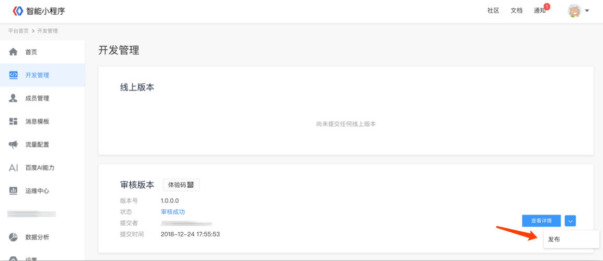

### 上线前准备
提交审核前需确保完成以下2个步骤，否则小程序将无法提交代码包及发布上线。
1.	<a href="http://localhost:4000/docs/introduction/authenticity/#%E5%AF%B9%E5%85%AC%E9%AA%8C%E8%AF%81/">真实性认证</a>审核通过 
2.	服务类目审核通过 

#### 在开发者后台可点击“发布”按钮完成小程序上线发布操作。

