## 什么是小程序自然搜索？
**对开发者**：智能小程序为开发者提供对接百度搜索生态的能力，为智能小程序导入搜索流量，旨在打造更加开放、互联互通的小程序生态。

**对百度用户**：在百度搜索结果页中，当智能小程序某页面被正常检索到，其展现形式和普通网页相同，用户在百度App（10.10或以上版本）点击该条搜索结果，即可打开智能小程序。

**自然搜索结果示例**
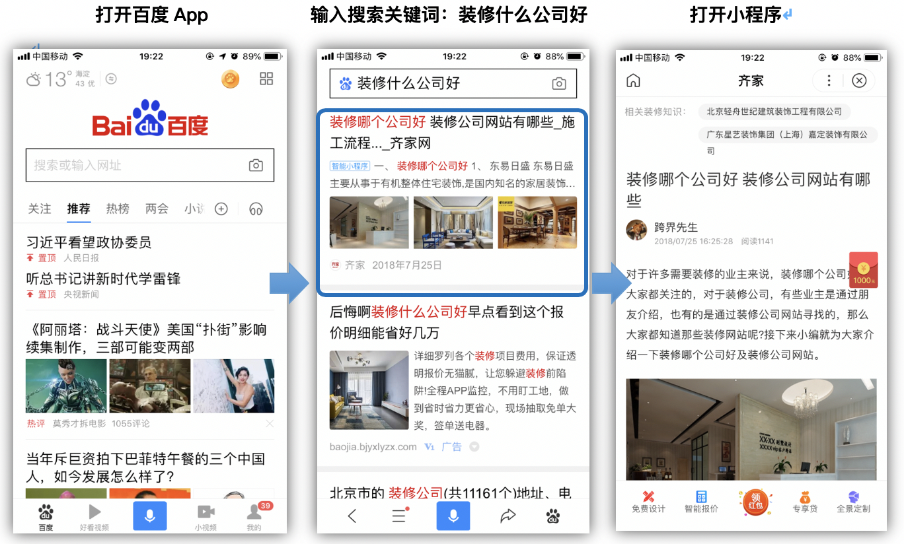

**搜索流量接入流程图**
 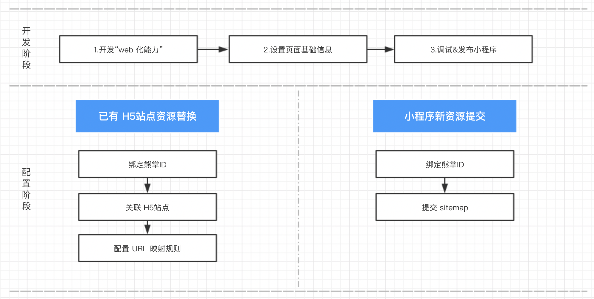


## 开启Web化能力
**1.为什么要开启Web化？**
开启Web化是为了让智能小程序被搜索引擎收录，收录的前提是可被爬虫发现和抓取，由于智能小程序运行在宿主 app 中，无法被爬虫感知，所以需要对智能小程序进行 Web 化的处理（在开发工具中开启 Web 化功能后发布小程序即可完成 Web 化小程序版本的生成），Web化可以理解为每一个智能小程序页面都会转码成一张网页。

**2.如何开启Web化？**
确认账号具有小程序开发权限（在成员管理中可进行对应权限设置）
打开“开发者工具”，点击“项目信息”点击“开启 Web 化能力(原接入百度搜索)”开关
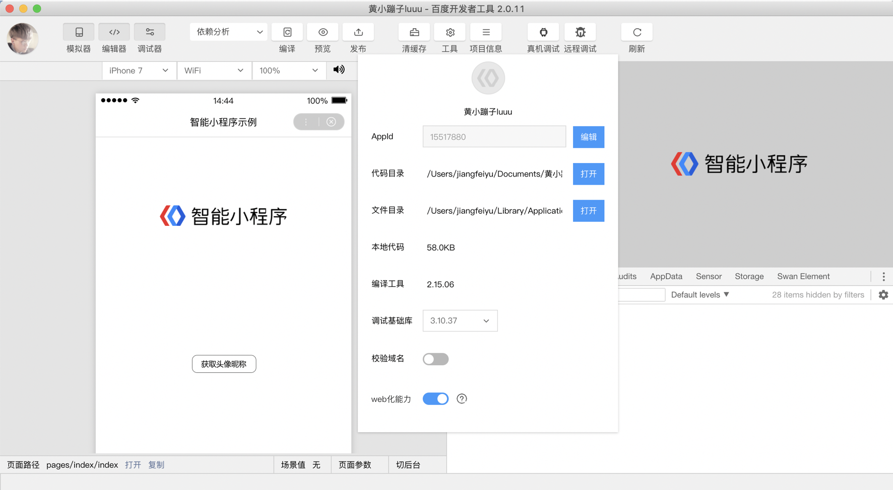


## 设置页面基础信息
**1.为什么要进行页面基础信息设置？**
智能小程序被搜索引擎正常收录的前提是Web化，Web化后小程序将以普通网页的形式被爬虫发现和抓取，因此需要进行页面基础信息的设置用于提升搜索引擎优化。

**2.页面基础信息都包含什么？**
页面基础信息包括标题、摘要、Keywords等信息。这些页面基础信息内容，会影响到小程序在搜索结果页中的呈现方式，需要开发者进行符合搜索要求的设置。
（1）**标题**：能够更加快速洞察页面内容，了解该结果与需求的相关性，通常是用来决定用户点击哪个结果的主要信息。所以，使用高质量的页面标题对小程序来说至关重要。
（2）**摘要**：小程序首页、栏目页、分类页的摘要非常重要，因为有可能在搜索结果中直接被用户看到，影响到用户是否选择点击查看详情：
（3）**Keywords**：小程序开发者给网站某个页面设定的词汇，以便让搜索引擎更好地理解页面价值。keywords代表了小程序主题内容，无论是首页、内页还是栏目页，关键词一般都代表的是当前页面或者栏目内容的主体。开发者根据实际情况设置即可。

开发者可点击并了解[页面基础信息配置方法](https://smartprogram.baidu.com/docs/develop/api/seo/#setPageInfo/ )

注：由于每个页面基础信息和页面内容强相关，建议先通过 swan.request 请求开发者 server ，由开发者 server 返回相关信息，再通过页面基础信息的 API 设置到页面中。

## 绑定熊掌ID
**1.为什么要绑定熊掌ID？**
绑定熊掌ID是为了开发者提交Sitemap使用，如果是老站替换的开发者，建议使用目标替换站点所属的熊掌ID进行绑定，从而使小程序继承原H5在百度搜索中的排名权重。

**2.如何绑定熊掌ID？**
在Web化版本小程序上线后，可在“流量配置>自然搜索结果页面”完成熊掌ID的绑定，点击“绑定”按钮即可唤起绑定操作的弹窗 。
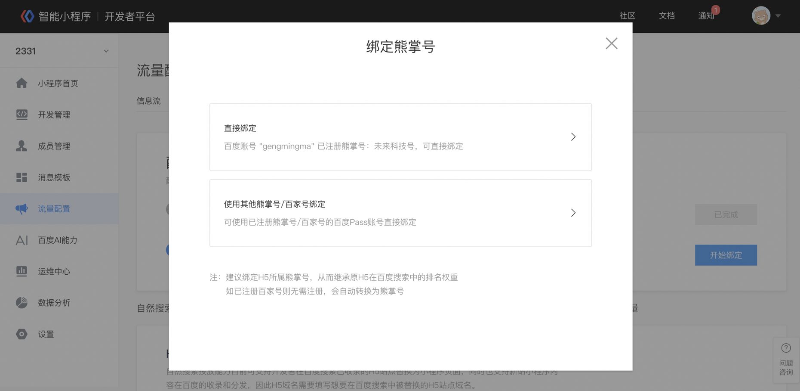

支持使用`当前账号完成注册绑定`，也支持`绑定与小程序同主体的其他熊掌ID`，绑定其他熊掌ID时需要获取其超级管理员的手机中收到的验证码进行操作权限的验证即可，开发者必须完成熊掌ID的绑定后才可进行H5站点的关联和Sitemap的提交。
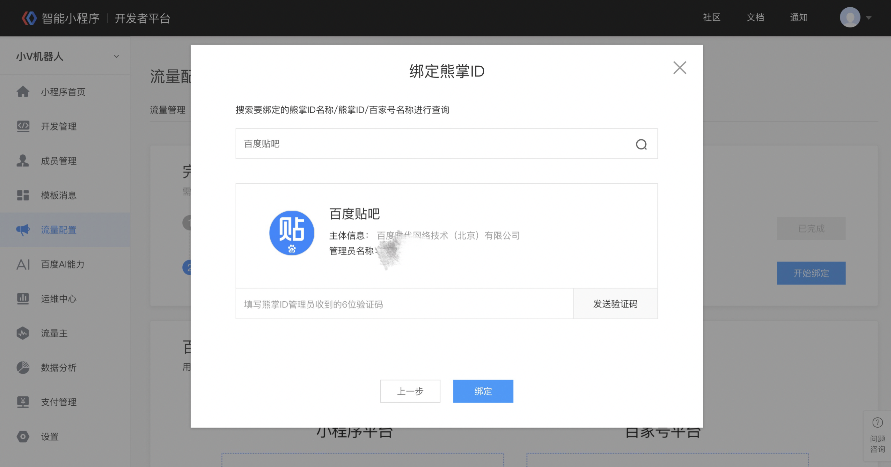

## 关联H5站点
**1.为何要做H5站点关联？**
H5站点关联的内容为小程序最终希望替换的已有 H5站点资源，因此关联是为了校验开发者是否对该站点拥有操作权限，且后续可在小程序平台中对该站点下的 top 流量资源进行替换并查看最终的替换结果。

**2.如何配置H5域名？**
可在“流量配置>自然搜索结果页面”中关联H5站点。一个小程序可设置关联多个 H5站点，但关联的站点必须属于相同主域，且已经关联的站点不支持解除关联的操作，开发者可点击“设置”按钮进行关联操作
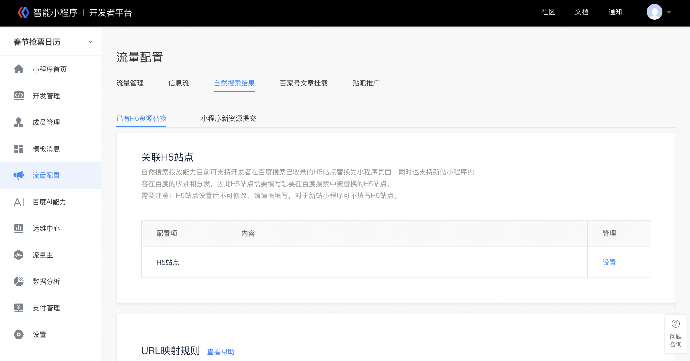

若开发者当前绑定的熊掌 ID 在搜索资源平台已经有关联的站点，在这里即可直接选择并进行关联操作，无须进行站点验证。在编辑弹窗中同时将会展示站点关联的状态，可关联多个但不能解除关联。


若开发者当前绑定的熊掌 ID 在搜索资源平台没有已关联的站点，或者需要增加关联其他站点时，可在弹窗中点击“新建”按钮，并在“站点权限校验”的页面中完成H5站点的新建绑定。新建站点时需要在 H5站点的根目录下放置校验文件，并验证当前绑定熊掌 ID 超级管理员的手机号验证码，从而进行最终站点的新增和关联操作。
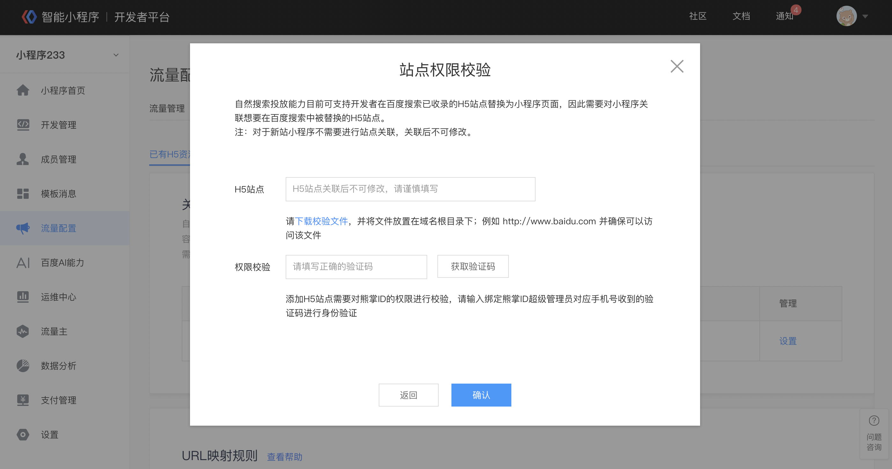

**3.H5站点关联说明：**
- “H5 站点”是指开发者 H5 站点的域名，一经配置之后不可更改，请谨慎填写。
- 如果开发者存在多个 H5子域，且这些 H5子域都有对应的小程序页面，请在这里关联所有希望进行替换的 H5站点。
- 对于新站小程序可不用关联 H5站点，直接提交 sitemap内容作为新资源供百度收录即可。

## 配置URL映射规则
**1.为什么要配置URL映射规则？**
该操作主要是为了进行老站替换，同时小程序在搜索排序上也会得到相应优待，URL映射规则是为了使小程序页面到 H5 页面之间产生映射关系，百度搜索基于这一份映射规则来计算小程序的排序权重以及和 H5 页面的去重处理等等，因此配置 URL映射规则对小程序入搜索至关重要。

**2.URL映射规则该怎么填写？**
规则适配方式通过正则表达式的方式声明 H5 链接地址与小程序路径间的对应关系。格式举例：

> H5：`http://example.com/detail?id=1`
> 小程序 web 化域名：xx.smartapps.cn
> 小程序路径：/pages/detail/index?id=1
> 这组对应关系可以用以下规则描述：
>`http://example.com/detail?id=([^&]+) `=> pages/detail/index?id=$1

如上例所示，规则左侧部分为由 H5 地址生成的正则表达式，标识了 H5 地址中与小程序参数有对应关系的部分；规则右侧部分由小程序路径和参数对组成。参数对中如果某个参数值是左侧匹配到的部分，则其参数值由`$左侧匹配项的序号`代替。

**2.1更多示例**

|H5 地址|小程序路径|
|--|--|
| `https://example.com/book?id=1&type=history`| pages/book/index?bookid=1&type=history |
```
http://example.com/book?id=([^&]+)&type=([^&]+) => pages/book/index?bookid=${1}&type=${2}
```

|H5 地址 |小程序路径 |
|-|-|
| `https://example.com/history/book?id=1` | pages/book/index?bookid=1&type=history |
```
// 参数部分序号根据正则匹配的顺序决定
http://example.com/([^\/]+)/book?id=([^&]+) => pages/book/index?bookid=${2}&type=${1}
```

| H5 地址 | 小程序路径 |
|-|-|
| `https://example.com/history_type/book?id=1 `| pages/book/index?bookid=1&type=history |
```
http://example.com/([^\_]+)_type/book?id=([^&]+) => pages/book/index?bookid=${2}&type=${1}
```

| H5 地址 | 小程序路径 |
|-|-|
| `https://example.com/book/1.html` | pages/book/index?bookid=1&type=history |
```
// 两个地址中没有对应项的参数保持不变
http://example.com/book/([^\.]+).html => pages/book/index?bookid=${1}&type=history
```

| H5 地址 | 小程序路径 |
|-|-|
| `https://example.com/book/history2019.html?id=1 `| pages/book?type=history |
```
http://example.com/book/([^\d]+)2019.html?id=1 => pages/book?type=history
```


**3.智能小程序平台配置 URL 映射关系**
在开发者平台>自然搜索结果中，当开发者需要对已有 H5资源配置时，可在 URL 映射规则的配置模块完成相应内容的设置
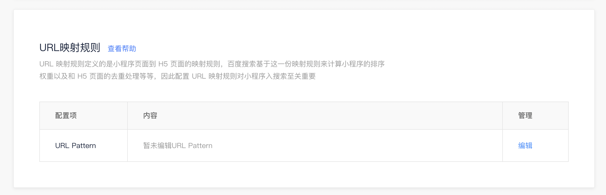

点击页面中的“编辑”按钮可选择 直接配置 URL映射规则，或使用相应的生成工具来进行辅助配置

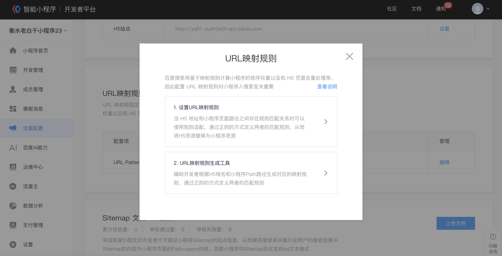

在 URL 映射规则的设置页面中，开发者需要填写具体H5 url 表达式和对应的小程序 path 表达式，并至少提供一对示例用于规则正确性的验证，开发者可添加多组规则

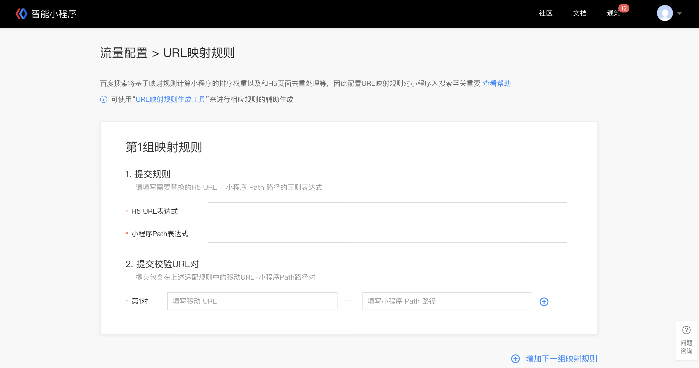

当完成验证并提交后，系统将自动为开发者对该规则覆盖的 H5资源进行替换处理（优先对 TOP 流量的 H5资源进行替换处理），开发者需要保证对应的小程序页面已完成“页面基础信息”的设置，并可在当前编辑页面中查看替换的进度和结果。
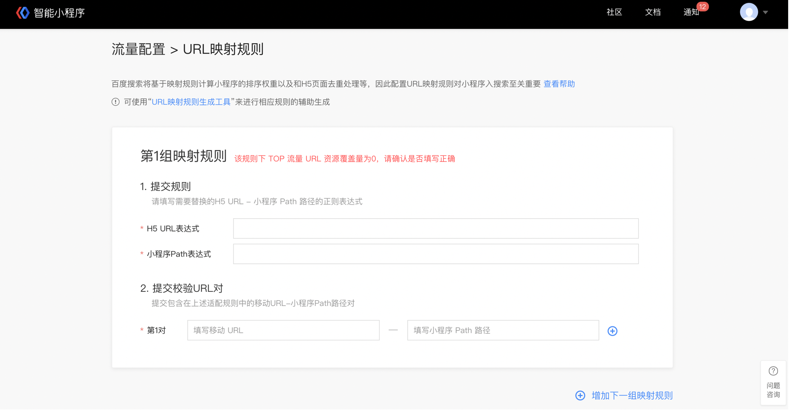

**4. URL 映射规则 – 生成工具**
开发者可在URL 映射规则的配置页面和编辑时的选择弹窗中均可点击相应入口引导，进入生成工具的页面中，开发者只需要按照生成工具的引导，提供 H5 URL 示例和小程序 Path 示例，并做简单的校验后即可生成对应的 URL 映射规则表达式。
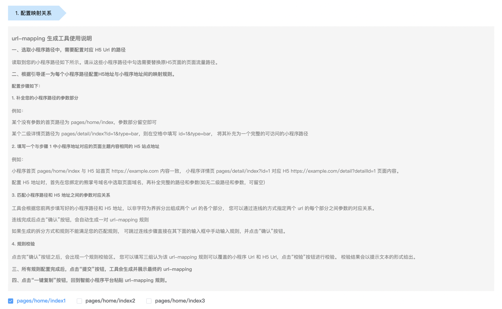
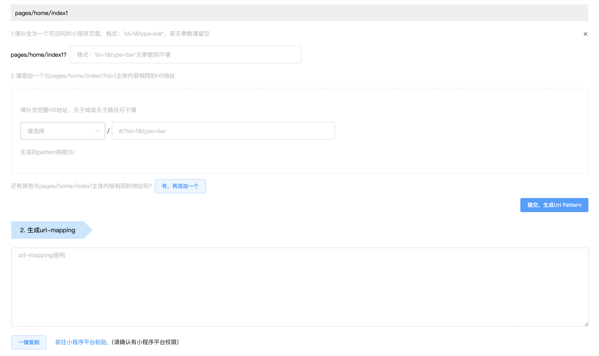
为了方便开发者的操作，可点击“一键复制”能力并返回开发者平台中按照提示完成已生成规则的新建和提交

## 提交sitemap
**1.什么是Sitemap？为何要提交Sitemap？**
Sitemap（即站点地图）就是您⽹站上各⽹⻚的列表。创建并提交 Sitemap 有助于百度发现并了解您⽹站上的所有⽹⻚。您还可以使⽤ Sitemap 提供有关您⽹站的其他信息，如上次更新⽇期、Sitemap ⽂件的更新频率等，供百度 Spider 参考。
百度对已提交的数据，不保证⼀定会抓取及索引所有⽹址。但是，我们会使⽤ Sitemap 中的数据来了解⽹站的结构等信息，这样可以帮助我们改进抓取策略，并在⽇后能更好地对⽹站进⾏抓取。
此外，Sitemap 与搜索排名没有关系，`提交的 Sitemap 内容为⼩程序⻚⾯的 Path路径列表`，以便百度 spider 按照其规则尽可能多的抓取和收录⼩程序的⻚⾯。

**2.Sitemap的内容**
Sitemap 用于声明主动推送给百度自然搜索收录的页面。列表中每一行都是一个要被收录页面的“路径+参数”，格式例如 pages/list/index?id=1。
Sitemap 示例:
>path/to/smartapp/list?city=bj
>path/to/smartapp/list?city=sh
>path/to/smartapp/detail?id=1024
>pages/detail?page=2048&id=1024&deailId=4096

**3. Sitemap ⽀持哪些提交格式？**
百度⼩程序中 Sitemap 协议⽀持⼀种格式：txt ⽂本格式，开发者需要在⼀个 txt ⽂本中列明向百度⼩程序提交的⼩程序⻚⾯ Path 地址，并将 txt ⽂本⽂件通过开发者平台-流量配置-⾃然搜索结果-sitemap 提交入口进⾏提交
格式示例如下：
>pages/articleDetail/articleDetail?articleId=579379
>pages/articleDetail/articleDetail?articleId=600884
>pages/articleDetail/articleDetail?articleId=582423
>pages/articleDetail/articleDetail?articleId=574993

此⽂本⽂件需要遵循以下指南：
- ⽂本⽂件每⾏都必须有⼀个 Path 路径地址，每个路径中不能有换⾏。
- 不应包含 Path 路径列表以外的任何信息。
- 您必须书写完整的⽹址⼩程序路径，包括⻚⾯ path 内的参数
- ⽂本⽂件需使⽤ UTF-8 编码或 GBK 编码。

**4.如何提交Sitemap？**
进入智能小程序平台，在小程序首页，单击“流量配置>自然搜索结果”。在自然搜索 tab 里可提交上传 Sitemap资源。
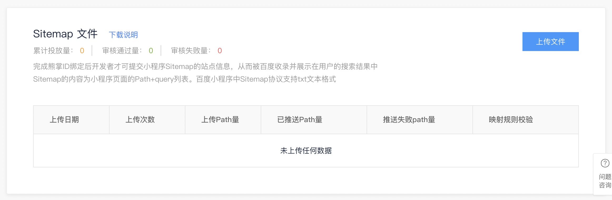
平台目前支持**天级别收录**和**周级别收录**两种时效的提交方式:
- 天级别收录预计2-3天完成收录，但每日数量配额少（每个熊掌 ID 限制每日可提交3000条）
- 周级别收录预计2-3周完成收录，当前每日可提交5W 条，后续将放宽数量限制。
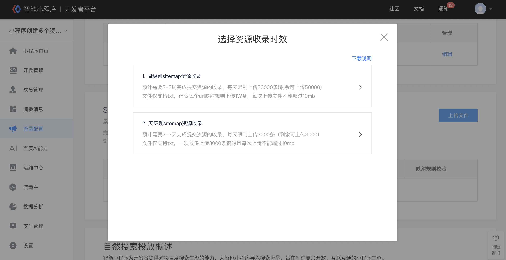

**5.如何得知 Sitemap 资源的收录索引情况**
当前开发者平台中针对 Sitemap资源的收录索引反馈正在建设中，开发者在上传了 Sitemap 资源后可在开发者平台中点击登录“搜索资源平台”部分的引导，使用当前绑定熊掌 ID 的超级管理员账号查看对应小程序的收录索引情况
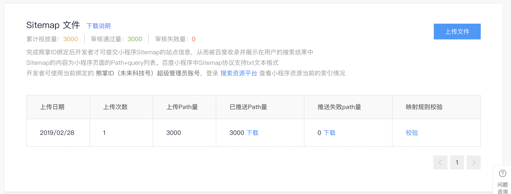


## 搜索流量接入FAQ
Q：什么是Web化？
A：简单来说Web化可以理解是为小程序页面转码成网页，这样就可以被爬虫发现和抓取，用于搜索引擎收录使用。

Q：接入自然搜索结果前有哪些必须提前完成的？
A：1.在开发阶段设置小程序的页面基础信息  2.小程序必须开启web化按钮，并且需要审核通过并且在线服务  2.小程序需要绑定熊掌ID

Q：什么是sitemap？
A：Sitemap（即站点地图）就是您小程序上各页面的web化url列表。创建并提交Sitemap有助于百度发现并了解您小程序上的所有页面并完成收录。

Q：为什么要配置URL映射规则？
A：该操作主要是为了进行老站替换，同时小程序在搜索排序上也会得到相应优待。URL映射规则是为了使小程序页面到 H5 页面之间产生映射关系，百度搜索基于这一份映射规则来计算小程序的排序权重以及和 H5 页面的去重处理等等，因此配置 URL映射规则对小程序入搜索至关重要。

Q：为什么要绑定熊掌ID？
A：绑定熊掌ID是为了开发者提交Sitemap使用，如果是老站替换的开发者，建议使用原H5所属熊掌ID进行绑定，从而使小程序继承原H5在百度搜索中的排名权重。

Q：为何要做H5站点关联？
A：H5域名和上文提到的URL映射规则配合使用，一起生成小程序和H5站点的映射关系，用于最终完成将原H5页面替换为小程序页面的操作。

Q：开发者有几百万甚至几千万的url资源量，是否要全部提交？以及目前是否有全部提交的快速通道？
A：对于小程序新资源，需要开发者尽量全的提交 Sitemap，以便被百度发现和收录，对于已有 H5资源的替换，开发者仅需完成 H5站点的关联和 URL 映射规则的提交即可，无需再提交大量的 Sitemap 资源，小程序平台将优先对 H5站点下的 TOP 流量 URL进行替换处理。

