## 什么是小程序自然搜索？
**对开发者**：智能小程序为开发者提供对接百度搜索生态的能力，为智能小程序导入搜索流量，旨在打造更加开放、互联互通的小程序生态。

**对百度用户**：在百度搜索结果页中，当智能小程序某页面被正常检索到，其展现形式和普通网页相同，用户在百度App（10.10或以上版本）点击该条搜索结果，即可打开智能小程序。

**自然搜索结果示例**


**搜索流量接入流程图**
 


## 开启Web化能力
工具从 [2.2.4](https://smartprogram.baidu.com/docs/develop/devtools/show_sur/) 版本开始，默认开启 web 化能力，更多内容详见[开发建议](http://smartprogram.baidu.com/docs/develop/function/proposal/)。
 
如您使用的版本不支持默认开启 web 化能力，建议升级您所使用的工具版本。


## 设置页面基础信息
**1.为什么要进行页面基础信息设置？**
智能小程序被搜索引擎正常收录的前提是Web化，Web化后小程序将以普通网页的形式被爬虫发现和抓取，因此页面基础信息的设置至关重要，能够提升小程序在搜索中的收录和展现结果。
**2. 页面基础信息都包含什么？**
页面基础信息包括标题、摘要、Keywords等信息。这些页面基础信息内容，会影响到小程序在搜索结果页中的呈现方式，需要开发者进行符合搜索要求的设置。
**（1）标题**：能够更加快速洞察页面内容，了解该结果与需求的相关性，通常是用来决定用户点击哪个结果的主要信息。所以，使用高质量的页面标题对小程序来说至关重要。
**（2）摘要**：小程序首页、栏目页、分类页的摘要非常重要，因为有可能在搜索结果中直接被用户看到，影响到用户是否选择点击查看详情：
**（3）Keywords**：小程序开发者给网站某个页面设定的词汇，以便让搜索引擎更好地理解页面价值。keywords代表了小程序主题内容，无论是首页、内页还是栏目页，关键词一般都代表的是当前页面或者栏目内容的主体。开发者根据实际情况设置即可。
开发者可点击并了解[页面基础信息配置方法](https://smartprogram.baidu.com/docs/develop/api/pageinfo/)
> 由于每个页面基础信息和页面内容强相关，建议先通过 swan.request 请求开发者 server ，由开发者 server 返回相关信息，再通过页面基础信息的 API 设置到页面中。
## 绑定熊掌ID
**1.为什么要绑定熊掌ID？**
绑定熊掌ID是小程序进入搜索的前提。能够帮助开发者提交URL适配规则及Sitemap，特别是H5替换的开发者，建议使用原H5所属熊掌ID进行绑定，从而使小程序继承原H5的搜索流量。
 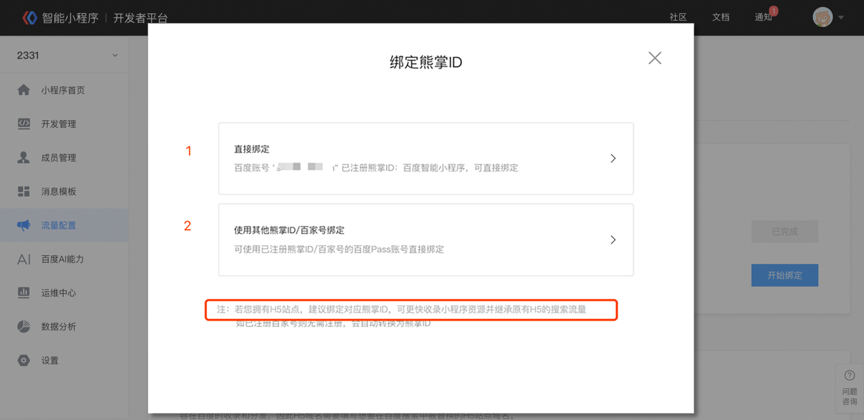
**2.如何绑定熊掌ID？**
在Web化版本小程序上线后，可在【流量配置】>【自然搜索结果页面】，根据系统提示完成熊掌ID的绑定，点击【开始绑定】按钮即可唤起绑定操作的弹窗，进行绑定操作。
支持使用当前百度账号对应的熊掌ID完成注册绑定。
也支持绑定与小程序同公司主体的其他熊掌ID（如图），绑定其他熊掌ID时，需获取超级管理员手机收到的验证码，进行操作权限的验证，开发者必须完成熊掌ID的绑定后才可进行H5站点的关联和Sitemap的提交。

 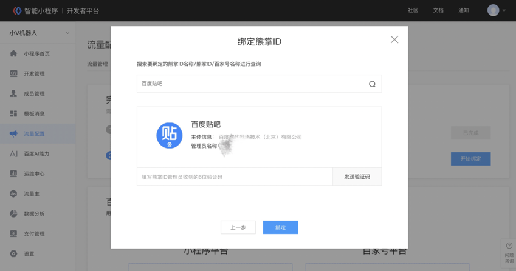

## 关联H5站点
**1.为何要做H5站点关联？**

若小程序希望替换搜索中已有H5站点资源，需要先进行H5站点关联。因此关联是为了校验开发者是否对该站点拥有操作权限（关联时需保证小程序和H5在同一个熊掌ID下），且后续可在小程序平台中对该站点下的 top 流量的页面资源进行替换，并查看最终的替换结果。

**2.如何配置H5域名？**
可在【流量配置】>【自然搜索结果页面】>【已有H5资源替换】>【设置】中关联H5站点。一个小程序可关联同一主域下的多个 H5站点，如果已关联的站点中没有小程序的对应站，可以通过“绑定新站点”进行绑定，且已经关联的站点不支持解除关联的操作。
 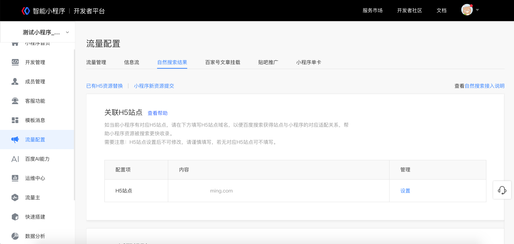
若开发者当前绑定的熊掌 ID 在搜索资源平台已经有关联的站点，在这里即可直接选择并进行关联操作，无须进行站点验证。在弹窗中将会展示该熊掌ID下所有站点的关联状态，小程序可关联多个站点，但不能解除关联。
 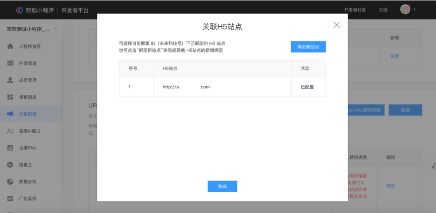
若开发者当前绑定的熊掌 ID 在搜索资源平台没有已关联的站点，或者需要关联其他站点时，可在弹窗中点击“绑定新站点”按钮进行绑定。
关联其它站点时，需要下载校验文件，并放置在准备替换的 H5站点根目录下。并由当前绑定熊掌 ID 超级管理员的手机号进行验证，完成站点的新增和关联操作。
 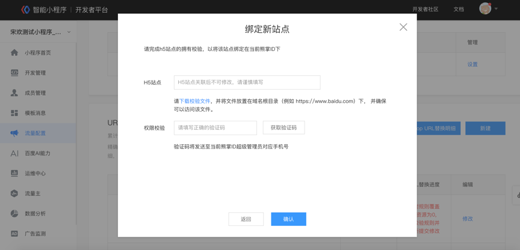
**3.H5站点关联说明**：
* “H5 站点”是指开发者 H5 站点的域名，一经配置之后不可更改，请谨慎填写。
* 如果开发者在一个H5站点下，存在多个子域名，且这些子域名都有对应的小程序页面，请在这里关联所有希望进行替换的 H5站点。
* 只有小程序，没有所对应站点的情况下，小程序可以不关联 H5站点，直接通过小程序新资源提交功能，将小程序资源供百度收录即可。

## 搜索结果出图配置

1. 搜索结果出图介绍
搜索结果中展现图片，一方面可以让搜索用户有更好的浏览体验，同时也可以为搜索结果带来更多点击。现在面对智能小程序推出搜索结果出图权益，允许开发者推荐智能小程序在搜索结果中展示的图片。搜索结果出图的图片样式共分两种，一图样式和三图样式，现阶段一图样式已全量开放，三图样式内测逐渐开放中。


<div class="m-doc-custom-examples">
    <div class="m-doc-custom-examples-correct">
         
    </div>
    <div class="m-doc-custom-examples-correct">
         
    </div>
    <div class="m-doc-custom-examples-correct">
        
    </div>     
</div>

2. 如何配置搜索结果出图？
（1）代码改造
在智能小程序页面开发工具中，在【API】>【开放接口】>【页面基础信息】部分，调用[swan.setPageInfo](https://smartprogram.baidu.com/docs/develop/api/pageinfo/#swan-setPageInfo/)方法，通过修改image参数来配置希望在搜索结果页展现的图片。可以配置1图或者3图，3图时用数组表示。

>不建议配置1或3以外数量的图片，否则将无法正常展现。

举例：配置3图时，代码应按如下格式编写：

```
    swan.setPageInfo({
                      title: '页面标题',
                      keywords: '关键词1,关键词2',
                      description: '页面简介',
                      articleTitle: '文章标题',
                      releaseDate: '2019-01-02 12:01:30',
                      image: [
                             'https://www.example.com/***/pic1.png',
                             'https://www.example.com/***/pic2.png',
                             'https://www.example.com/***/pic3.png'
                      ],
           ...})
```
（2）资源提交
页面信息配置完毕后，将小程序资源通过进自然搜索的一般通路提交。如天级通路、周级通路等均可。搜索经过约五个工作日的处理即可生效。
3. 搜索建议提交什么图片？
（1）宽高比为（或近似为）3：2；
（2）大小不低于375px * 250px；
（3）提交的图片要和小程序落地页中的图片完全一致，即图片出自主体内容，且与文本信息强相关。
4. 搜索拒绝接收什么图片？
（1）涉及低俗、色情、反动等内容的图片；
（2）动态图片；
（3）纯文字图、纯色图、内容令人不适等影响用户浏览体验的图片；
（4）含有二维码、联系电话、微信号等推广营销内容或方式的图片；
（5）水印过于明显，以至于大面积覆盖主要内容的图片。


## 数据提交如何选择

在小程序进入搜索的过程中，有两种资源提交方式：提交Sitemap文件和URL适配规则。两种提交方式不存在先后关系，只与提交的资源类型相关，都能够帮助资源快速进入搜索。
两者的区别如下：
1. Sitemap适用于无H5站或者H5站收录不好的开发者，可直接将小程序web提交Sitemap；有H5站的开发者，也可将新产生的小程序资源提交Sitemap，便于资源快速收录。
2. URL适配规则主要用于小程序资源与原有H5资源的搜索结果线上替换，便于小程序资源快速继承并获得原有H5的流量。值得注意的是，开发者提交URL适配规则后，搜索还将根据开发者的全部数据进行深度挖掘，帮助开发者更好的进行线上结果替换。


## 配置URL适配规则
**1.为什么要配置URL适配规则？**
设置URL适配规则，可以使百度搜索得到您的小程序页面与H5页面之间的对应关系。精确的URL适配规则有助于百度搜索更快收录小程序资源并继承原有H5的搜索流量。因此配置 URL适配规则对小程序进入搜索至关重要。
**2.URL适配规则该怎么填写？**
通过正则表达式的方式声明 H5 链接与小程序路径间的对应关系。格式举例：

>H5：`http://example.com/detail?id=1`
小程序路径：`/pages/detail/index?id=1`
这组对应关系可以用以下规则描述：
`http://example.com/detail?id=([^&]+)=> pages/detail/index?id=${1}`

如上例所示，“=>” 左侧部分为 H5 链接生成的正则表达式，标识了 H5 地址中与小程序参数有对应关系的部分；“=>”右侧部分由小程序路径和参数对组成。参数对中如果某个参数值是左侧匹配到的部分，则其参数值由${左侧匹配项的序号}代替。

**2.1更多示例**

| H5 地址 | 小程序路径 |
|-|-|
| https://example.com/ | pages/home/index |
```
// 如果要完全匹配到 url 结尾，例如当 url 后没有 path 时，适配小程序首页 path，url 后要加结束符
https://example.com/$ => pages/home/index
```

|H5 地址|小程序路径|
|--|--|
| `https://example.com/book?id=1&type=history`| pages/book/index?bookid=1&type=history |
```
https://example.com/book?id=([^&]+)&type=([^&]+) => pages/book/index?bookid=${1}&type=${2}

// 只要是符合正则规则的匹配方式都可以，例如下述规则也同样正确
https://example.com/book?id=([\w]+)&type=(.+)$ => pages/book/index?bookid=${1}&type=${2}
```

|H5 地址 |小程序路径 |
|-|-|
| `https://example.com/history/book?id=1` | pages/book/index?bookid=1&type=history |
```
// 参数部分序号根据正则匹配的顺序决定
https://example.com/([^\/]+)/book?id=([^&]+) => pages/book/index?bookid=${2}&type=${1}
```

| H5 地址 | 小程序路径 |
|-|-|
| `https://example.com/history_type/book?id=1 `| pages/book/index?bookid=1&type=history |
```
https://example.com/([^\_]+)_type/book?id=([^&]+) => pages/book/index?bookid=${2}&type=${1}
```

| H5 地址 | 小程序路径 |
|-|-|
| `https://example.com/book/1.html` | pages/book/index?bookid=1&type=history |
```
// 两个地址中没有对应项的参数保持不变
https://example.com/book/([^\.]+).html => pages/book/index?bookid=${1}&type=history
```

| H5 地址 | 小程序路径 |
|-|-|
| `https://example.com/book/history2019.html?id=1 `| pages/book?type=history |
```
https://example.com/book/([^\d]+)2019.html?id=1 => pages/book?type=${1}
```
3. 小程序接入搜索Sitemap反馈失败及URL替换失败错误原因详解
开发者在小程序接入搜索的过程中，如遇到Sitemap反馈失败及URL替换失败的错误反馈，可以根据页面反馈及参照本文引导进行自查，通过本文列举的7种错误原因及处理方式，能够帮助开发者更快速准确的完成修改。

 - **页面白屏：**页面打开为空白页，请提交有具体内容的页面。
 - **页面404：**页面返回码为404，请及时查看并修复死链。
 - **页面存在第三方跳转：**请查看页面是否存在跳转H5、嵌套H5情况，不建议提交webview模式小程序，建议开发原生小程序。
 - **页面未配置title信息**：页面未配置缺少标题，请填写正确的基础信息字段，以便搜索准确识别，详见小程序文档《设置页面基础信息》。
 - **主体内容不一致：**请确认提交的web化页面与H5页是否为同一内容；可重点查看页面基础信息如title、正文主体、页面版块是否基本一致。修改一致后，需在小程序平台重新提交规则。
 - **抓取失败：**网站抓取失败主要会在sitemap提交后反馈，需开发者自查以下方面：
    1）小程序是否能稳定访问，不稳定的访问会造成抓取失败；
    2）小程序及对应的H5站点，是否有封禁百度、设置robots信息；
 - **页面内容低质：**页面内容低质主要需要自查以下几个方面：
    1）页面是否空白、空短：①页面无内容示例请见下图一 ②页面空短示例请见下图二；
    2）页面访问是否稳定，页面是否加载、响应时间过长，导致页面无法获取完整内容。页面访问不稳定一直加载中请见下图三；
    

    3）已下架、已过期类资源不建议提交：
    如电商类、招聘类等开发者经常会有大量的产品下架、售空、资源过期等情况，此类资源不建议再提交sitemap。
    4）切勿资源采集、拼凑：
    如果小程序资源存在大量从其他站点或公众号等内容生产方采集、搬运而来的内容，信息未经整合，排版混乱，文章可读性差，有明显采集痕迹，则对用户无任何增益价值，被视为低质内容。

以上就是提交反馈的7种问题反馈的详解，对已反馈数据失败的情况，sitemap及url替换，均需要各位修复数据后，再次提交sitemap或规则。


**4.智能小程序平台配置 URL 适配关系**
在【开发者平台】>【自然搜索结果中】>【URL适配规则】，当开发者需要对已有 H5资源配置时，可在 URL 适配规则的配置模块完成相应内容的设置，具体步骤如下：
 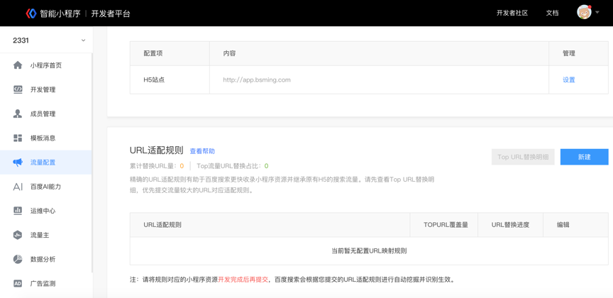
**第一步：**点击页面中的“新建”按钮后，选择“设置 URL适配规则”进行配置。如对规则不够熟悉，也可以使用第二条“URL适配规则生成工具”来辅助配置。
 
**第二步：**在 URL 适配规则的设置页面中，开发者需要填写具体H5 链接表达式和对应的小程序 path（路径） 表达式，并至少提供一对示例链接，用于验证规则准确性。
开发者可在本页面添加多组规则。
 
**第三步：**当完成验证并提交后，系统将自动对该规则覆盖的 H5资源进行替换处理（优先对 TOP 流量的 H5资源进行替换）。因此，开发者需要保证对应的小程序页面已完成“页面基础信息”的设置。
 
**第四步：**查看规则生效情况。点击TOP URL替换明细，可以查看替换的结果
 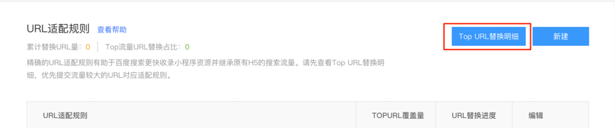
 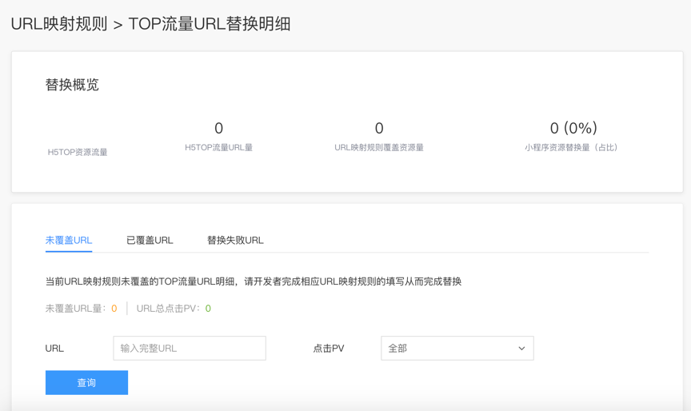

**5. URL 适配规则 – 生成工具**
URL 适配规则的辅助生成工具，也可以通过规则编辑页面进入。在规则辅助生成工具的页面中，开发者只需要按照工具的引导，提供 H5 URL 示例和小程序 Path 示例，并根据提示进行校验后，即可生成对应的 URL 适配规则表达式。
 
 
为方便开发者操作，点击下方的“一键保存至平台”后，规则会直接复制到配置工具中，用户可以按照提示完成新建和提交。也可以选择自主撰写规则后提交。

**6. URL适配规则提交后未替换成功的常见问题原因**

URL适配规则提交在4.25日升级，升级后，开发者仅需要提交需替换资源的小程序Web化规则即可；之前推送过的URL适配规则不需要改动。所以URL适配规则提交后未替换成功的常见原因，则可以分为策略上线前后来看：

 - 策略上线之前，URL适配规则提交后未替换成功的主要原因有以下9点：
 
    1. 对应H5站点未收录，URL适配规则主要是替换原有H5展示，如果H5页面未收录，则无法进行替换成功。
    2. 小程序页面与H5页面相似度不够。页面相似度要求两个页面的主体内容尽可能一致，这里除了包括页面中标题，内容的一致性外，最重要的是页面板块也需要有对应，部分开发者在H5站页面板块较多，一页内容中包括正文、推荐、评论等板块，但是小程序页面只做了正文部分，那这种情况下相似度是无法达到一致的。
    3. Web化地址中含有大量不常见参数，如：/、%等，会导致无法识别适配，建议开发者规范web化。
    4. Web化URL中的参数不能是一个路径：比如?arg=/xxx/xxx/xx。
    5. 小程序web化url中的参数内容在pc/h5的url中没有，无法形成规则适配关系。
    6. Web化大小写问题，如：https://2222.smartapps.cn/pages/article/RRRR 和 https://2222.smartapps.cn/pages/article/rrrr 两个Web化地址同时存在且内容不一致，建议开发者不要出现此类情况，这类情况也会出现替换出错问题。
    7. Web化访问问题，如Web化访问不稳定，页面不存在，则会出现抓取识别，无法替换的情况。
    8. 使用Webview方式改造小程序，Webview主要表现为小程序内嵌套H5，点击小程序页面则会跳出到H5页面，此类页面用户体验十分不友好，此类情况URL适配规则和Sitemap都将是拒绝处理，也请开发者了解。
    9. Web化页面问题，如Web化页面打开空白、内容空短，需授权登陆才可以访问等，此类页面会被搜索识别为不优质页面，无法进行资源替换。

 - 4.25日升级URL适配规则提交，除以上需要关注的原因，提交未替换原因还有以下两点：

    1. 小程序后台有TOP URL提示引导，请开发者尽量提交TOP URL进行替换，TOP URL指，在搜索中获得较高点击的H5 URL；TOP URL将会优先下发并生效，非TOP类资源则生效周期较慢，此问题我们也在积极解决，尽量提升全部资源的替换效率
    2. Web化地址改变；目前发现的部分开发者出现小程序回退H5或替换未生效，追查后发现均为开发者Web化更改路径，或Web化打不开，导致无法替换或替换失效。

**7. 小程序数据提示“替换中”的解决方案**    

开发者在提交小程序数据后，会出现已替换、替换失败（可查看具体原因反馈）、及替换中的状态。目前数据替换需一周时间完成，即自数据提交一周后，如数据仍提示替换中，则可通过“先自查、后反馈”的方式定位解决问题，自查方式及反馈途径如下：
**7.1 开发者需自查部分：web化与H5是否收录**
**可能原因 1：Web化未收录**。需开发者自查，是否存在页面白屏、页面乱码、资源死链、页面内容为空、页面加载过慢甚至打不开等情况，如有以上情况，则数据无法进行正常校验替换。
**解决方案：**建议资源整改完毕后重新提交。

**可能原因 2：H5未收录（此原因较常见）**。开发者可通过“关键词+site:H5域名”或H5 url线上搜索的方式查找H5资源是否收录；若H5为新增资源，也可能会出现资源未收录的情况。
**解决方案：**如H5资源未收录，则建议直接将小程序web化资源提交Sitemap。
**7.2 反馈路径**
若数据提交超过一周仍显示“替换中”，且自查原因后仍无法定位问题，请在小程序[社区](https://smartprogram.baidu.com/forum/ )进行反馈。
**7.3 注意事项**

开发者提交资源后，可通过后台数据反馈查看替换明细，路径如下：智能小程序开发者平台——流量配置——自然搜索结果——URL适配规则。
如下图，点击该版块右侧的“TOP流量URL替换明细”，可查看替换进度。
 
 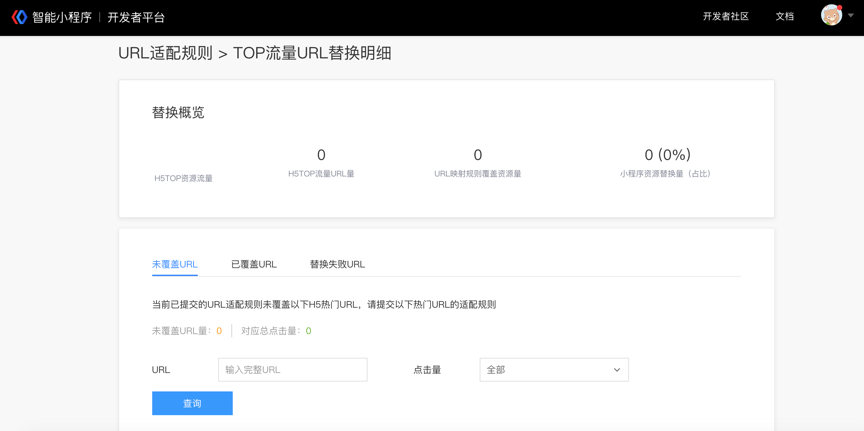
其中，“替换失败URL” tab下显示具体的失败原因。
* 若替换反馈的失败原因为页面白屏、页面404、缺少SEO信息等，请修改后重新提交规则。修改文档请参考上方的配置URL适配规则。
* 若替换反馈的失败原因为主体内容不一致，表示小程序页面与对应H5页面相似度不够。页面相似度要求两个页面的主体内容尽可能一致，除了页面中标题、内容的一致性外，最重要的是页面版块也需对应，若H5页面含有正文、推荐、评论等多个版块，而小程序页面只有正文部分，则相似度校验无法通过，需修改后重新提交。


## 提交Sitemap
**1.什么是Sitemap？为何要提交Sitemap？**

Sitemap（即站点地图）指站点上各页面的列表目录。在小程序进搜索的过程中，Sitemap 可方便百度发现并了解小程序上有哪些可供抓取的页面。
百度对已提交的数据，不保证⼀定会抓取及索引所有⽹址。但是，通过对 Sitemap 中的数据进行分析，百度能更好的了解小程序页面结构等信息，改进抓取策略，更好地对小程序进⾏抓取。
需要注意的是，Sitemap 与搜索排名没有关系，提交的 Sitemap 内容为⼩程序⻚⾯的 Path路径列表，以便百度 spider 按照其规则尽可能多的抓取和收录⼩程序的⻚⾯。


**2.Sitemap的内容**
Sitemap 用于声明主动推送给百度自然搜索收录的页面。列表中每一行都是一个要被收录页面的“路径+参数”，格式例如 pages/list/index?id=1。
Sitemap 示例:
>path/to/smartapp/list?city=bj
>path/to/smartapp/list?city=sh
>path/to/smartapp/detail?id=1024
>pages/detail?page=2048&id=1024&deailId=4096

**3. Sitemap ⽀持哪些提交格式？**
百度⼩程序中 Sitemap 协议⽀持⼀种格式：txt ⽂本格式，开发者需要在⼀个 txt ⽂本中列明向百度⼩程序提交的⼩程序⻚⾯ Path 地址，并将 txt ⽂本⽂件通过开发者平台-流量配置-⾃然搜索结果-Sitemap 提交入口进⾏提交
格式示例如下：
>pages/articleDetail/articleDetail?articleId=579379
>pages/articleDetail/articleDetail?articleId=600884
>pages/articleDetail/articleDetail?articleId=582423
>pages/articleDetail/articleDetail?articleId=574993

此⽂本⽂件需要遵循以下指南：

* ⽂本⽂件每⾏都必须有⼀个 Path 路径地址，每个路径中不能有换⾏；
* 不应包含 Path 路径列表以外的任何信息；
* 您必须书写完整的⽹址⼩程序路径，包括⻚⾯ path 内的参数；
* ⽂本⽂件需使⽤ UTF-8 编码。


**4.如何提交Sitemap？**

进入【小程序开发者平台】->【流量配置】->【自然搜索 tab】->【小程序新资源提交】 里提交上传 Sitemap资源，点击上传文件即可进行提交。
 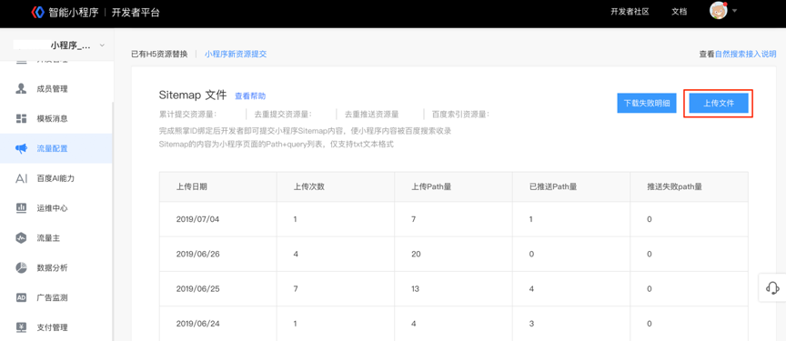

平台目前支持天级别收录和周级别收录两种时效的提交方式，可以在上传时选择。
• 天级别收录（供高时效性内容使用）：预计2-3天完成提交资源的收录，但每日数量配额少，且会根据上周总体配额使用情况和资源质量情况动态进行调节。上传的文件仅支持txt，每次上传不能超过10mb。
• 周级别收录（供通用内容使用）：预计2-3周完成提交资源的收录，当前每日可提交5W 条，文件仅支持txt，每次上传文件不能超过10mb。

 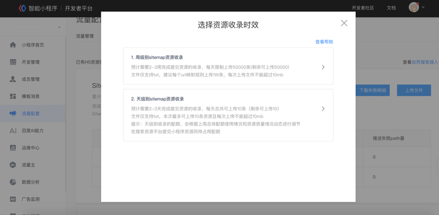
**5.如何得知 Sitemap 资源的收录索引情况**

开发者在上传了 Sitemap 资源后可在开发者平台中点击登录“搜索资源平台”，使用当前绑定熊掌 ID 的超级管理员账号查看对应小程序的收录索引情况。
 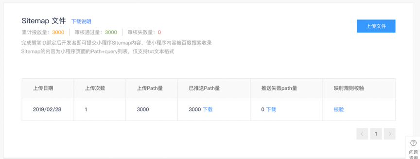
 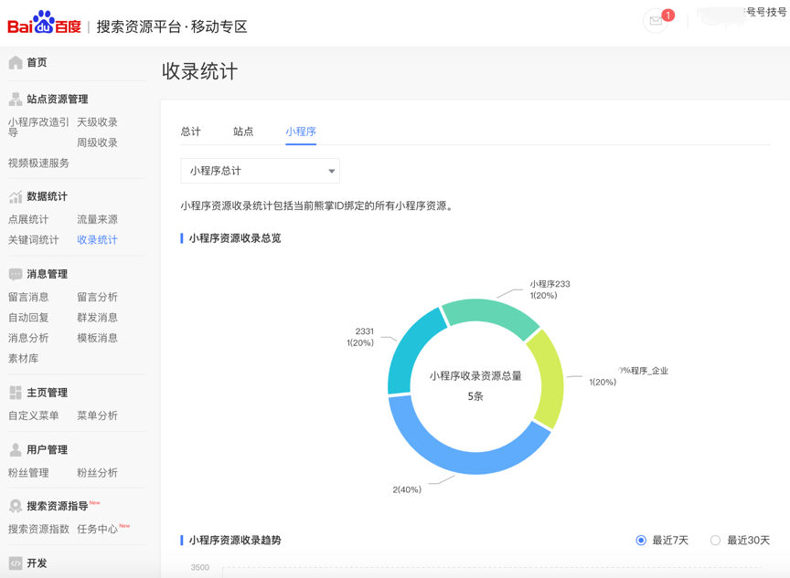


##  小程序API提交


#### 什么是小程序API提交？与上传sitemap文件有何区别？

小程序API提交是将小程序资源提交到搜索的一种方式，即开发者可通过请求API接口，将小程序资源path路径，提交到API接口中。相比于上传sitemap文件，API提交方式能给用户更便捷的提交体验，两种方式都会占用当日提交配额。

#### 请求路径:
```
POST https://openapi.baidu.com/rest/2.0/smartapp/access/submitsitemap/api?access_token=ACCESS_TOKEN
```


#### 参数说明:

参数名 | 类型 | 是否必须 | 描述 | 示例
----- |-----| ------| ----- | ----
access_token	|string|	是	|权限校验Token，获取方式见[开发者服务权限说明](https://smartprogram.baidu.com/docs/develop/serverapi/power_exp/)。|
type |int | 是 | 通过TYPE字段选择上传接口。<br>**·**0：周级提交，一周左右生效；<br>**·**1：天级提交，2~3天生效| 0
url\_list |string  | 是 | 小程序path集合，多个path用逗号分隔。<br>**·**天级提交配额根据提交活跃度和资源质量进行调节，具体以平台显示为准；<br>**·**周级提交配额每日上限为5W条，每次提交上限为3000条。|/pages/index1?id=1,/pages/index2


#### 返回值示例:
```
{
  "errno": 0,
  "msg": "success"
}
```

#### 错误码说明：

错误码 | 错误描述 | 
----- |-----
0| 成功
-1024|业务异常
500| 对不起，服务器出错了，请稍候再试
2002|小程序不存在/选择的收录级别不合法/url数量不合法
30001| 参数有误
30013| 数量超上限
47005| 文件上传失败
60005| 尚未绑定熊掌ID，请先绑定熊掌ID


## robots协议介绍

开发者可通过robots文件声明小程序中不想被搜索引擎收录的部分或者指定搜索引擎只收录特定的部分。仅当您的小程序中包含不希望被视频搜索引擎收录的内容时，才需要使用robots.txt文件。文件上传路径为：智能小程序开发者平台->设置->开发设置->小程序资源抓取设置->点击“设置”按钮->点击“上传协议”按钮。

该文件中的记录通常以一行或多行User-agent开始，后面加上若干Disallow和Allow行,详细情况如下：


* **User-agent:**

    该项的值用于描述搜索引擎robot的名字。在`"robots.txt"`文件中，如果有多条User-agent记录说明有多个robot会受到`"robots.txt"`的限制，对该文件来说，至少要有一条User-agent记录。如果该项的值设为`*`，则对任何robot均有效，在`"robots.txt"`文件中，`"User-agent:*"`这样的记录只能有一条。如果在`"robots.txt"`文件中，加入`"User-agent:SomeBot"`和若干Disallow、Allow行，那么名为`"SomeBot"`只受到`"User-agent:SomeBot"`后面的 Disallow和Allow行的限制。

* **Disallow:**

    该项的值用于描述不希望被访问的一组URL，这个值可以是一条完整的路径，也可以是路径的非空前缀，以Disallow项的值开头的URL不会被 robot访问。例如`"Disallow:/help"`禁止robot访问/help.html、/helpabc.html、/help/index.html，而`"Disallow:/help/"`则允许robot访问/help.html、/helpabc.html，不能访问/help/index.html。`"Disallow:"`说明允许robot访问该网站的所有url，在`"/robots.txt"`文件中，至少要有一条Disallow记录。如果`"/robots.txt"`不存在或者为空文件，则对于所有的搜索引擎robot，该网站都是开放的。


* **Allow:**

    该项的值用于描述希望被访问的一组URL，与Disallow项相似，这个值可以是一条完整的路径，也可以是路径的前缀，以Allow项的值开头的URL 是允许robot访问的。

    例如`"Allow:/hibaidu"`允许robot访问/hibaidu.htm、/hibaiducom.html、/hibaidu/com.html。一个网站的所有URL默认是Allow的，所以Allow通常与Disallow搭配使用，实现允许访问一部分网页同时禁止访问其它所有URL的功能。

* **使用"*"and"$"：** 

    百度spider支持是用以下两个通配符来模糊匹配url。
    "*" 匹配0或多个任意字符
    "$" 匹配行结束符


|举例 | 用法 | 
|---|---|
|禁止所有搜索引擎访问小程序中的任何部分</p> | `User-agent: Disallow: / `| 
| 允许所有的robot访问| `User-agent: * Allow: / ` | 
| 仅禁止Baiduspider访问您的小程序| `User-agent: Baiduspider Disallow: / ` | 
|仅允许Baiduspider访问您的小程序 |  `User-agent: Baiduspider Allow: / User-agent:* Disallow: /` | 
|禁止spider访问特定目录 |` User-agent: * Disallow: /cgi-bin/ Disallow: /tmp/ Disallow: /~joe/ `| 
| 允许访问特定目录中的部分url|  `User-agent: * Allow: /cgi-bin/see Allow: /tmp/hi Allow: /~joe/look Disallow: /cgi-bin/ Disallow: /tmp/ Disallow: /~joe/ `| 
| 禁止Baiduspider抓取小程序中所有图片|  `User-agent: Baiduspider Disallow: /*.jpg$ Disallow: /*.jpeg$ Disallow: /*.gif$ Disallow: /*.png$ Disallow: /*.bmp$`| 
       

>百度会严格遵守robots的相关协议，请注意区分您不想被抓取或收录的目录的大小写，百度会对robots中所写的文件和您不想被抓取和收录的目录做精确匹配，否则robots协议无法生效。
## 搜索流量接入FAQ

Q：接入自然搜索结果前，有哪些事情是必须提前完成的？
A：1.在开发阶段设置小程序的页面基础信息；2.小程序必须开启Web化，并且需要状态为“在线服务”；3.小程序需要绑定有效的熊掌ID


Q：什么是Web化？
A：简单来说Web化可以理解为小程序页面转成网页，这样就可以被爬虫发现和抓取，用于搜索引擎收录使用。


Q: Web化配置有哪些注意事项？
A: 1.Web化地址中含有大量不常见参数，如：/、%等，会导致无法识别适配，建议开发者规范Web化2.Web化URL中的参数不能是一个路径：比如?arg=/xxx/xxx/xx 3.小程序WEB化URL中的参数内容在pc/h5的URL中没有，无法形成规则适配关系。4.Web化大小写问题，如：`https://2222.smartapps.cn/pages/article/RRRR和https://2222.smartapps.cn/pages/article/rrrr` 两个Web化地址同时存在且内容不一致，建议开发者不要出现此类情况，这类情况也会出现替换出错问题


Q：Web化的适配规则一般多久会生效?
A：替换资源如覆盖TOP URL资源，且数据校验通过，一般5天左右生效；未覆盖TOP URL资源部分，则生效期较久，建议提交TOP 资源


Q：Web化是替换了原来站点的所有页面信息，还是只是替换了数据?
A：小程序入搜索的替换是在端内将已有H5的搜索结果替换为小程序的落地页


Q：Web化中H5替换成功的标识是什么？Web化开通后在哪里可以查看？小程序收录要多久？
A：1、查看适配替换进度，替换失败处会提示替换失败原因，常见原因有页面基础信息不全、页面空白等情况影响资源替换；2、在百度APP下搜索query查看，如替换成功则query下显示小程序资源。


Q：Web化和自然搜索配置完成后，如何在百度APP中搜索展示？
A：需要完成自然搜索的替换或者新资源Sitemap的提交后才可被百度搜索收录；
使用site语法进行查询，关键词 site:XXX.smartapps.cn，通过这样的方式比较容易搜索到你的小程序web化页面


Q：为什么要绑定熊掌ID？
A：绑定熊掌ID是为了开发者提交URL适配规则及Sitemap文件，特别是H5替换的开发者，建议使用原H5所属熊掌ID进行绑定，从而使小程序继承原H5在百度搜索中的流量。


Q：为何要做H5站点关联？
A：H5域名和上文提到的URL适配规则配合使用，一起生成小程序页面和H5站点页面的适配关系，用于最终完成将原H5页面替换为小程序页面的操作。


Q：为什么要配置URL适配规则？
A：URL适配规则指H5与小程序资源间的适配规则，精确的适配规则有助于百度搜索更快收录小程序资源并继承原有h5的搜索流量。


Q：查看TOP流量URL替换明细，在未覆盖的URL中，为什么会出现PC页面？
A：一般有两种原因：1.请查看熊掌ID是否绑定站点是否为PC站，请在熊掌ID下绑定移动站；2.网站的PC页面在百度APP中确实有流量分发


Q：适配规则覆盖TOP资源为0，原因是什么？
A：请查看提交适配规则，页面右上角有TOP URL明细的蓝色按钮；小程序平台将优先下发并生效TOP资源。


Q：什么是Sitemap？
A：Sitemap（即站点地图）就是小程序上各页面的Web化URL列表。创建并提交Sitemap有助于百度发现并了解小程序上的所有页面并完成收录。小程序新增资源建议提交Sitemap；小程序替换H5资源建议提交URL Mapping


Q：百度索引资源量多长时间会显示？
A：索引资源量主要为通过Sitemap文件提交的资源量，Sitemap文件提交分为天级、周级两个通路；天级通路一般48小时候有反馈，周级需要周级处理后反馈索引量。


Q：开发者有几百万甚至几千万的URL资源量，是否要全部提交？目前是否有全部提交的快速通道？
A：对于小程序新资源，需要开发者尽量全的提交 Sitemap，以便被百度发现和收录，对于已有 H5资源的替换，开发者仅需完成 H5站点的关联和 URL 适配规则的提交即可，无需再提交大量的 Sitemap 资源，小程序平台将优先对 H5站点下的 TOP 流量 URL进行替换处理。


Q: 出现部分页面未替换时，需要怎么进行排查？
A: 1.查看适配替换进度，替换失败处会提示替换失败原因，常见影响替换的原因有：页面基础信息不全、页面空白等；2.在百度APP下搜索相关query查看，如替换成功则query下会显示相关的小程序资源


Q：在百度APP中如何搜索到小程序？
A：在百度APP里搜索有两个场景：一是搜索小程序名字，能够在搜索结果页面中展示小程序；另一个搜索相关资源场景，能调起开发者的小程序，需要开发者开启Web化后提交资源给搜索，具体可参考上方文档中，接入搜索Web化相关说明。

