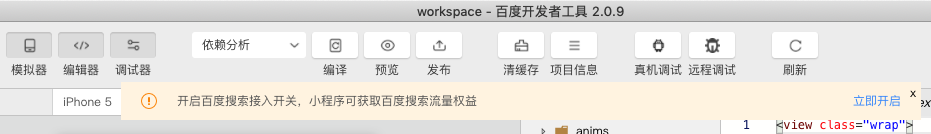
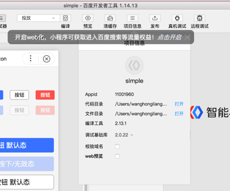
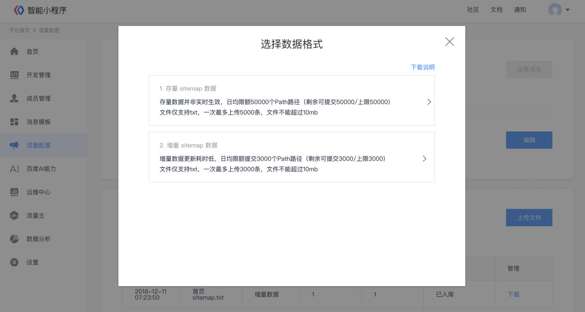
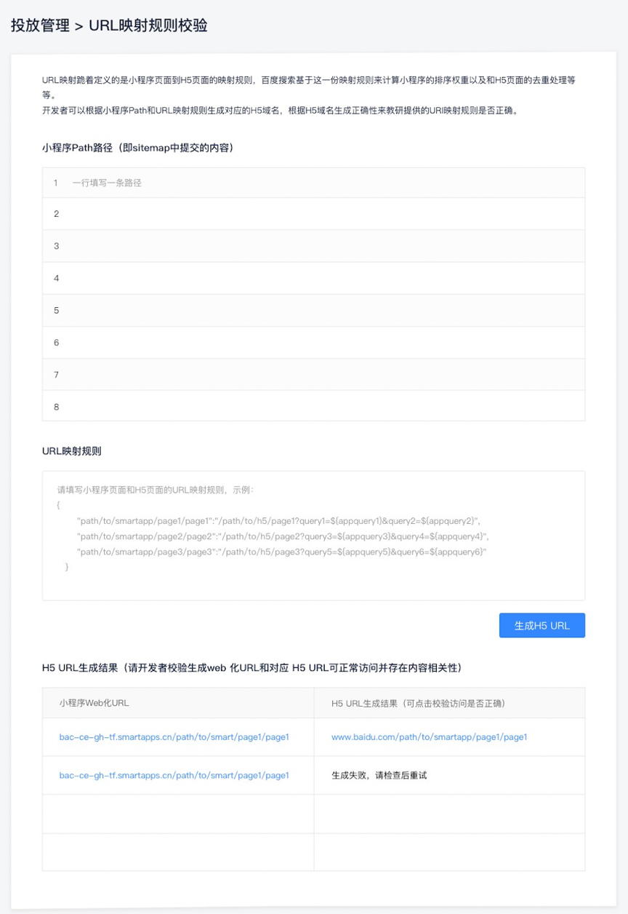
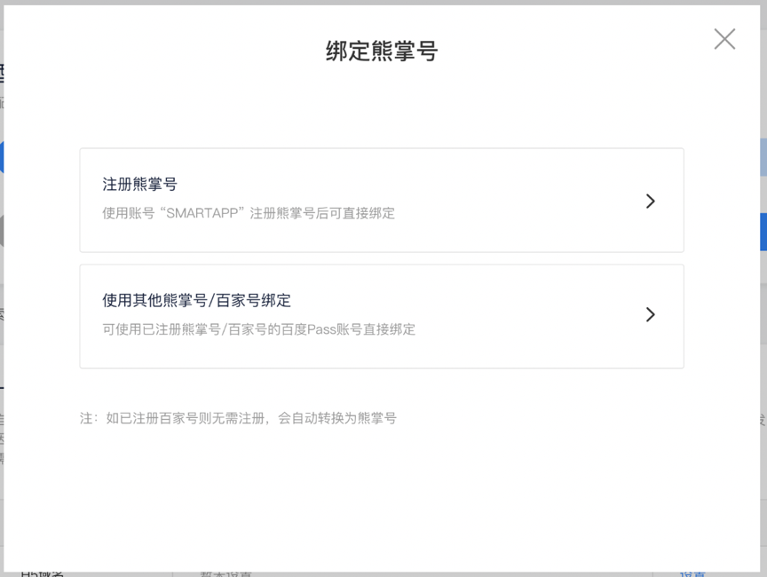
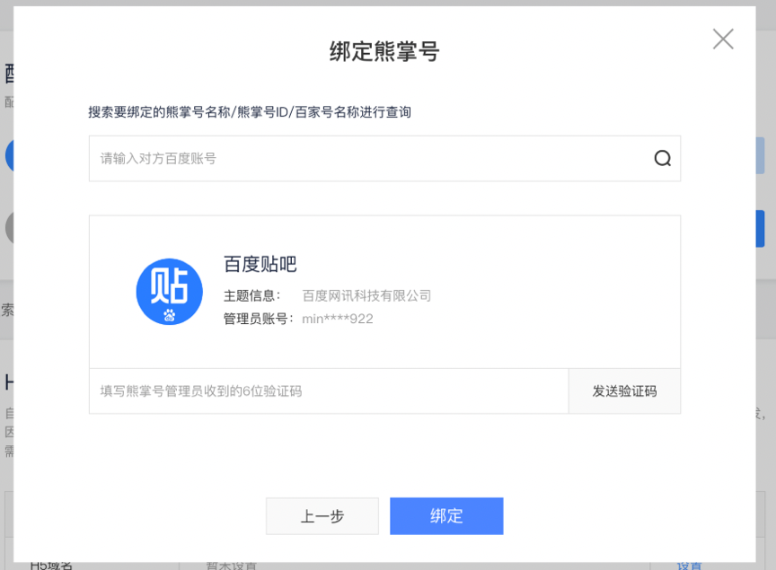

为了使智能小程序更好的被搜索引擎收录，智能小程序提供了一套完整的接入搜索的通路方案，开发者只需要按照下述方式进行操作配置和物料提交，就可以优化搜索引擎对小程序的抓取和收录，使得智能小程序获得在搜索引擎中更高效的分发。
具体配置方式包括：

* 开启 web 化
* 熊掌号绑定
* H5域名配置
* 页面基础信息设置
* URL映射规则设置
* Sitemap 提交

## 开启 web 化

> 请确认已具备小程序开发权限。

下载最新的<a href="https://smartprogram.baidu.com/docs/develop/devtools/show_sur/">开发者工具</a>，工具界面将会出现如下提示：

1. 单击“项目信息”，在弹出的对话框中勾选“接入百度搜索”。

2. 勾选后，单击“预览”，在弹出框选择“WEB预览”。
    * 为确保 web 小程序可以正常展示，建议通过这个按钮获取 Web 小程序的预览二维码，用手机浏览器扫码调试。
    * 请确保 web 版小程序：页面可正常展示，页面可正常跳转，底部 Tabbar 可正常点击切换。


## 页面基础信息

> 智能小程序被搜索引擎正常收录的前提是可以进行网页化的处理，能够以普通网页的形式被爬虫发现和抓取。可以理解为每一个智能小程序页面都会转码成一张网页。

页面基础信息的设置有助于智能小程序在搜索引擎和信息流中得到更加有效的展示和分发。
页面基础信息包括 title、description、keywords，以及用与描述页面内容信息（文章标题、发布时间等）、图片信息（地址，尺寸等）、视频信息（地址、时长、封面图等）等的字段。

页面基础信息设置接口详见<a href="http://smartprogram.baidu.com/docs/develop/api/seo/">页面基础信息</a>。

由于每个页面的页面基础信息和页面内容强相关，建议先通过 swan.request 请求开发者 server ，由开发者 server 返回相关信息，再通过页面基础信息的 API 设置到页面中。


## 配置 URL 映射规则

URL映射规则定义的是小程序页面到 H5 页面的映射规则，百度搜索基于这一份映射规则来计算小程序的排序权重以及和 H5 页面的去重处理等等，因此配置 URL映射规则对小程序入搜索至关重要。

### 规则提交方式
配置 URL 映射规则的方式有两种：
1. 在小程序源码文件 app.json 中声明
在 app.json 中增加 `url-mapping` 字段，声明智能小程序与其对应的H5页面的URL的映射规则。
示例：
```json
"url-mapping": {
    "pages/home/index": "/",
    "pages/list/index": "/products",
    "pages/book/index": "/book/detail?id=${id}"
}
```

2. 在百度智能小程序平台提交配置
进入智能小程序平台，从管理中心进入小程序开发者平台，单击“流量配置 > 自然搜索结果> URL 映射规则”，对URL映射规则进行线上配置。



### 规则格式说明

* 每组小程序 path - H5 url 的映射关系由一个 `key:value` 格式声明。
key 为小程序路径，格式与 `pages` 字段中声明路径格式一致。
value 为对应的 H5 页面路径。如果小程序路径和 H5 页面是一对一映射，value 为一个字符串；如果是一对多映射，value为一个数组。

* value 中的可变参数部分通过模板变量声明，模板变量的界定符是 `${}`。如果 H5 中某个参数值与小程序对应页面中某个参数一致，参数变量名取小程序参数名称以声明参数的对应关系；如果 H5 中某个参数在对应小程序页面参数中不存在，可用任意不包含在小程序页面参数名中名称。

* URL 映射规则默认不包含 host 部分，具体的 host 需要开发者在上述步骤中的 H5 域名部分进行配置。URL 映射规则也可包含 host 部分，要求 host 部分必须为在小程序平台的 H5 域名的子域。
   > * 可省略 host 的情况：小程序只需要映射到同一域名下的页面，只需要将该域名配置到上文提到的 H5 域名下，在 URL映射规则可省略 host
   > * 不可省略 host 的情况：某些 Web 站点可能存在多个子域名，小程序的页面需要同时映射到多子域下的 H5 页面，这种场景下需要在上文中提到的 H5 域名区域出配置主域名，在 URL 映射规则中配置 H5 子域。

### 配置示例

#### 映射规则格式示例

1. 一对一的映射关系

```json
{
    "pages/home/index": "/",
    "pages/list/index": "/products",
    "pages/book/index": "/book/detail?id=${id}"
}
```

2. 一对多映射关系

如果一个小程序页面存在多个对应的 H5 URL，通过数组方式声明

```json
{
    "pages/home/index": "/",
    "pages/list/index": "/products",
    "pages/book/index": [
        "/book/detail?id=${id}",
        "/book/history/detail?id=${id}",
        "/book?id=${id}"
    ]
}
```

3. 与子域名站点映射关系

如果某条映射规则的 host 是子域 host，value 前的域名不可省略

```json
{
    "pages/home/index": "/",
    "pages/list/index": "/products",
    "pages/book/index": [
        "/book/detail?id=${id}",
        "/book/history/detail?id=${id}",
        "https://my.example.com/book?id=${id}"
    ]
}
```


#### 映射项示例

1. 无参数情况

```json
// 小程序路径：pages/home/index
// 对应 H5 路径：https://example.com/
"pages/home/index": "/",

// 小程序路径：pages/list/index
// 对应 H5 路径：https://example.com/products
"pages/list/index": "/products"
```

2. 参数一致情况

当小程序页中的参数和 H5 中的参数含义一致时，value 部分参数值替换成模板变量，变量名为小程序中对应的参数名

```json
// 小程序路径：pages/book/index?id=12
// 对应 H5 路径：https://example.com/book/detail?id=12
"pages/book/index": "/book/detail?id=${id}",

// 小程序路径：pages/book/index?id=12
// 对应 H5 路径：https://example.com/book/detail?bookid=12
"pages/book/index": "/book/detail?bookid=${id}"
```


3. 小程序的参数为 H5 链接中一部分的情况

当 H5 中的可变部分不是在 URL Query 中，同样可以通过模板变量的方式替换对应的部分

```json
// 小程序路径：pages/book/index?id=12&cate=history
// 对应 H5 路径：https://example.com/book/history?bookid=12
"pages/book/index": "/book/${cate}?bookid=${id}",

// 小程序路径：pages/book/index?id=12
// 对应 H5 路径：https://example.com/book/history/12.html
"pages/book/index": "/book/${catgid}/${id}.html"
```

4. 映射 mip 流量

如果有 H5 站点基于 mip 技术进行了页面改造，且希望将 mip 页的流量置换为小程序，可在 url-mapping 中直接配置 mip 页的 url。

**举例**：
```json
H5站点url：www.msite.com/path
对应mip页url：www.msite.com/mip/path

在url-mapping中，建议基于一对多的配置规则，将小程序路径同时映射为H5和mip的url

{
    "pages/path/path": [
        "/path",
        "/mip/path"
    ]
}
```
## URL 映射规则 - 校验工具

在URL映射规则规则的填写弹窗中增加了“校验工具”的入口，开发者可点击“映射规则校验”进入对应的校验工具页面中，开发者可在页面中填写小程序的Path（即后续 Sitemap 中提交的内容）和 URL 映射规则，生成相应的 Web 化小程序 URL 和对应的 H5 URL 进行最终生成结果的检查，以便校验提交内容的正确性。




## 绑定熊掌号

在Web化版本小程序上线后，可在“流量配置>自然搜索结果页面”完成熊掌号的绑定，点击“绑定”按钮即可唤起绑定操作的弹窗 。


支持使用当前账号完成注册绑定，也支持绑定与小程序同主体的其他熊掌号，绑定其他熊掌号时需要获取其超级管理员的手机中收到的验证码进行操作权限的验证即可。

> 开发者必须完成熊掌号的绑定后才可进行Sitemap的提交，建议使用原H5所属熊掌号进行绑定，从而使小程序继承原H5在百度搜索中的排名权重。
