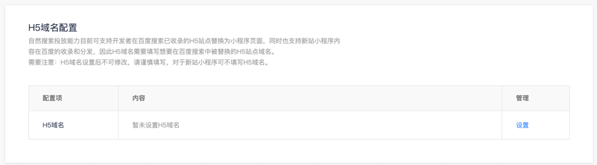
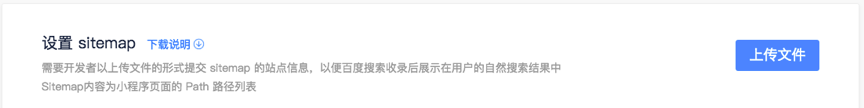
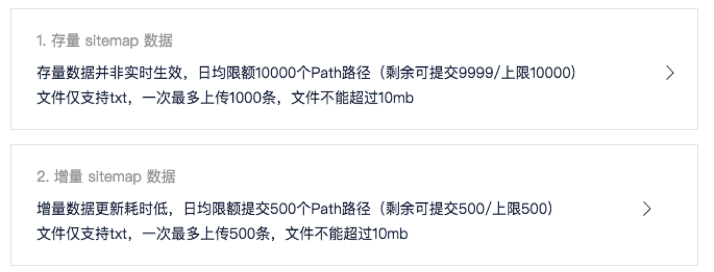

开发者依次进行**打开 Web 化开关并确认效果、配置页面基础信息、配置 H5 域名、配置 url 映射规则、提交 sitemap** 的操作，即可完成智能小程序对接自然结果的配置。

## 开启 web 化

> 请确认已具备小程序开发权限。

下载最新的<a href="https://smartprogram.baidu.com/docs/develop/devtools/show_sur/">开发者工具</a>，工具界面将会出现如下提示：

1. 单击“点击开启”，在弹出的对话框中勾选“web预览”。

2. 勾选后，开发者工具上方的按钮区域会出现“web 预览”的按钮。
    * 为确保 web 小程序可以正常展示，建议通过这个按钮获取 web 小程序的预览二维码，用手机浏览器扫码调试。   
    * 请确保 web 版小程序：页面可正常展示，页面可正常跳转，底部 tabbar 可正常点击切换。


## 配置页面基础信息

> 智能小程序被搜索引擎正常收录的前提是可以进行网页化的处理，能够以普通网页的形式被爬虫发现和抓取。可以理解为每一个智能小程序页面都会转码成一张网页。

开发者需要为当前的小程序页面配置页面基础信息，包括 title、description、keywords，这三类信息需要保持和小程序对应的 H5 站页面一致。具体接口详见<a href="http://smartprogram.baidu.com/docs/develop/api/seo/">配置页面基础信息</a>。

由于每个页面的页面基础信息和页面内容强相关，建议先通过 swan.request 请求开发者 server ，由开发者 server 返回相关信息，再通过页面基础信息的 API 设置到页面中。

<!-- ## 申请并绑定熊掌号

为使智能小程序被百度搜索分发，请提前要绑定熊掌号。
* 如果还未申请/绑定熊掌号，请使用小程序创建时登录的百度账号移步至<a href="https://xiongzhang.baidu.com">熊掌号</a>注册申请帐号。
* 请确保和熊掌号关联的百度帐号和创建小程序时登录智能小程序平台的百度帐号相同。
* 也可以在进入小程序首页后，在“流量配置-自然搜索结果”中完成熊掌号的在线注册绑定。 -->

## 配置 H5 域名

> H5域名和下文提到的url映射规则配合使用，一起生成小程序和H5站点的映射关系

1. 配置业务域名
在配置 H5 域名之前，请提前在“流量配置-自然搜索结果”中将开发者 H5 站点的域名，添加到“业务域名”中。

2. 在配置页面的“H5 域名配置”中，单击“设置域名”按钮，在弹出的对话框中，配置 “H5 域名”即可。


#### H5 域名

**举例**：https://tieba.baidu.com
**说明**：
* “H5 域名”是指开发者 H5 站点的域名，一经配置之后不可更改，请谨慎填写。
* 如果开发者存在多个 H5 子域，且这些 H5子 域都有对应的小程序页面，请配置 H5 主域名。
    举例，如果存在多个 H5 子域：
    https://news.m.yiche.com
    https://v.m.yiche.com
    https://car.m.yiche.com
    请在小程序平台配置主域名：https://m.yiche.com
* 对于新站小程序可不填 H5 域名，此时自然搜索的内容为新站点内容的收录。

## 配置 url 映射规则

url 映射规则定义的是小程序页面到 H5 页面的映射规则，百度搜索基于这一份映射规则来计算小程序的排序权重以及和 H5 页面的去重处理等等，因此配置 url 映射规则对小程序入搜索至关重要。
### 增加 url-mapping 字段
在 app.json 中增加 url-mapping 字段，配置智能小程序与其对应的H5页面的 url 的映射规则，供搜索引擎在自然结果中将H5站url进行匹配和替换。

* url-mapping 字段为 Object，在pages 中配置的小程序路径作为 key，每一个小程序路径对应的 H5 页面作为 value; 每一对”key-value”作为一个完整的url映射。如果小程序路径和H5页面是一对一映射，value为一个字符串；如果是一对多映射，value为一个数组。
* url映射规则通过字符串模板的方式进行定义，模板变量的界定符是${}。需要将Web版智能小程序url中的query部分，和字符串模板进行编译，生成正式的url实例。
* url 映射规则默认不包含 host 部分，具体的 host 需要开发者在上述步骤中的H5域名部分进行配置。url 映射规则也可包含 host 部分，要求 host 部分必须为在小程序平台的 H5 域名的子域。
   > * 可省略 host 的情况：小程序只需要映射到同一域名下的页面，只需要将该域名配置到上文提到的H5域名下，在 url 映射规则可省略 host。
   > * 不可省略 host 的情况：某些Web站点可能存在多个子域名，小程序的页面需要同时映射到多子域下的H5页面，这种场景下需要在上文中提到的H5域名区域出配置主域名，在url映射规则中配置H5子域。

### 配置示例

#### 一对一映射关系示例

|小程序页面链接|对应H5页面链接|
|--|--|
|web化主页：https://byokpg.smartapps.cn/path/to/smartapp/home|H5主页：https://m.site.com/|
|web化列表页： https://byokpg.smartapps.cn/path/to/smartapp/list?city=bj|H5列表页：https://m.site.com/list/bj.html|
|web化详情页：https://byokpg.smartapps.cn/path/to/smartapp/detail?city=bj&id=1024|H5详情页：https://m.site.com/detail.html?id=1024|


app.json中配置url-mapping字段如下：
```json

    "url-mapping": {
        "pages/index/index":"/",
        "pages/pb/pb":"/p/${tid}",
        "pages/frs/frs": "/?kw=${kw}"
    }

```
#### 参数不一致示例

|小程序页面链接|对应H5页面链接|
|--|--|
|https://byokpg.smartapps.cn/pages/detail?id=1024|https://m.site.com/detail.html?page=2048 |
app.json中url-mapping的对应规则为：
```json
"url-mapping": {
    "pages/detail ":"/detail.html?page=${page}&id=${id}"
}
```


#### 一对多映射关系示例
* 当多个H5的页面内容相同并且指向同一个小程序页面时：

|小程序页面链接|对应H5页面链接|
|--|--|
|https://byokpg.smartapps.cn/pages/shop/shop?shopid=1024 | https://m.site.com/shop/1024<br>https://m.site.com/mshop/1024|
app.json中url-mapping的对应规则为：
```json
"url-mapping": {
    "pages/shop/shop ":["/shop/${shopid}","/mshop/${shopid}"]
}
```
* 当H5域名属于绑定域名的同一主域下的不同二级域名时，需要补全二级域名：

|绑定 H5 域名|小程序页面链接|对应H5页面链接|
|--|--|--|
|https://m.site.com | https://byokpg.smartapps.cn/pages/shop/shop?shopid=1024 | https://shop.m.site.com/shop/1024 |
app.json中url-mapping的对应规则为：
```json
"url-mapping": {
    "pages/shop/shop ":"https://shop.m.site.com/shop/${shopid}"
}
```
**说明**：
当多个不同的H5页面（如视频页、图集页）对应同一个小程序页面模板并且H5和小程序的path参数完全不同时，此时建议将小程序页面根据类型和参数进行拆分。

### 智能小程序平台配置url映射关系
url映射规则不仅可以在app.json中进行配置，同样也可以在智能小程序平台中进行配置。进入智能小程序平台，单击进入小程序首页，单击“流量配置>自然搜索结果>URL Pattern”，对url映射规则进行线上配置。


## 在开发者工具重新提包

完成上述步骤之后，请在开发者工具里重新提包，在代码编译过程中可能会出现和Web化相关的报错信息，请根据报错信息进行修复。
代码包通过审核后，开发者将会自动获得一个Web小程序的线上地址，请参见<a href="https://smartprogram.baidu.com/docs/develop/web/detail/">Web化域名获取</a>。
> 开发者可通过该地址来确认自己的Web小程序是否已成功部署到线上, 该域名可被访问但不建议对外直接提供使用。

## 提交 sitemap

进入智能小程序平台，在小程序首页，单击“投放管理>自然搜索管理”。在自然搜索 tab 里，可上传 sitemap。
**sitemap**:
内容为小程序页面的 path+query 列表，其中 query 必须包含 url-mapping 中的 H5 链接的参数全集。
**url-mapping规则**:
```json
 {
    "path/to/smartapp/list":"/list/${city}.html",
    "path/to/smartapp/detail":"/detail.html?id=${id}",
    "pages/detail ":["/detail.html?page=${page}&id=${id}","/main/detail.html?detailId=${detailId}"]
}
```
**sitemap 示例**:
```
path/to/smartapp/list?city=bj
path/to/smartapp/list?city=sh
path/to/smartapp/detail?id=1024
pages/detail?page=2048&id=1024&deailId=4096

```
目前支持存量上传和增量上传两种方式:
* 其中存量上传并非实时生效，可提交的量较多，但是更新耗时较长；
* 增量上传数据更新耗时低，但是日均可提交的配额较少。


    

**说明**：
当详情页面个数较多，而小程序的路径唯一时，请携带query依次提交sitemap。