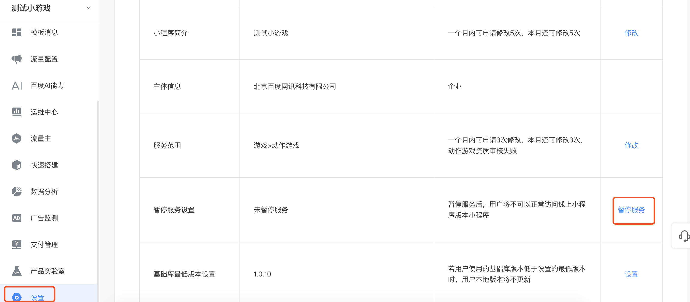
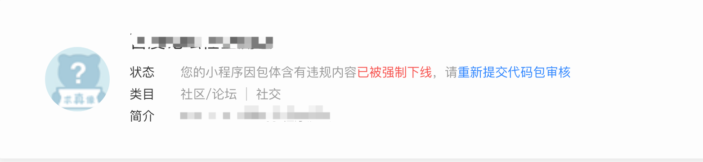
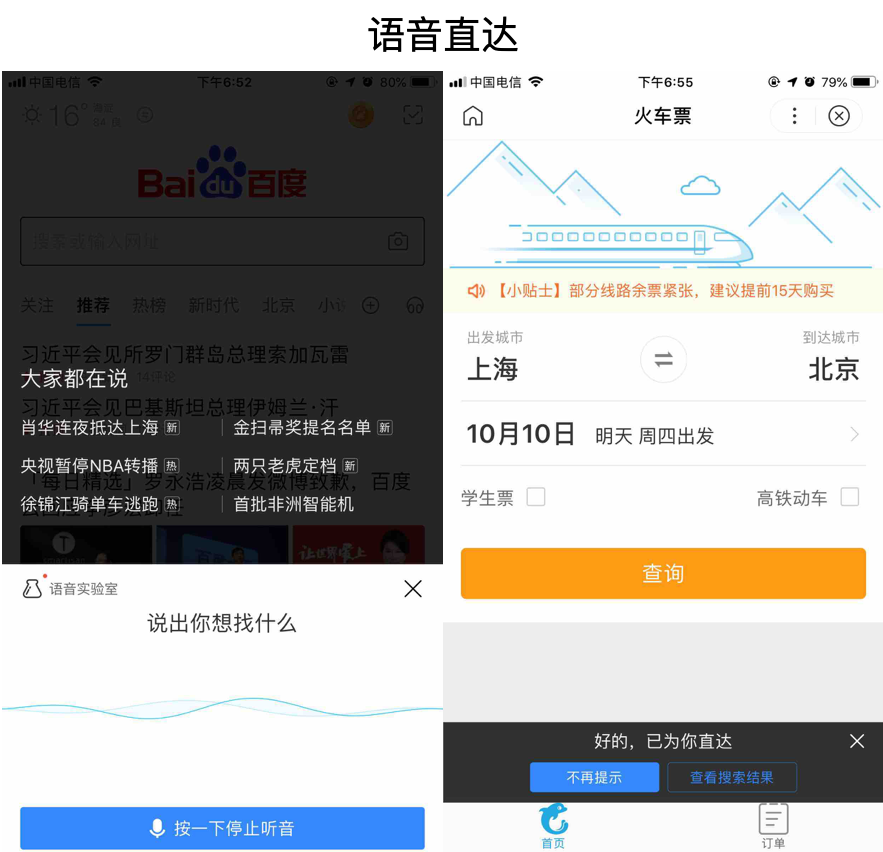
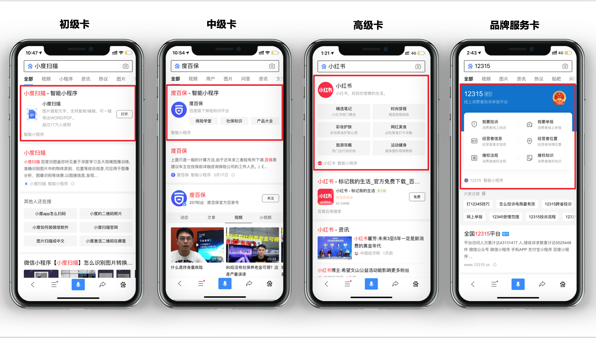
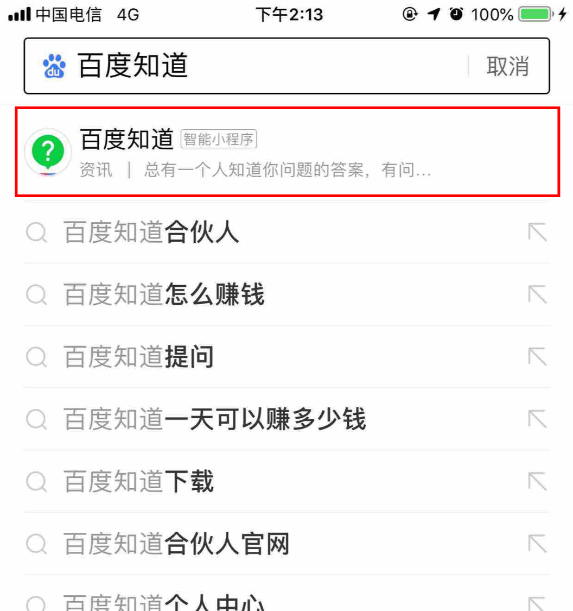
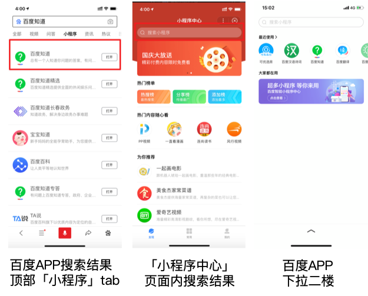

 

智能小程序资源下线退场通路包括「开发者自主操作下线」和因小程序资源存在低质、违规、侵权等问题被「平台强制下线」两种情况。

1. 开发者自主操作下线：自主下线适用于开发者由于自身原因，需要对智能小程序进行下线，可以选择自主下线功能。通过「小程序开发平台」→「设置」→「基本设置tab」→下拉→「暂停服务设置」→「点击暂停服务」即可完成自主下线。

 

2. 平台强制下线：平台强制下线是当某个智能小程序资源存在低质、违规、侵权等情况时，会被平台强制下线，以保障用户体验。被下线的小程序开发者会收到对应的系统通知和页面提示，请根据提示进行修改，及时处理问题。

 

需要注意的是，无论是用户自主操作下线还是因质量问题被智能小程序平台强制下线，该小程序对应的如下所有搜索展示场景都会同步关闭，所以开发者需要谨慎使用下线功能，同时保证小程序质量优质。

下线入口如下：

1. 语音直达：
语直达是指用户可以通过百度APP下方的语音搜索入口，语音说出小程序名或关键词后，会直接跳转到符合需求的小程序页面。

若智能小程序资源下线，对应的语音直达能力也会在约15分钟左右同步关闭，生效后用户将无法通过语音直接进入到对应的小程序。

 

2. 自然搜索结果-适配资源&原生小程序资源：

智能小程序资源下线后，自然搜索将在48小时内对小程序内容完成屏蔽。生效后，用户在搜索时，将无法搜索到已下线小程序对应的内容资源。

3. 搜索特型展现-智能小程序单卡：

智能小程序单卡是一种搜索特型卡片，具有品牌曝光强势、服务交互便捷等优点，能够帮助开发者获取更多用户关注和转化。

若智能小程序资源下线，小程序的单卡样式会在约24小时内同步下线。

 

4. 搜索词推荐直达（sug直达）：

搜索词推荐直达是指⽤户在百度APP搜索框输入明确需求的关键词时，如果有对应的⼩程序能够直接满⾜⽤户需求并具有优质的体验效果，搜索框下会自动推荐匹配的⼩程序，用户点击后，会直接进入对应小程序页面，提升品牌曝光和品牌服务触达转化。

当智能小程序资源下线后，对应的搜索词推荐直达入口会在约2小时内关闭。生效后，用户搜索时，将不会出现自动推荐的小程序结果。

 

5. 百度APP搜索结果顶部「小程序」tab &「小程序中心」页面内搜索结果&百度APP下拉二楼

无论是百度APP搜索结果顶部「小程序」tab 还是「小程序中心」页面内搜索结果或是百度APP下拉二楼，都会在开发者的智能小程序下线后的约48小时内，同步屏蔽对应小程序的搜索结果展现。

 

综上，当智能小程序主动或被动下线后，会在各搜索场景中全方位的下线，用户将无法通过各搜索场景的入口访问开发者的智能小程序。

所以我们诚挚地建议各位开发者：

1. 牢记小程序质量规范，经常自查，切勿触碰红线导致被下线，从而造成不必要的损失。相关内容可参考：[《百度智能小程序SEO指南》](https://ziyuan.baidu.com/college/articleinfo?id=2772)

2. 遇到问题请及时咨询客服或进入社区沟通交流，请勿随意对小程序进行下线操作，相关操作可参考本文档。

