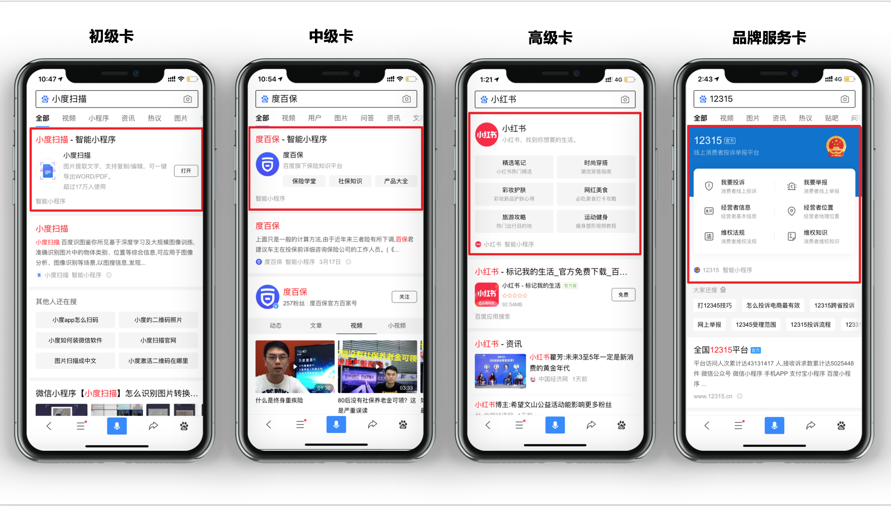

 

**1.智能小程序单卡介绍：**

智能小程序单卡是一种搜索特型卡片，具有品牌曝光强势、服务交互便捷等优点，能够帮助开发者获取更多用户关注和转化。

在品牌曝光上，用户搜索小程序相关名称时，会有4大特型样式展现，尤其高级卡和品牌服务卡，能占据手机屏幕一半以上，帮助开发者快速打动用户心智。

在服务交互上，开发者可自行配置展示模块，用户一搜即达，帮助用户快速找到、使用、分享相关服务能力。
**2.智能小程序单卡样式：**

**3.智能小程序单卡获取方式：**

**4.智能小程序单卡子链配置方式：**
如下图路径：登录百度智能小程序开发者后台 > 流量配置 > 小程序单卡 > 添加子链，按提示操作审核通过后即可上线展示给用户。

**5.智能小程序单卡子链配置注意事项：**

（1）单卡子链必须是该小程序的核心功能或子频道，不能是首页、单一商品页或单一内容页。
（2）最多可提交15个小程序单卡的外露子链进行审核，至少需要有2条子链通过审核才可以展现。
（3）审核通过的子链，开发者设置的排序靠前的优选子链会优先分发，当优选子链出现异常或用户对备选子链有强需求时，会自动分发备选子链。优选子链和备选子链会按照顺序依次分发，请开发者按期望排序调整。
（4）path路径即页面路径，和配置文件app.json的pages字段涵义相同，提交的path要与子链文案相对应。
（5）子链名称不超过10个字符（1个汉字为2个字符）、子链相关描述不超过16个字符（1个汉字为2个字符），子链名称和子链描述不能重复，子链文案需符合广告法。
（6）path落地页功能完善，用户体验优质

