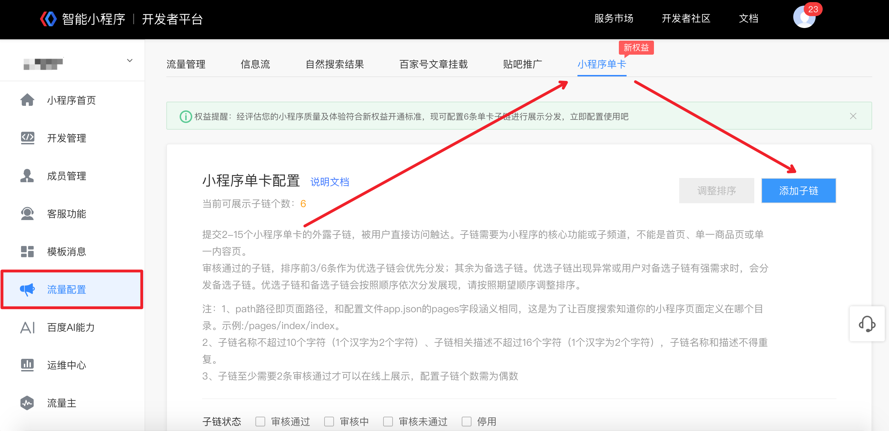

 

**1.智能小程序单卡介绍：**

智能小程序单卡是一种搜索特型卡片，具有品牌曝光强势、服务交互便捷等优点，能够帮助开发者获取更多用户关注和转化。

在品牌曝光上，用户搜索小程序相关名称时，会有4大特型样式展现，尤其高级卡和品牌服务卡，能占据手机屏幕一半以上，帮助开发者快速打动用户心智。

在服务交互上，开发者可自行配置展示模块，用户一搜即达，帮助用户快速找到、使用、分享相关服务能力。
**2.智能小程序单卡样式：**

**3.智能小程序单卡获取方式：**

初级卡与中级卡：上线后自动获取（24小时内），中级卡样式需开发者进行单卡子链配置（子链审核通过后，4小时内生效）。

高级卡：根据智能小程序质量及体验评估获得，需开发者进行单卡子链配置（子链审核通过后，4小时内生效），高级卡拥有6个子链模块，更强的交互展现，开发者可以提供更多的服务内容，方便用户快速找到并使用所需服务。

品牌服务卡：根据智能小程序质量及体验评估获得，需开发者进行单卡子链配置（子链审核通过后，4小时内生效）。

**4.智能小程序单卡子链配置方式：**
如下图路径：登陆百度智能小程序开发者后台 > 流量配置 > 小程序单卡 > 添加子链，按提示操作审核通过后即可上线展示给用户。

**5.智能小程序单卡子链配置说明：**
提交2-15个小程序单卡的外露子链，被用户直接访问触达。子链需要为小程序的核心功能或子频道，不能是首页、单一商品页或单一内容页。
审核通过的子链，排序靠前的优选子链会优先分发，其余为备选子链。优选子链出现异常或用户对备选子链有强需求时，会分发备选子链。优选子链和备选子链会按照顺序依次分发展现，请按照期望顺序调整排序。

**6.备注：**
（1）path路径即页面路径，和配置文件app.json的pages字段涵义相同，这是为了让百度搜索知道你的小程序页面定义在哪个目录。示例:/pages/index/index。
（2）子链名称不超过10个字符（1个汉字为2个字符）、子链相关描述不超过16个字符（1个汉字为2个字符），子链名称和描述不得重复。
（3）子链至少需要2条审核通过才可以在线上展示，配置子链个数需为偶数

