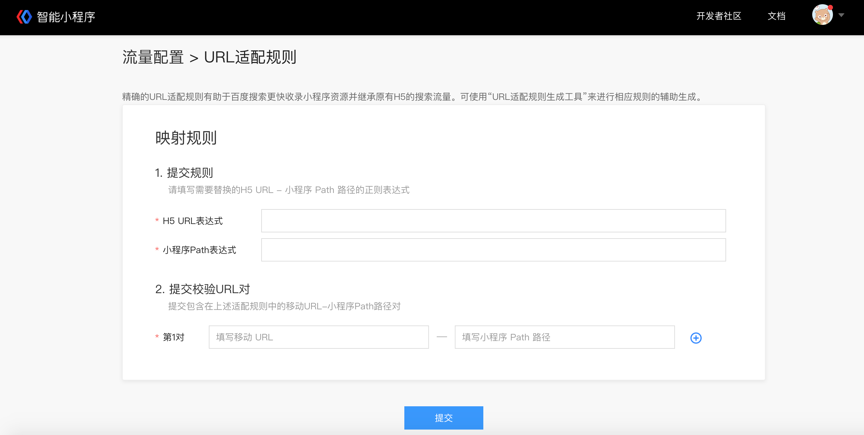
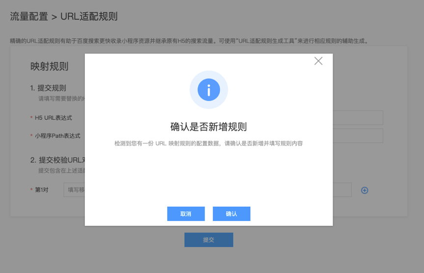
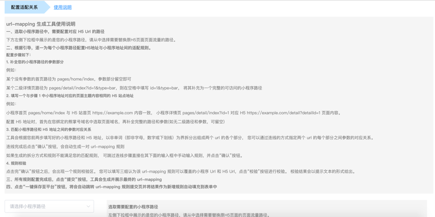
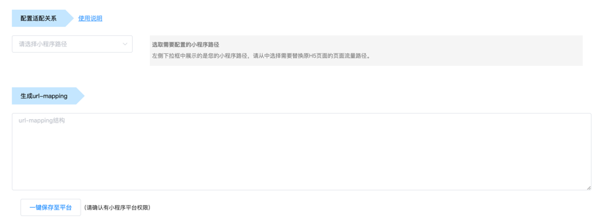
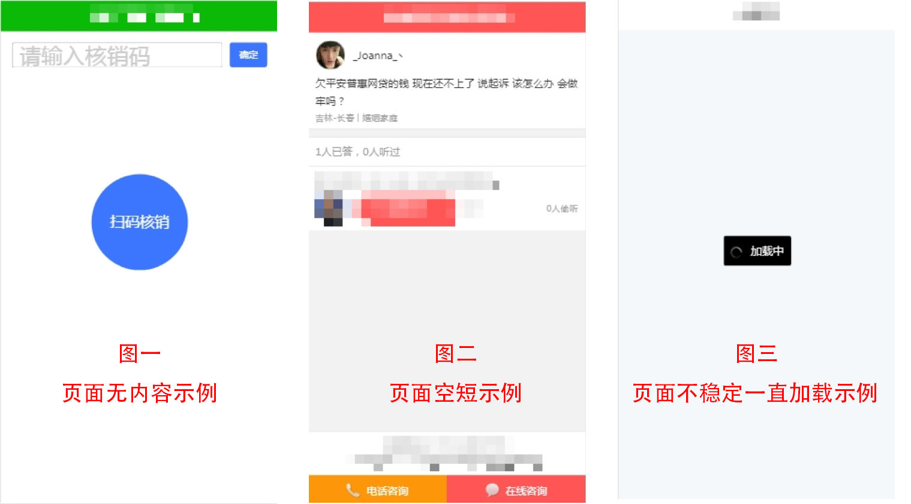

**1.为什么要配置URL适配规则？**
设置URL适配规则，可以使百度搜索得到您的小程序页面与H5页面之间的对应关系。精确的URL适配规则有助于百度搜索更快收录小程序资源并继承原有H5的搜索流量。因此配置 URL适配规则对小程序进入搜索至关重要。
**2.URL适配规则该怎么填写？**
通过正则表达式的方式声明 H5 链接与小程序路径间的对应关系。格式举例：

>H5：`http://example.com/detail?id=1`
小程序路径：`/pages/detail/index?id=1`
这组对应关系可以用以下规则描述：
`http://example.com/detail?id=([^&]+)=> pages/detail/index?id=${1}`

如上例所示，“=>” 左侧部分为 H5 链接生成的正则表达式，标识了 H5 地址中与小程序参数有对应关系的部分；“=>”右侧部分由小程序路径和参数对组成。参数对中如果某个参数值是左侧匹配到的部分，则其参数值由${左侧匹配项的序号}代替。

**2.1更多示例**

| H5 地址 | 小程序路径 |
|-|-|
| https://example.com/ | pages/home/index |
```
// 如果要完全匹配到 url 结尾，例如当 url 后没有 path 时，适配小程序首页 path，url 后要加结束符
https://example.com/$ => pages/home/index
```

|H5 地址|小程序路径|
|--|--|
| `https://example.com/book?id=1&type=history`| pages/book/index?bookid=1&type=history |
```
https://example.com/book?id=([^&]+)&type=([^&]+) => pages/book/index?bookid=${1}&type=${2}

// 只要是符合正则规则的匹配方式都可以，例如下述规则也同样正确
https://example.com/book?id=([\w]+)&type=(.+)$ => pages/book/index?bookid=${1}&type=${2}
```

|H5 地址 |小程序路径 |
|-|-|
| `https://example.com/history/book?id=1` | pages/book/index?bookid=1&type=history |
```
// 参数部分序号根据正则匹配的顺序决定
https://example.com/([^\/]+)/book?id=([^&]+) => pages/book/index?bookid=${2}&type=${1}
```

| H5 地址 | 小程序路径 |
|-|-|
| `https://example.com/history_type/book?id=1 `| pages/book/index?bookid=1&type=history |
```
https://example.com/([^\_]+)_type/book?id=([^&]+) => pages/book/index?bookid=${2}&type=${1}
```

| H5 地址 | 小程序路径 |
|-|-|
| `https://example.com/book/1.html` | pages/book/index?bookid=1&type=history |
```
// 两个地址中没有对应项的参数保持不变
https://example.com/book/([^\.]+).html => pages/book/index?bookid=${1}&type=history
```

| H5 地址 | 小程序路径 |
|-|-|
| `https://example.com/book/history2019.html?id=1 `| pages/book?type=history |
```
https://example.com/book/([^\d]+)2019.html?id=1 => pages/book?type=${1}
```

**3.智能小程序平台配置 URL 适配关系**
在【搜索接入】-【自然搜索】-【已有H5资源替换】，当开发者需要对已有 H5资源配置时，可在 URL 适配规则的配置模块完成相应内容的设置，具体步骤如下：
 
**第一步：**点击页面中的“新建”按钮后，选择“设置 URL适配规则”进行配置。如对规则不够熟悉，也可以使用第二条“URL适配规则生成工具”来辅助配置。
 
**第二步：**在 URL 适配规则的设置页面中，开发者需要填写具体H5 链接表达式和对应的小程序 path（路径） 表达式，并至少提供一对示例链接，用于验证规则准确性。
开发者可在本页面添加多组规则。
 
**第三步：**当完成验证并提交后，系统将自动对该规则覆盖的 H5资源进行替换处理（优先对 TOP 流量的 H5资源进行替换）。因此，开发者需要保证对应的小程序页面已完成“页面基础信息”的设置。
 
**第四步：**返回【已有H5资源替换】，可在下方查看替换进度及适配生效量。
 
 
 **4. URL 适配规则 – 生成工具**
URL 适配规则的辅助生成工具，也可以通过规则编辑页面进入。在规则辅助生成工具的页面中，开发者只需要按照工具的引导，提供 H5 URL 示例和小程序 Path 示例，并根据提示进行校验后，即可生成对应的 URL 适配规则表达式。
 
 
为方便开发者操作，点击下方的“一键保存至平台”后，规则会直接复制到配置工具中，用户可以按照提示完成新建和提交。也可以选择自主撰写规则后提交。

**5.URL适配规则提交反馈状态详解**
开发者在已有H5资源替换中提交适配规则后，可见如下5种适配规则状态，本文将对这些状态进行详解，帮助开发者更好地理解，并及时修改有误规则。

1）.适配成功：
该状态表示，您所提交的规则已全部适配成功，无需任何操作。如果删除已经适配成功的规则，可能会导致已经生效的适配规则失效，百度App内的搜索结果回退至H5，请谨慎操作。
2）.部分失败：
该状态表示，您所提交的规则有部分对应链接校验成功，还有一部分校验失败。请根据校验失败的原因自查并修改规则，确认无误后重新提交。修改方法可以参考《url替换失败错误原因详解》。（https://smartprogram.baidu.com/forum/topic/show/67930）
3）.适配失败：
该状态表示，您所提交的规则校验失败，请根据校验失败的原因自查并修改规则，确认无误后再重新提交。
4）.校验中：
该状态表示，您所提交的规则仍在校验中，提交适配规则后，一般需要约一周的时间进行适配校验，在此期间不能进行任何操作，请耐心等待。
5）.不满足适配条件：
该状态表示，您所提交的规则对应的H5链接未收录或近期在搜索中无点击，建议以sitemap形式提交对应小程序资源。若重新提交适配规则，建议优先覆盖关联的H5站点内有点击的url，所关联H5站点的点击情况请查看“热门H5目录”。


**6.小程序接入搜索Sitemap反馈失败及URL替换失败错误原因详解**
开发者在小程序接入搜索的过程中，如遇到Sitemap反馈失败及URL替换失败的错误反馈，可以根据页面反馈及参照如下内容进行自查，通过以下错误原因及处理方式，能够帮助开发者更快速准确的完成修改。

 - **资源未收录：**您的规则对应的H5或小程序资源未被收录，您可将对应小程序资源通过sitemap方式提交。 
 - **小程序页面死链：**您的规则对应小程序资源存在内容死链或死链率较高，请自查修复后重新提交。
 - **小程序页面存在第三方跳转：**您的规则对应小程序资源存在跳转H5、嵌套H5等情况，请自查修复后重新提交，我们不建议提交webview模式小程序，建议开发原生小程序。
 - **H5页面死链：**您的规则对应H5资源页面死链，请自查修复后重新提交。
 - **主体内容不一致：**您的规则对应的小程序页面与H5页面内容不一致，请自查页面基础信息如title、正文主体、页面版块是否基本一致，修改一致后重新提交规则。
 - **规则异常：**您所提交的适配规则存在异常，请自查正则表达式拼写是否正确，是否存在空格、乱码、异常符号等情况，纠错后重新提交。
 - **规则被占用：**您所提交的适配规则已被另一规则占用并优先生效，请自查规则之间是否存在重复，修复后重新提交。
 - **小程序path不规范：**您提交的小程序path不符合约定格式，在提交规则时需要注意符合以下规范：
    1）小程序path不能带有#标记
    “#”这个符号在通用url中标记锚文本，和不带#的url表示同一个页面。请不要在小程序path中夹带#标记，避免适配出错。
    2）小程序path参数不能为路径
    小程序path可以带参数，但需注意，参数不可以是一条路径，也不可以是一条H5 url。以下这三类都是不符合规范的：
    xxx.smartapp.cn/parameter_a=/path1/file，
    xxx.smartapp.cn/parameter=http://xxx.baidu.com/path1/1.html，
    xxx.smartapp.cn/parameter=xxx.baidu.com/path1/1.html。
    如需带相关参数，务必清晰表述参数名和参数定义，如dir_name=news。
 - **小程序已下线：**对于整站下线的小程序，适配不予生效。请重新提包之后，等待适配校验生效。
    请注意：小程序重新提包之后，搜索会尽快对已提交的规则进行校验，因此小程序重新上线之后无需进行任何操作，耐心等待规则重新校验即可。    
 - **页面内容低质：**您所提交的适配规则对应小程序页面内容低质，请自查是否存在以下几方面错误，修复后重新提交。
    1）页面是否空白、空短：①页面无内容示例请见下图一 ②页面空短示例请见下图二；
    2）页面访问是否稳定，页面是否加载、响应时间过长，导致页面无法获取完整内容。页面访问不稳定一直加载中请见下图三；
    

    3）已下架、已过期类资源不建议提交：
    如电商类、招聘类等开发者经常会有大量的产品下架、售空、资源过期等情况，此类资源不建议再提交sitemap。
    4）切勿资源采集、拼凑：
    如果小程序资源存在大量从其他站点或公众号等内容生产方采集、搬运而来的内容，信息未经整合，排版混乱，文章可读性差，有明显采集痕迹，则对用户无任何增益价值，被视为低质内容。

以上就是提交反馈的10种问题反馈的详解，对已反馈数据失败的情况，sitemap及url替换，均需要各位修复数据后，再次提交sitemap或规则。


