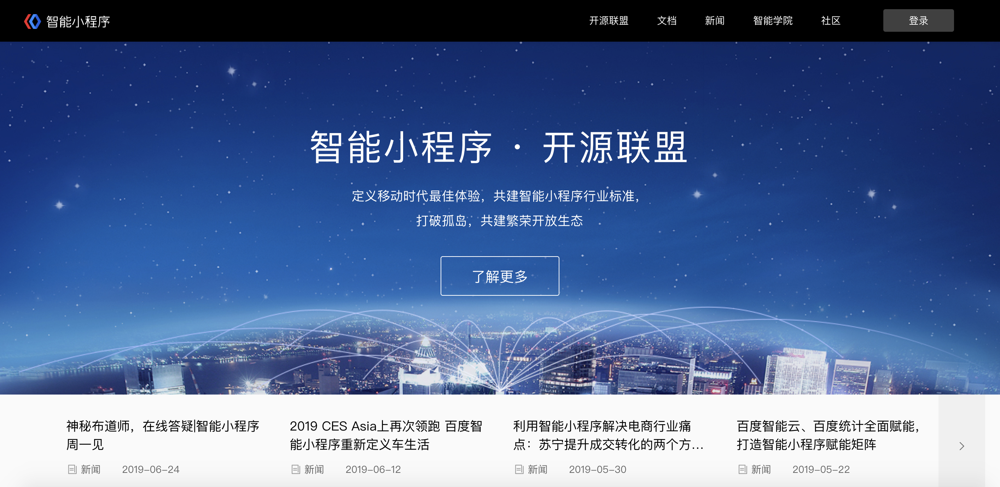
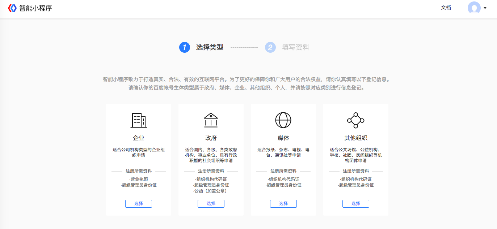

注册地址(PC版)：<a href="https://passport.baidu.com/v2/?reg&tt=1521786256298&overseas=undefined&gid=D8D45DC-FFC4-486A-BA34-B3215E98FF74&tpl=mn&u=https%3A%2F%2Fwww.baidu.com%2F" >点击注册</a>

登录地址(PC版)：<a href="https://smartprogram.baidu.com/mappconsole/main/login">点击登录</a>
 - 使用百度App扫码登录
 - 手机短信验证登录
 - 百度账号密码登录

## 主体资质审核

### 选择主体类型
<!-- 主体类型：个人、媒体、企业、政府、其他组织五种主体类型。
 主体类型说明：
 - 个人：由自然人注册和运营的公众帐号；
 - 媒体：报纸、杂志、电视、电台、通讯社、其他等；
 - 企业：企业、个体工商户、企业相关品牌；
 - 政府：国内、各级、各类政府机构、事业单位、具有行政职能的社会组织等；
 - 其他组织：公共场馆、公益机构、学校、社团、民间组织等机构团体申请； -->
 主体类型：媒体、企业、政府、其他组织四种主体类型。
 主体类型说明：
 - 媒体：报纸、杂志、电视、电台、通讯社、其他等；
 - 企业：企业、个体工商户、企业相关品牌；
 - 政府：国内、各级、各类政府机构、事业单位、具有行政职能的社会组织等；
 - 其他组织：公共场馆、公益机构、学校、社团、民间组织等机构团体申请；

### 主体信息登记

不同类型的开发者所需的登记信息：包括主体信息、超级管理员信息两部分。

|类型|定义|所需信息|
|---|---|---|
|企业 | 企业、个体工商、企业相关品牌 |1. 企业名称   2. 营业执照注册号／统一社会信用代码 3. 营业执照原件照片|
|政府 | 国内、各级、各类政府机构、事业单位、具有行政职能的社会组织等 | 1. 政府名称 2. 组织机构代码 3. 组织机构代码证原件照片 4. 确认公函 |
|媒体 | 报纸、杂志、电视、电台、通讯社、其他等 | 1. 组织类型 2. 组织名称 3. 组织机构代码  4. 组织机构代码证原件照片 |
|其它组织 | 公共场馆、公益机构、学校、社团、民间组织等机构团体申请 | 1. 组织名称 2. 组织机构代码 3. 组织机构代码证原件照片 |

<!-- |个人 | 由自然人注册和运营的账号 | 超级管理员信息 | -->

注：每个帐号有5次提交审核机会，5次审核仍然没通过的，将不能再提交。

### 运营者信息登记

登记运营者身份证姓名、身份证号码并验证手机号。

### 提交并等待审核通知

## 真实性认证

### 审核通过

1. 信息审核通过后，单击“尽快完成认证”，验证主体的真实性。

2. 单击“对公验证”，进入对公打款页面。

3. 对公打款：填写企业对公银行开户信息。

    回填金额

4. 单击“小程序优惠通道”。

5. 单击开通优惠通道，请于60天内完成至少一个小程序的发布

6. 认证完成

