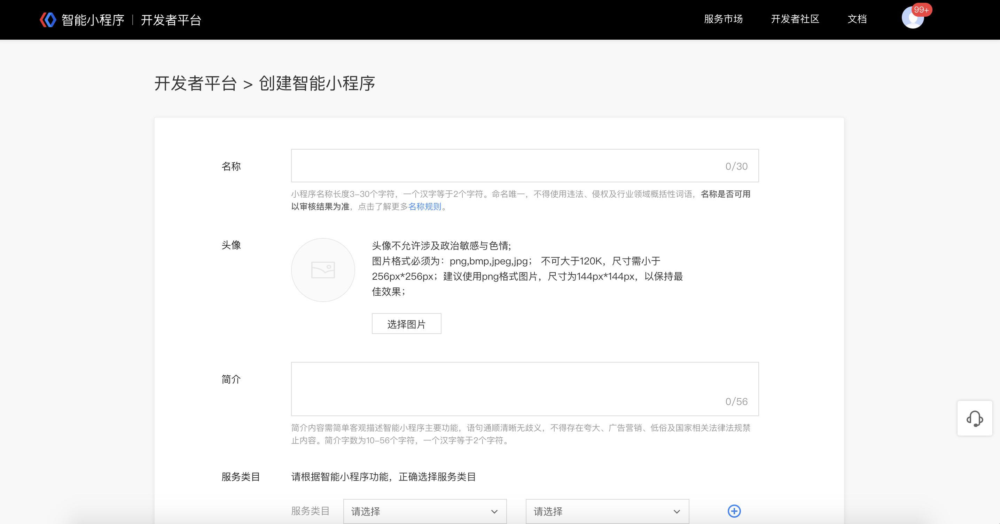
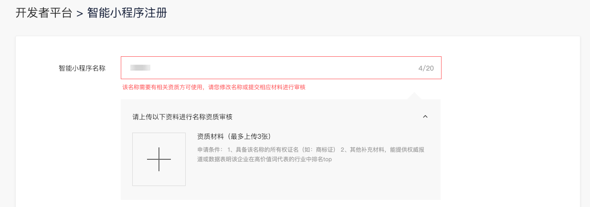
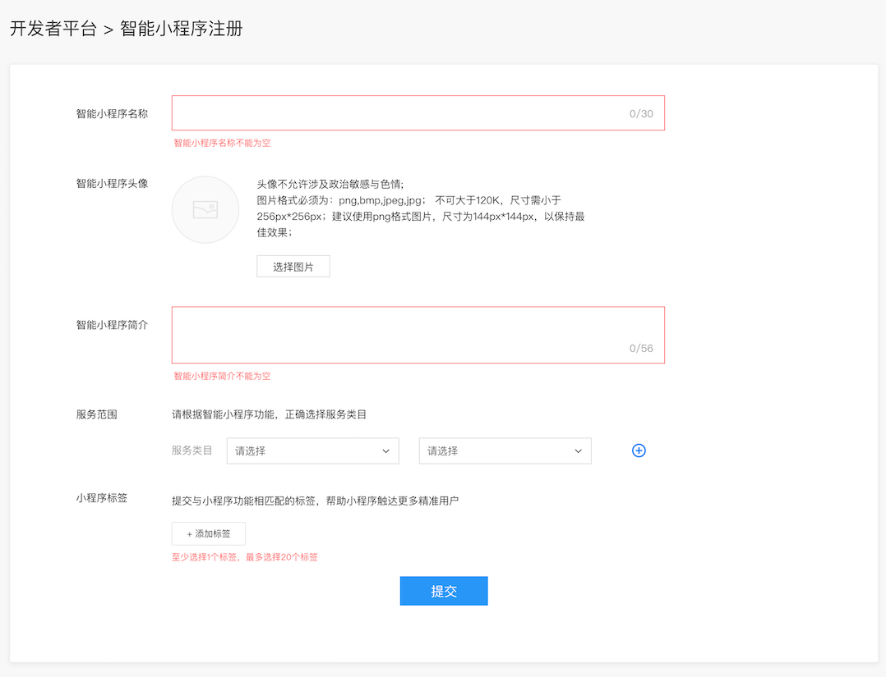

主体认证审核通过后，您可先操作“创建智能小程序”

## 完善基本信息

填写智能小程序名称、简介、上传头像并选择服务范围。如果选择为特殊行业，还需根据界面提示提交相应资质材料。
关于小程序名称：请参考<a href="http://smartprogram.baidu.com/docs/operations/specification/">平台运营规范</a>。

若填写的智能小程序名称涉及品牌或名称侵权需提交相关资料进行审核。

填写智能小程序名称、简介、上传头像并选择服务范围。如果选择为特殊行业，还需根据界面提示提交相应资质，审核预计需要2个工作日完成，在此期间不会影响您进行正常的小程序开发。

