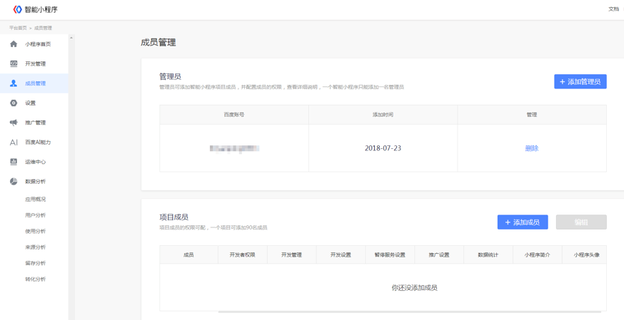
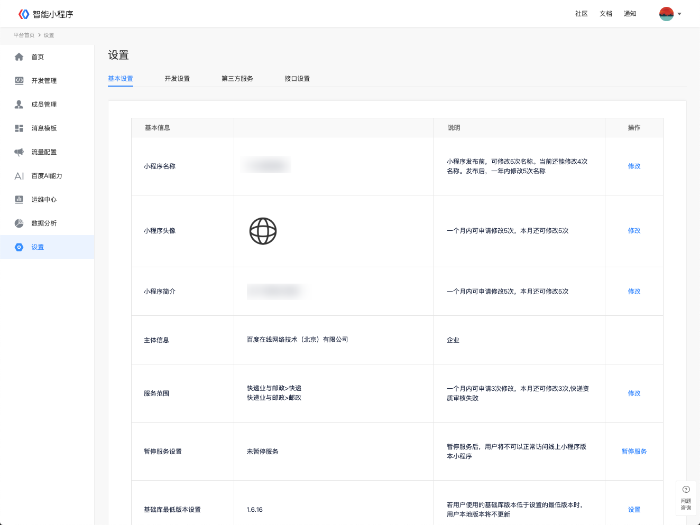
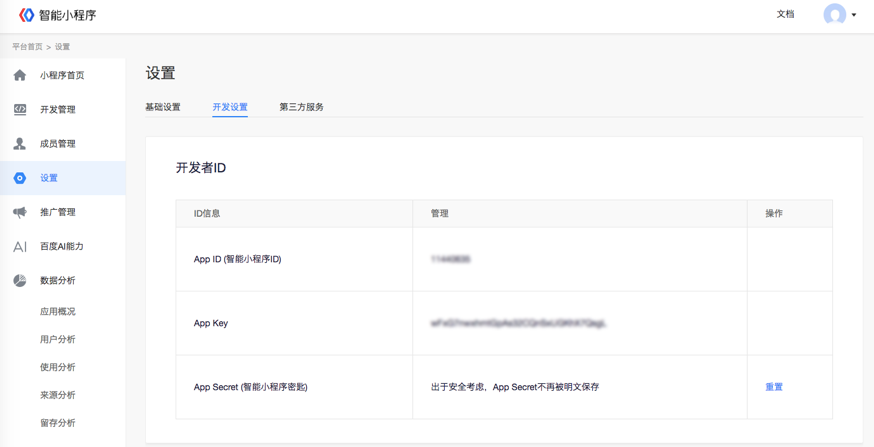
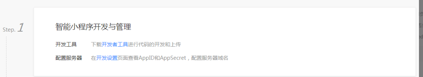
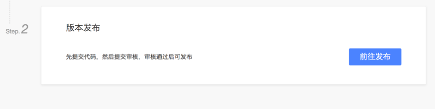

### 智能小程序项目成员管理

登录智能小程序平台，进入平台首页- 成员管理，添加智能小程序项目成员并配置成员权限，一个智能小程序只能添加一名管理员。

### 小程序项目成员数量

|成员角色|人员数量|
|----|----|
|超级管理员|	1人（不可修改）|
|管理员	|1人（可修改）|
|成员|	60人（可修改）|

### 修改基本设置

进入“平台首页-设置-基础设置”。

### 获取AppID

进入“平台首页-设置”，获取 AppID（智能小程序 ID）、App Key、App Secret（智能小程序密钥）。 

### 开发工具

下载开发者工具（[Windows 64版下载地址](http://smartprogram.baidu.com/mappconsole/api/devDownload?system=windows&type=online)  |   [Mac版下载地址](http://smartprogram.baidu.com/mappconsole/api/devDownload?system=mac&type=online)）进行代码的开发和上传。

### 配置服务器

在开发设置页面查看 AppID 和 AppSecret，配置服务器域名。

### 版本发布

需先提交代码，然后提交审核，审核（预计2个工作日左右）通过后可发布。

