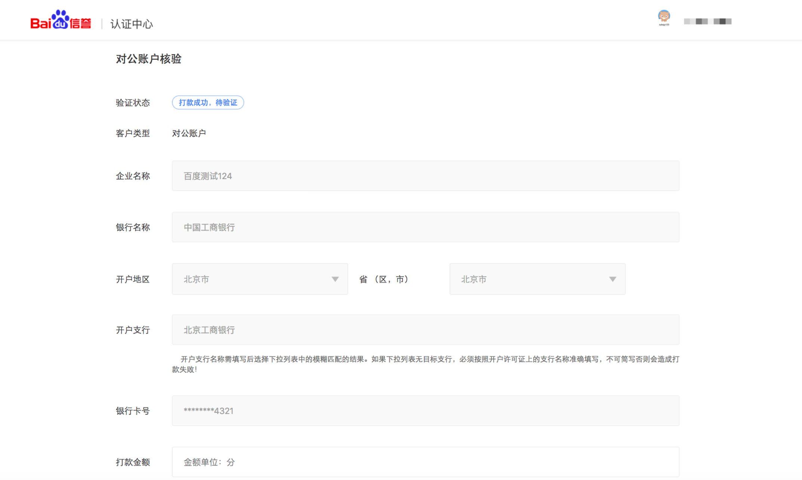

### 智能小程序项目成员管理

登录智能小程序平台，进入平台首页- 成员管理，添加智能小程序项目成员并配置成员权限，一个智能小程序只能添加一名管理员。

### 小程序项目成员数量
<!-- 
**·** 小程序未通过高级认证时，管理员可绑定项目成员30人；
**·**  小程序通过高级认证尚未发布时，管理员最多可绑定项目成员60人；
**·** 小程序已发布时，管理员最多可绑定项目成员90人。 -->
|小程序状态|管理员可绑定项目成员数量|
|----|----|
|未通过高级认证|30人|
|通过高级认证尚未发布|60人|
|已发布|90人|
<!-- |个人 | 未认证、未发布 |已认证、未发布 |已认证、已发布|
|---|---|---|---|
|15 | 30| 60 | 90| -->
<!-- | 未认证未发布 |已认证未发布 |已认证已发布|
|----|----|----|
| 30人| 60人 | 90人| -->

### 修改服务范围

进入“平台首页-设置-基础设置-服务范围-修改”，点击后选择对应的行业，根据提示上传所需行业资质即可。

### 获取AppID

进入“平台首页-设置”，获取AppID（智能小程序ID）、App Key、App Secret（智能小程序密钥）。

### 开发工具

下载开发者工具（[Windows 64版下载地址](http://smartprogram.baidu.com/mappconsole/api/devDownload?system=windows&type=online)  |   [Mac版下载地址](http://smartprogram.baidu.com/mappconsole/api/devDownload?system=mac&type=online)）进行代码的开发和上传。

### 配置服务器

在开发设置页面查看AppID和AppSecret，配置服务器域名。

### 版本发布

需先提交代码，然后提交审核，审核（预计5个工作日左右）通过后可发布。

