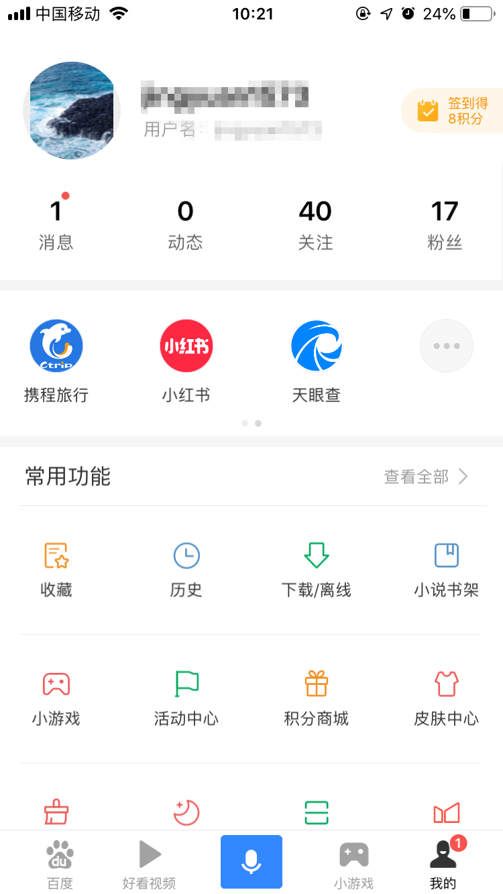
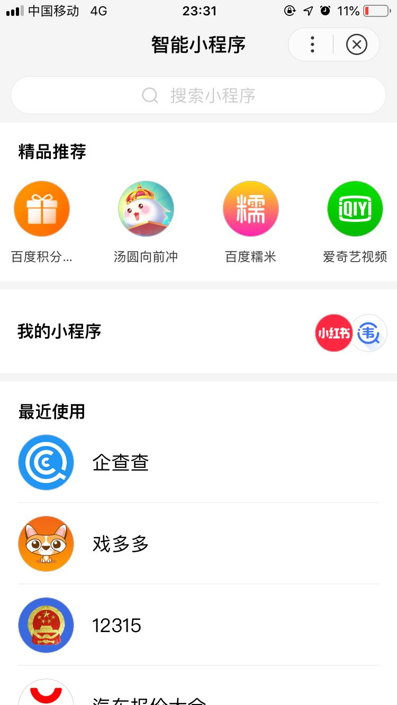
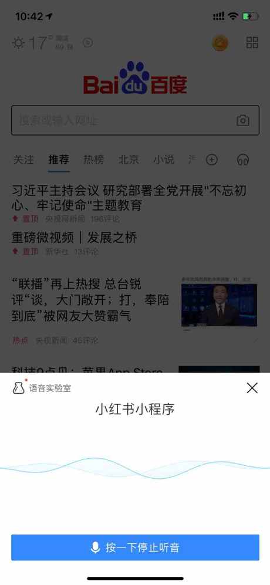
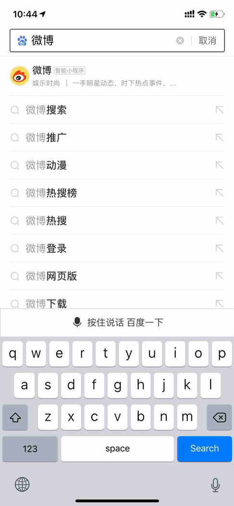
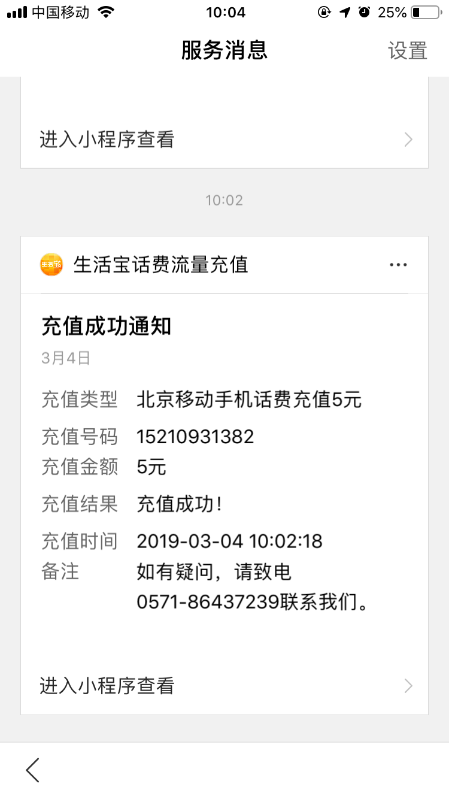
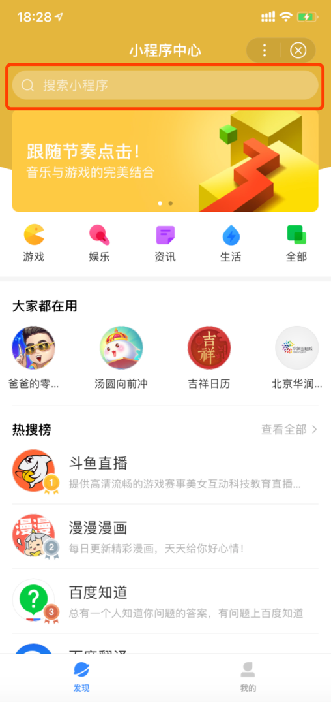
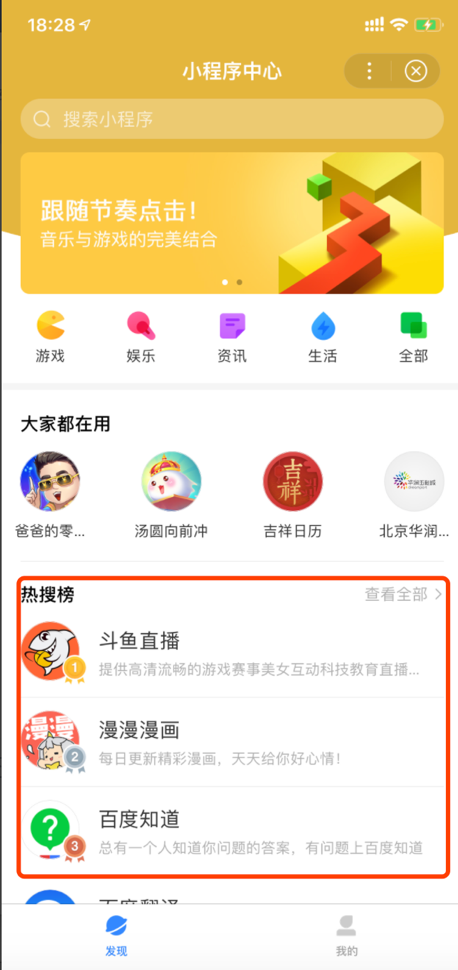

用户访问过某个小程序之后可在以下入口快速重新访问
1、小程序历史 ：当用户访问过某个小程序，会在以下历史入口快速找到该小程序：
•	二楼-最近使用
•	二楼-最近使用更多
•	我的-小程序横滑历史
•	我的-小程序横滑历史-更多
•	我的-历史-小程序

	

		
	

	

		
	

          
2、我的小程序：当用户主动添加小程序到“我的小程序”时，会在以下入口快速找到“我的小程序”：
•	二楼-我的小程序
•	二楼-我的小程序标题
•	二楼-我的小程序更多
•	我的-智能小程序-我的小程序

	

		
	

	

		
	

3、模板消息：可以方便开发者更高效的触达用户，例如：交易状态、物流状态，订单评价等；用户在小程序内产生交互行为后，开发者可以通过用户交互行为产生的凭证配置模板消息来发送给用户。目前已经开放的模板消息主要是两类：支付类和表单类消息。
•	我的-消息-服务消息
•	通知栏消息
消息相关开发文档：
https://smartprogram.baidu.com/docs/develop/api/open_infomation/

	

		
	

	

		
	

            
   
4、快捷桌面：当用户在使用智能小程序的过程中，点击了右上角省略号可以选择将小程序添加至桌面，添加之后用户可在桌面快速重新访问该小程序

	

		
	

	

		
	

    
5、系统多任务：当用户在使用智能小程序的过程中，被其他任务（比如手机短信）打断暂停使用小程序进入了其他手机功能模块，待用户想重新访问刚才访问过的小程序，可通过安卓系统多任务窗口点击小程序进行重访
 
6、分享：当用户在使用智能小程序的过程中，点击了右上角省略号选择分享功能将小程序分享到百度动态、第三方App等平台时，该用户或者被分享的用户可通过该分享入口重新访问该小程序

