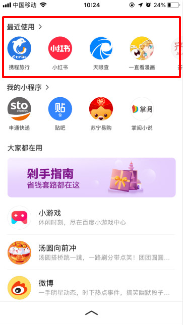

## 小程序历史

渠道说明：当用户在百度App访问过某个小程序，会在二楼-小程序历史模块，或个人中心-小程序横滑历史模块快速找到该小程序：

•         二楼-最近使用

•         二楼-最近使用标题

•         二楼-最近使用更多

•         我的-小程序横滑历史

•         我的-小程序横滑历史-更多

•         我的-历史-小程序

获取方式：该入口不需要开发者进行配置，小程序上线后有用户使用即自动获取。

    

        
    

    

        
    

    

        
    
     

## 我的小程序

渠道说明：当用户主动添加小程序到“我的小程序”时，会在以下入口快速找到“我的小程序”，开发者可引导用户添加：

•         二楼-我的小程序

•         二楼-我的小程序更多

•         我的-智能小程序-我的小程序

开发者接入相关开发文档：<a href="https://smartprogram.baidu.com/docs/design/component/guide_add/)[/](https://smartprogram.baidu.com/docs/design/component/guide_add/">添加到我的小程序引导</a>

获取方式：该入口不需要开发者进行配置，小程序上线后有用户使用即自动获取。

    

        
    

    

        
    

    

        
    

## 消息通知-服务消息：

渠道说明：此渠道可以方便开发者更高效的触达用户，例如：交易状态、物流状态，订单评价等；用户在小程序内产生交互行为后，开发者可以通过用户交互行为产生的凭证配置模板消息来发送给用户。目前已经开放的模板消息主要是两类：支付类和表单类消息。

•         支付消息入口：

    我的-消息-服务消息

    通知栏消息

•         表单消息入口：

    我的-消息-服务消息

开发者接入相关开发文档:<a href="https://smartprogram.baidu.com/docs/develop/api/open_infomation/">模板消息</a>

获取方式：当用户使用小程序进行了支付行为或者有其他交互行为（具体需要视小程序而定）

    

        
    

    

        
    

    

        
    

                     

## 快捷桌面

渠道说明：当用户在使用智能小程序的过程中，点击了右上角省略号可以选择将小程序添加至桌面，添加之后用户可在桌面快速重新访问该小程序

获取方式：该入口不需要开发者进行配置，小程序上线后有用户将小程序添加至桌面快捷方式即可获取。 

    

        
    

    

        
    

    

        
    
    

## 系统多任务

渠道说明：当用户在使用智能小程序的过程中，被其他任务（比如手机短信）打断暂停使用小程序进入了其他手机功能模块，待用户想重新访问刚才访问过的小程序，可通过安卓系统多任务窗口点击小程序进行重访。

获取方式：该入口不需要开发者进行配置，用户打开小程序5分钟内可以从系统多任务窗口重访该小程序。

    

        
    

    

        
    

    

        
    
     

## 分享

渠道说明：当用户在使用智能小程序的过程中，点击了右上角省略号选择分享功能将小程序分享到百度动态、第三方App等平台时，该用户或者被分享的用户可通过该分享入口重新访问该小程序。

    

        
    

    

        
    

    

        
    
     

## 二维码

渠道说明：当用户用百度app扫描小程序二维码时，将进入对应的小程序页面中访问具体的小程序

获取方式：该入口不需要开发者进行配置，在小程序发布上线后会自动获取。开发者可根据自身情况开展线下/线上二维码推广

    

        
    

    

        
    

    

        
    
     

