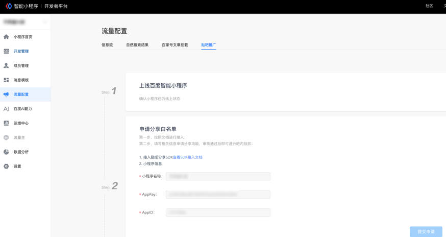
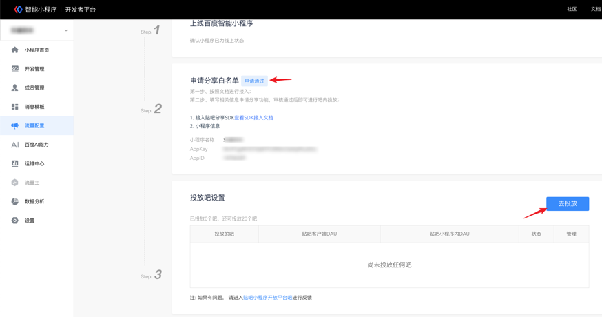
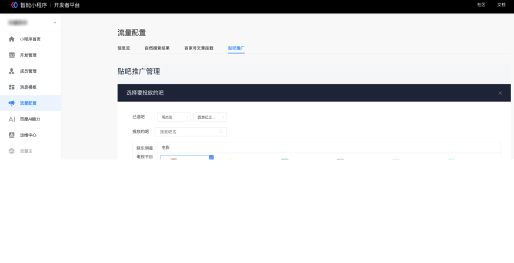
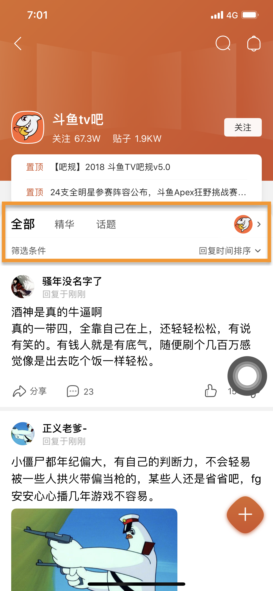
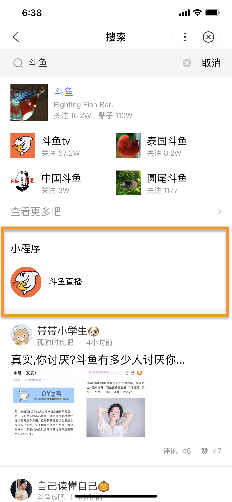
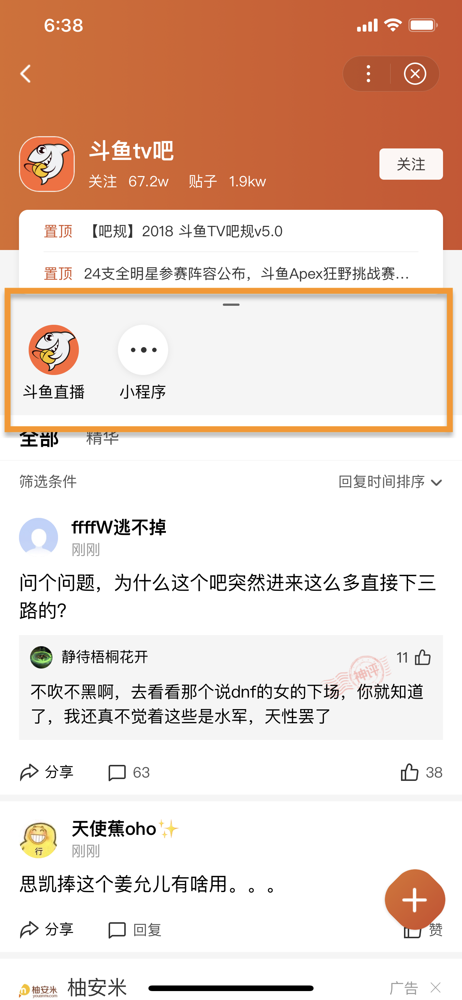

进吧投放功能介绍及申请：
智能小程序发布后，开发者可在【流量配置】-【贴吧推广】模块进行贴吧流量获取，选择对应吧投放后会进行审核，审核通过后用户可在“贴吧”APP及“百度APP”中的贴吧小程序内对应吧看到挂载展示。
1.	首先需要确保要投放的智能小程序为已上线状态，否则将无法投放；
2.	在“申请分享白名单”模块先接入“贴吧分享SDK”后点击“提交申请”按钮。
 

3、审核通过后，在“投放吧设置”模块点击“去投放”按钮
 

4、所选投放吧应与小程序所提供的服务内容相符合，否则将无法审核通过，最多可选20个。
 

### 审核通过将在对应贴吧中展示，入口参考如下

* 贴吧APP内截图

	

		
		
搜索入口 

	

	

		
		
吧内挂载 

	

	

		
		
feed卡片

	

   

* 贴吧小程序内入口

	

		
		
搜索入口 

	

	

		
		
吧内挂载 

	

	

		
		
feed卡片

	

   

 
