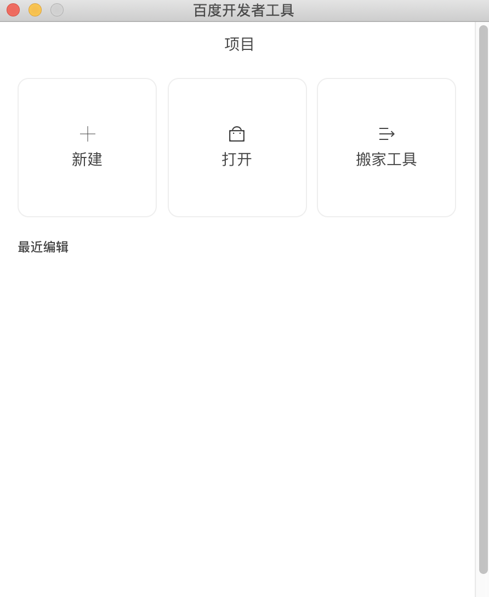
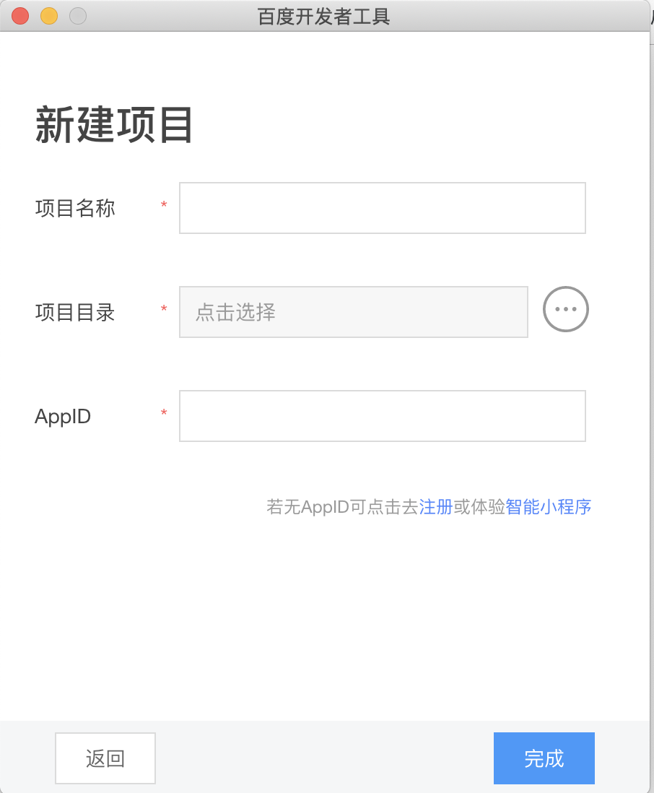
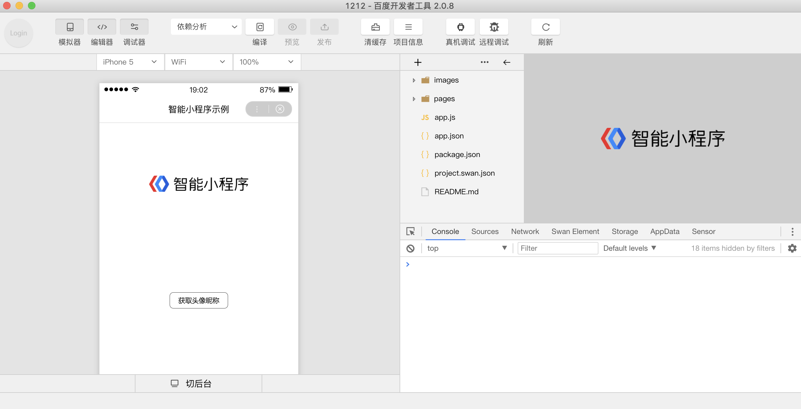

 

下载开发者工具（[Windows 64版下载地址](http://smartprogram.baidu.com/mappconsole/api/devDownload?system=windows&type=online)  |   [Mac版下载地址](http://smartprogram.baidu.com/mappconsole/api/devDownload?system=mac&type=online)）进行代码开发和上传。

	

		
		<!-- 
正确

内容左右边距应至少34px(17pt)。
 -->
	

	

		
		<!-- 
错误

边距过宽，页面元素过于集中。
 -->
	

 
