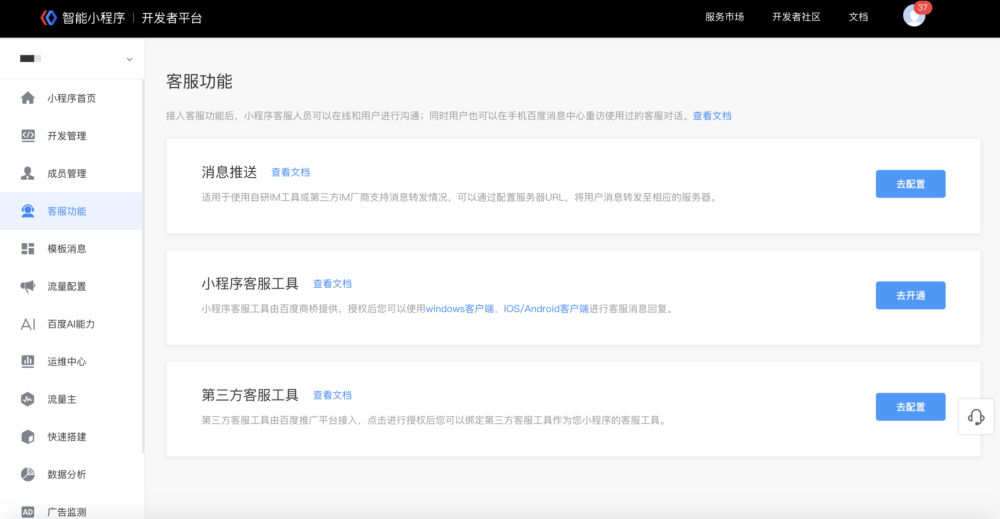
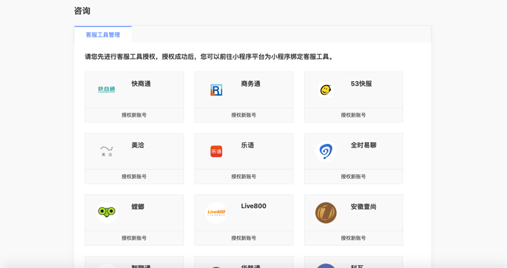
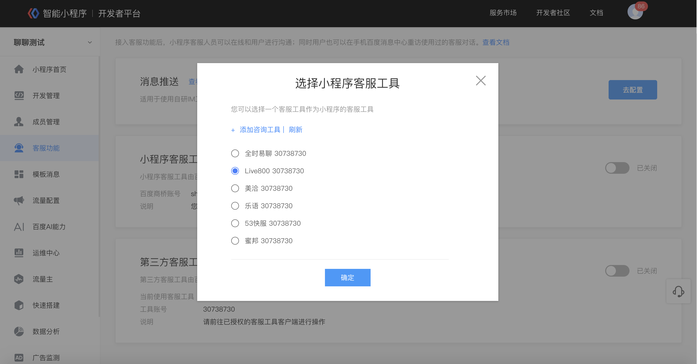

 
第三方客服工具由百度推广平台接入，在开发者后台配置后，可以使用第三方客服工具进行客服消息回复。

### 配置流程：：

1. 使用超级管理员权限登录开发者后台，点击“客服管理-第三方客服工具-去配置"，即开始第三方客服工具配置流程。

> 仅超级管理员有权限进行此项配置。
 

2. 在新跳转的页面选择想要绑定的第三方客服工具，点击"授权新账号"。

3. 输入第三方客服工具账号密码，完成授权，授权成功后，点击"确定"。

4. 在已经授权的客服工具账号里，选择一个与小程序进行绑定。

 

