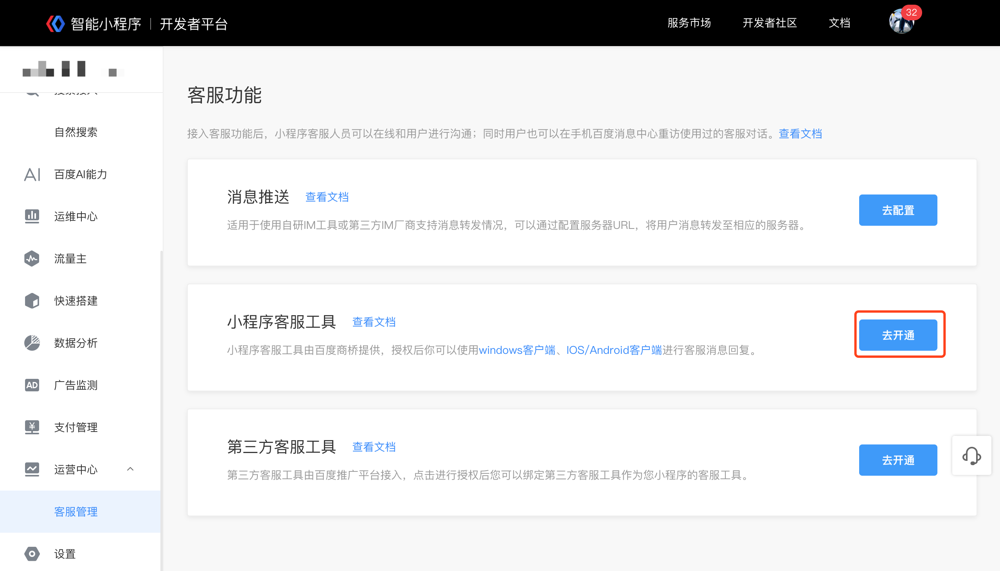
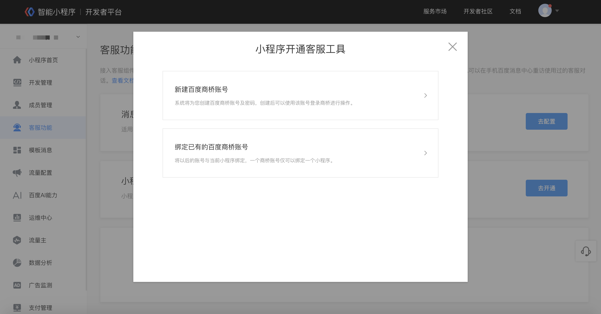
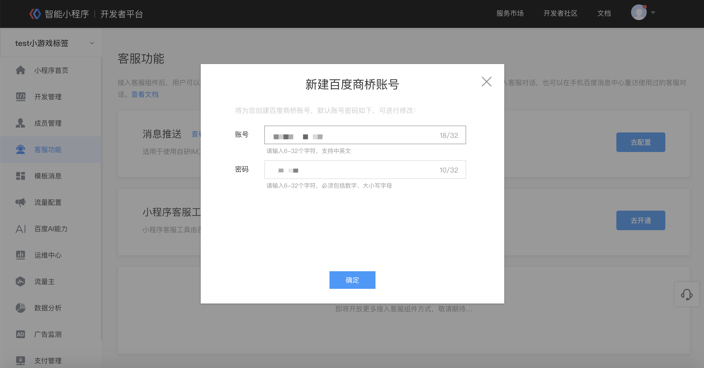
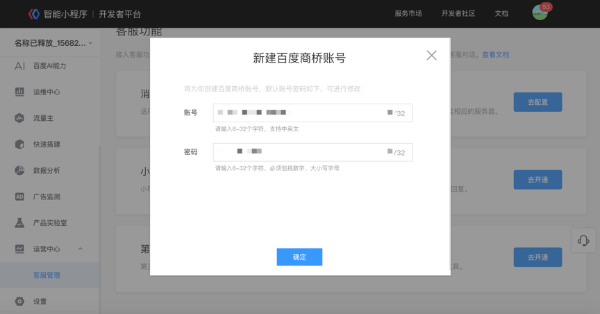

在“小程序客服工具”模块点击“去开通”，即开始小程序客服工具开通流程。

如果您希望将已有的百度商桥账号作为小程序的客服账号，可以选择“绑定已有的百度商桥账号”。如果没有百度商桥账号，或想使用新的商桥账号进行小程序客服消息回复，点击“新建百度商桥账号”开通并使用。

### 新建百度商桥账号

如果您没有百度商桥账号，或想使用新的商桥账号进行小程序客服消息回复，可以选择此选项，并按照页面提示进行操作。

 1. 点击“新建百度商桥账号”。

 2. 系统会自动为您生成一个账号名/密码，可在当前弹窗内进行修改，修改并牢记账号密码后再点击“确定”键。

**注意！**请您牢记并保存好账号及密码，注意不要误触“确定”键，智能小程序不会存储您客服工具的密码。

3.	账号创建成功并开启后，您可以下载百度商桥客户端进行配置客服等操作。

### 绑定已有百度商桥账号

如果您希望将已有的百度商桥账号作为小程序的客服账号，可以选择此选项。

1.	点击“绑定已有的百度商桥账号”。

2.	按照页面提示输入商桥账号及密码，校验成功后会自动绑定。

3.	账号绑定成功并开启后，您可以在百度商桥客户端进行配置客服等操作。

### 小程序客服工具使用指南

将商桥账号和小程序进行绑定后，会按照小程序名称自动生成站点，您可以在商桥客户端进行小程序客服账号创建、客服消息回复、客服统计数据查看等操作。

