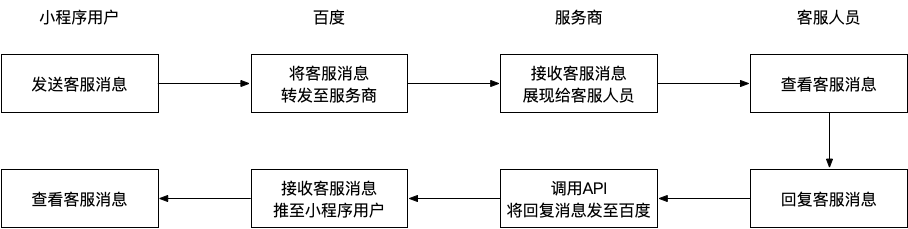

为丰富小程序的服务能力，提高服务质量，百度为小程序提供客服消息能力，客服能力可以便捷的连接用户与开发者，提升用户满意度。

> 注意：开发者需将客服权限授权给第三方服务商后，服务商才可以代替开发者收发客服消息。

### 客服消息功能说明

#### 客服消息入口

1. 开发者在小程序内添加客服功能（参考在[在页面中使用客服消息](http://smartprogram.baidu.com/docs/develop/serverapi/contact_api/#%E5%9C%A8%E9%A1%B5%E9%9D%A2%E4%B8%AD%E4%BD%BF%E7%94%A8%E5%AE%A2%E6%9C%8D%E6%B6%88%E6%81%AF/)）后，用户可在小程序内唤起客服会话页面，给小程序发消息；

2. 已使用过的小程序客服消息会聚合显示在手机百度消息中心 “小程序客服消息”文件夹内，用户可以在此处查看历史客服消息，并给小程序客服发消息。

#### 消息下发条件

当用户向小程序客服发送消息后，48小时内，小程序客服最多可以向开发者发送5条消息，可发送客服消息条数不累加，上述用户动作会触发可下发条数及可下发时限的更新，可下发消息条数更新为当前可下发条数限制的最大值，有效下发时间限制也更新为最长有效时间。

#### 消息支持的类型

目前支持文本及图片类型消息。

### 客服消息转发原理

在开发者将**客服权限**授权给服务商后，服务商可以代为接收并回复小程序的客服消息。



当用户给小程序（已授权客服权限）客服发消息时，百度的服务器会将消息的数据包（JSON或者XML格式）POST到第三方服务商的消息与事件接收URL。服务商收到客服消息后，需自行展示给客户的客服人员，并在客服回复消息后，调用接口将该消息异步回复给百度。

### 第三方平台的客服功能

在[客服消息](http://smartprogram.baidu.com/docs/develop/serverapi/contact_api/)文档的介绍中，使用客服消息需要配置以下四个参数，第三方平台开通客服权限后，会使用原来的平台设置中的参数进行配置。

>- URL: 开发者用来接收消息的接口 URL。开发者所填写的URL 必须以 http:// 或 https:// 开头，分别支持 80 端口和 443 端口。
>- Token: 可由开发者可以任意填写，用作生成签名（该 Token 会和接口 URL 中包含的 Token 进行比对，从而验证安全性）。
>- EncodingAESKey: 由开发者手动填写或随机生成，将用作消息体加解密密钥。
>- 消息加解密方式：明文模式（默认）.兼容模式和安全模式。可以选择消息数据格式：XML 格式（默认）或 JSON 格式。

第三方平台使用的参数：

* URL：【第三方平台-设置-开发设置-授权后实现业务-消息与事件接收URL】
* Token：【第三方平台-设置-开发设置-授权后实现业务-消息验证TOKEN】
* EncodingAESKey:【第三方平台-设置-开发设置-授权后实现业务-消息加解密Key】
* 消息加解密方式：JSON格式

另外，为了证明使用的消息接受URL是有效的，我们会向第三方平台设置的URL发送请求，服务器收到请求必须做出规定的回复。

百度服务器将发送POST请求到填写的服务器地址URL上，POST请求携带参数如下表所示：

| 参数      | 描述                                                         |
| :-------- | :----------------------------------------------------------- |
| signature | 百度加密签名，signature结合了开发者填写的token参数和请求中的timestamp参数.nonce参数。 |
| timestamp | 时间戳                                                       |
| nonce     | 随机数                                                       |
| echoStr   | 随机字符串                                                   |

开发者通过检验 signature 对请求进行校验（下面有校验方式）。若确认此次 POST 请求来自百度服务器，请原样返回 echoStr 参数内容，则接入生效，成为开发者成功，

**当进行全网发布或新添加权限包含客服能力权限时，同样会进行该URL的检测，要求返回与上所述一致**

### 在页面中使用客服消息

可参考：[在页面中使用客服消息](http://smartprogram.baidu.com/docs/develop/serverapi/contact_api/#%E5%9C%A8%E9%A1%B5%E9%9D%A2%E4%B8%AD%E4%BD%BF%E7%94%A8%E5%AE%A2%E6%9C%8D%E6%B6%88%E6%81%AF/)

### 接收客服消息

用户向小程序客服发送消息时，百度服务器将向第三方服务商的**消息与事件接收URL**推送消息，开发者可以依据自身业务逻辑进行响应。百度服务器在将用户的消息发给服务商服务器地址后，百度服务器在2秒内收不到响应会断掉连接。

关于重试的消息排重，有 msgid 的消息推荐使用 msgid 排重。事件类型消息推荐使用 FromUserName + CreateTime 排重。

消息接受成功，要求服务器收到请求必须做出下述回复。详见下面说明：

> 1. 直接回复success（推荐方式）
> 2. 直接回复空串

#### 消息结构

各消息类型的推送JSON.XML数据包结构如下：

#### 文本消息

##### JSON 格式

```json
{
  "ToUserName": "toUser",
  "FromUserName": "fromUser",
  "CreateTime": 1482048670,
  "MsgType": "text",
  "Content": "this is a test",
  "MsgId": 1234567890123456
}
```

##### 参数说明

| 参数         | 说明                |
| :----------- | :------------------ |
| ToUserName   | 小程序的appId       |
| FromUserName | 发送者的openid      |
| CreateTime   | 消息创建时间(整型） |
| MsgType      | text                |
| Content      | 文本消息内容        |
| MsgId        | 消息id，64位整型    |

#### 图片消息

##### JSON 格式

```json
{
  "ToUserName": "toUser",
  "FromUserName": "fromUser",
  "CreateTime": 1482048670,
  "MsgType": "image",
  "PicUrl": "this is a url",
  "MsgId": 1234567890123456
}
```

##### 参数说明

| 参数         | 说明                   |
| :----------- | :--------------------- |
| ToUserName   | 小程序的appId          |
| FromUserName | 发送者的openid         |
| CreateTime   | 消息创建时间(整型）    |
| MsgType      | image                  |
| PicUrl       | 图片链接（由系统生成） |
| MsgId        | 消息id，64位整型       |

### 发送客服消息

本接口应在服务器端调用，用于发送客服消息给用户。
相关接口可参考：[发送客服消息API](http://smartprogram.baidu.com/docs/develop/serverapi/contact_api/#%E5%8F%91%E9%80%81%E5%AE%A2%E6%9C%8D%E6%B6%88%E6%81%AF%E6%8E%A5%E5%8F%A3/)

##### 请求地址

```
post https://openapi.baidu.com/rest/2.0/smartapp/message/custom/sendbytp
```

##### 请求参数

| 参数名       | 类型   | 是否必须 | 描述                                   |
| ------------ | ------ | -------- | -------------------------------------- |
| access_token | string | 是       | 小程序access_toekn                     |
| user_type    | int    | 是       | 1:游客登录 2:百度账号登录              |
| open_id      | string | 是       | 用户的 OpenID                          |
| msg_type     | string | 是       | 消息类型  text:文本格式 image:图片链接 |
| content      | string | 是       | 文本消息内容，msg_type ="text" 时必填  |
| pic_url      | string | 是       | 图片消息，msg_type ="image" 时必填     |

##### 响应数据

```json
{
    "errno": 0,
    "msg": "success"
}
```

##### 错误码

| 值    | 说明                                                         | 描述 |
| ----- | ------------------------------------------------------------ | ---- |
| 0     | 请求成功                                                     |      |
| 3001  | 请求参数有误                                                 |      |
| 30022 | 不合法的 OpenID，请开发者确认 OpenID 是否是其他小程序的 OpenID |      |
| 90001 | 客服接口下行条数超过上限                                     |      |
| 90002 | 请确认小程序已开通客服能力                                   |      ||


